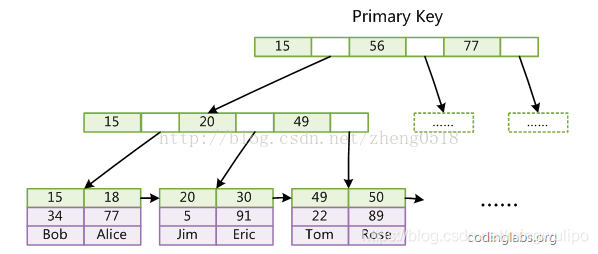
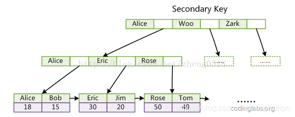
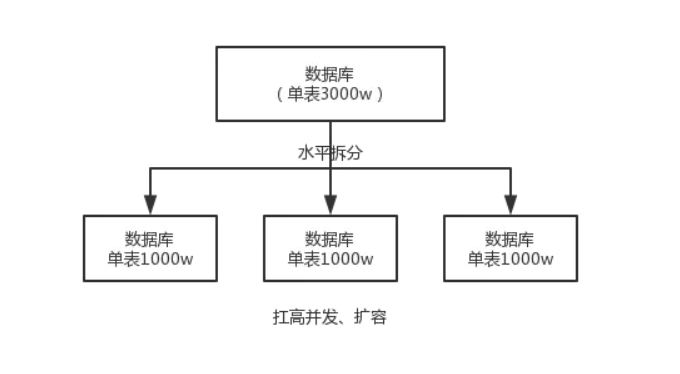
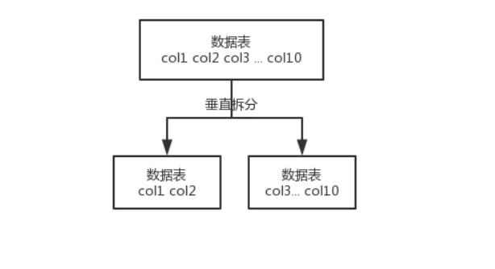
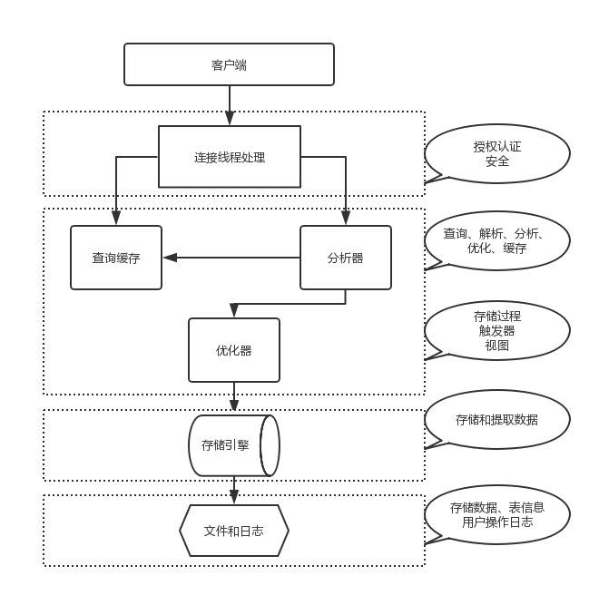

# ==mysql==

# db

## 关系的完整性约束

- 实体完整性
  - 主属性不能为空
- 参照完整性
  - 外码要么为空，要么为另一关系的主码值
- 用户自定义的完整性
  - 自定义的约束条件（范围等
  - 如不为空，有默认值等

## 候选码等

- 候选码
  - 若关系中某一属性组能唯一标识一条记录，其子集不能，则该属性组为候选码
  - 候选码可有多个
- 主码
  - 选择其中一个候选码作为记录的唯一标识，这个候选码就是主码
- 主属性
  - 候选码中的属性
- 非主属性
  - 不是任何候选码中的属性
- 外码
  - 一个关系中的一个属性引用了另一关系的主码，则该属性为外码
  - 外码要么为空，要么为对应主码的某个值

## 范式

- 存在问题
  - 插入异常
  - 删除异常
  - 更新异常
  - 数据冗余
- 1NF（**确保每列保持原子性)**
  - 每一列都是原子数据项
- 2NF（**确保表中的每列都和主键相关)**
  - 1NF基础上，非主属性完全依赖于候选码。（还是可能会间接依赖
  - 消除了非主属性对主码的部分函数依赖（依赖于其子集）
- 3NF**(确保每列都和主键列直接相关,而不是间接相关)**
  - 2NF基础上，非主属性不依赖于其他主属性
  - 消除了传递依赖
- BCNF
  - 主属性不依赖于主码的子集
  - 消除了主属性对主码的部分函数依赖

## 事务的ACID

- ACID是数据库事务的核心特性，它代表了四个关键属性：

  1. Atomicity（原子性）：原子性指的是事务是一个不可分割的单位，要么全部执行成功，要么全部失败回滚。如果事务中的任何一部分操作失败，那么整个事务将被回滚到初始状态，所有修改将被撤销，不会产生部分完成的结果。
  2. Consistency（一致性）：一致性要求事务在开始和结束时，数据库必须处于一致的状态。这意味着事务必须遵循预定义的规则和约束，以确保数据的完整性和有效性。如果事务执行成功，数据库从一个一致的状态转换到另一个一致的状态。
  3. Isolation（隔离性）：隔离性指的是每个事务的执行都应该与其他事务相互隔离，使得并发执行的事务不会相互干扰。每个事务都应该感觉好像在单独地执行，即使在同时进行的情况下，也不会受到其他事务的影响。
  4. Durability（持久性）：持久性确保事务一旦提交，对数据的修改将永久保存，并且不会因系统故障或其他错误而丢失。系统必须将已提交的事务更改写入磁盘或其他可持久化存储器中，并且能够在故障后重新恢复这些更改。

  ACID属性确保了数据库事务的可靠性和完整性。它们提供了保障，确保事务在并发环境下能够正确执行并维护数据的一致性。数据库管理系统使用各种机制来实现ACID属性，如日志记录、锁定机制和回滚段等。

# 索引

## B-Tree

- Balanced-Tree。B树是为了实现高效的磁盘存取而设计的多叉平衡搜索树，多用于数据库中

- 来源

  - B树的启发来源于二叉查找树，二叉查找树的特点是每个非叶子节点都只有两个孩子节点
  - 当数据量非常大时，二叉查找树过高，搜索算法从根节点向下搜索时，需要访问的节点数会变多，若节点存放在磁盘，要多次IO
  - B树就是扩展每个节点的信息，降低树的高度
  - 非叶子节点也放数据

- m阶B树特点

  - 每个节点至多有m棵子树，除根节点外，其他分支节点至少有ceil（m/2）棵子树。根节点至少有两棵子树（除非B树只包含一个节点
  - 有j个孩子节点的非叶节点有j−1个关键字，关键字按非降序排列
  - 所有叶子节点具有相同的深度，这也说明B树是平衡的，B-tree的名字也是这样来的

- 非叶子节点存储数据

  - 非叶子节点可以不存储数据，只放索引？
  - 理论上可以，但最基本的B-Tree一般放数据吧
    - 要放索引，那不如直接用B+Tree
  
  

## B+-Tree

- 与B树区别

  - 数据只放在叶子节点，非叶子节点作为索引
  - 叶子节点有序且有指向下一节点的指针，形成链表

  

  - 也有说是节点是数组的双向循环链表，并且排好序，满足数组的访问优点和链表的更新优点

  

- 比B树的查询优势

  - 中间节点不保存数据，进行IO时速度更快（只要加载索引就可以，找到叶子节点再加载相应数据
  - 每次都要查询到根节点，比B树稳定（也不慢
  - 有利于区间查询，可先通过中间节点找到下限，再遍历链表找到上限。而B树要不断进行中序遍历
  - 有利于按照主键的排序查询

- 与红黑树比

  - 红黑树是二叉树，B+树有更低的树高

## 什么是索引

- 用于快速查找的数据结构
- 索引要实现建立好，更新数据时也要更新索引

## 索引分类

- 为什么索引能提高查询性能

  - 更快定位和访问数据，不需要全表扫描
  - 底层实现是B+Tree，Hash表等就知道了。。。

- 概述（Index）

  - 索引是在存储引擎层实现的，而不是在服务器层实现的，所以不同存储引擎具有不同的索引类型和实现
  - 索引是帮助MySQL高效获取数据的数据结构，最形象的比喻就是图书的目录
  - 在大量数据中查询时索引才显得有意义

- 按数据结构分

  - B+Tree索引
    - 多叉平衡搜索树
    - mysql的InnoDb底层是双向循环链表
    - 优点
      - 树低，查询效率高
      - 有序链表使范围查找，排序查找，分组查找以及去重查找变得异常简单
  - Hash索引
    - Memory引擎默认支持哈希索引，用链表法解决Hash冲突.InnoDB或MyISAM支持Hash索引，但通过伪Hash索引来实现(自适应Hash索引)
    - 优点
      - 不Hash冲突时一次定位，检索效率非常高
    - 缺点
      - 仅能满足等值查询，不能进行范围查询，排序查询
      - 多Hash冲突时效率也不高
  - 全文索引
    - MyISAM 存储引擎支持Full-text索引，用于查找文本中的关键词，而不是直接比较是否相等。Full-text索引一般使用倒排索引实现，它记录着关键词到其所在文档的映射，直接查询映射表
    - InnoDB 存储引擎在 MySQL 5.6.4 版本中也开始支持Full-text索引                                                      

- 按物理存储分

  - 聚簇索引（主键索引）
    - 按照每张表的主键构造一颗 B+tree，同时叶子节点中存放的就是整张表的行记录数据，聚集索引的叶子节点被称为数据页
    - InnoDB
      - 要求必须有聚簇索引，默认在主键字段上建立聚簇索引
      - 在没有主键字段的情况下，表的第一个非空的唯一索引将被建立为聚簇索引
      - 在前两者都没有的情况下，InnoDB将自动生成一个隐式的自增id列，并在此列上建立聚簇索引
  - 非聚集索引（非主键索引、二级索引、辅助索引）
    - 和聚集索引基本相同，但非叶子结点存储的都是索引指针（非主键），叶子节点存储的是主键。
    - 查找时，需要先查找到数据对应主键值，然后再到聚集索引中进行查找
  - 所以不是直接找索引（聚簇、非聚簇）的列的话，是需要回表查询

- 物理分类二

  - 聚簇索引和非聚簇索引概念
    聚簇索引：将数据存储与索引放到了一块，索引结构的叶子节点保存了行数据

  ​	   非聚簇索引：将数据与索引分开存储，索引结构的叶子节点是主键。再回聚簇索引查询，叫回表查询

  - 聚簇索引和非聚簇索引的关系
    聚簇索引是物理有序的；非聚簇索引是逻辑有序，物理无序，在mysql中数据存储顺序就是聚簇索引的顺序，所以一个表只有一个聚簇索引，其他索引都是非聚簇的

    如下图所示，一张表 聚簇索引和非聚簇索引的关系

    

  - 非聚簇索引的叶子结点存储的是索引列的值，它的数据域是聚簇索引即ID，聚簇索引叶子结点存储的是对应的数据。聚簇索引默认是主键，如果表中没有定义主键，InnoDB 会选择一个唯一且非空的索引代替。如果没有这样的索引，InnoDB 会隐式定义一个主键（类似oracle中的RowId）来作为聚簇索引。如果已经设置了主键为聚簇索引又希望再单独设置聚簇索引，必须先删除主键，然后添加我们想要的聚簇索引，最后恢复设置主键即可。

- 按字段类型分

  - 主键索引(PRIMARY KEY)
    - 建立在主键上的索引被称为主键索引，一张数据表只能有一个主键索引，索引列值不允许有空值，通常在创建表时一起创建
  - 唯一索引(UNIQUE)
    - 建立在UNIQUE字段上的索引被称为唯一索引，一张表可以有多个唯一索引，索引列值允许为空，列值中出现多个空值不会发生重复冲突
  - 普通索引(INDEX)
    - 建立在普通字段上的索引被称为普通索引

- 按字段数分

  - 单列索引
    - 建立在单个列上的索引被称为单列索引
  - 组合索引
    - 建立在多个列上的索引被称为联合索引，使用最左前缀匹配
  - 前缀索引
    - 字符串很长且前面的字符区分度已经很好，就拿前面字符添加索引，减小索引文件。

## 索引使用

- 1、最左前缀匹配原则，非常重要的原则，mysql会一直向右匹配直到遇到范围查询(>、<、between、like)就停止匹配，比如a = 1 and b = 2 and c > 3 and d = 4 如果建立(a,b,c,d)顺序的索引，d是用不到索引的，如果建立(a,b,d,c)的索引则都可以用到，a,b,d的顺序可以任意调整。（会自己优化排序，先a再b再c再d，不能跨

  2、=和in可以乱序，比如a = 1 and b = 2 and c = 3 建立(a,b,c)索引可以任意顺序，mysql的查询优化器会帮你优化成索引可以识别的形式。

  3、尽量选择区分度高的列作为索引，区分度的公式是count(distinct col)/count(*)，表示字段不重复的比例，比例越大我们扫描的记录数越少，唯一键的区分度是1，而一些状态、性别字段可能在大数据面前区分度就是0，那可能有人会问，这个比例有什么经验值吗？使用场景不同，这个值也很难确定，一般需要join的字段我们都要求是0.1以上，即平均1条扫描10条记录。

  比如性别建立索引，怎么找都基本能找到一半，不建议建立索引，因为索引也是要维护的

  索引命中时还是取出一大堆数据，约等于没有命中

  4、索引列不能参与计算，保持列“干净”，比如from_unixtime(create_time) = ’2014-05-29’就不能使用到索引，原因很简单，b+树中存的都是数据表中的字段值，但进行检索时，需要把所有元素都应用函数才能比较，显然成本太大。所以语句应该写成create_time = unix_timestamp(’2014-05-29’)。

  计算前并不知道结果，索引要全表扫描进行计算。

  不是提前计算，因为索引本身要通过B+树找到，找到了才能进行计算啊

  5、尽量的扩展索引，不要新建索引。比如表中已经有a的索引，现在要加(a,b)的索引，那么只需要修改原来的索引即可。

- 索引这么多优点，为什么不对表中的每一个列创建一个索引呢？

  1. 当对表中的数据进行增加、删除和修改的时候，索引也要动态的维护，这样就降低了数据的维护速度。
  2. 索引需要占物理空间，除了数据表占数据空间之外，每一个索引还要占一定的物理空间，如果要建立聚簇索引，那么需要的空间就会更大。

## 索引优缺点

**索引的优点**

* 可以大大加快数据的检索速度，这也是创建索引的最主要的原因。
* 通过使用索引，可以在查询的过程中，使用优化隐藏器，提高系统的性能。

**索引的缺点**

* 时间方面：创建索引和维护索引要耗费时间，具体地，当对表中的数据进行增加、删除和修改的时候，索引也要动态的维护，会降低增/改/删的执行效率；
* 空间方面：索引需要占物理空间。

## 主键索引和二级索引

- 以前不懂，现在可以理解为就是聚簇索引和非聚簇索引

- 主键索引

  数据表的主键列使用的就是主键索引。

  一张数据表有只能有一个主键，并且主键不能为 null，不能重复。

  在 MySQL 的 InnoDB 的表中，当没有显示的指定表的主键时，InnoDB 会自动先检查表中是否有唯一索引且不允许存在null值的字段，如果有，则选择该字段为默认的主键，否则 InnoDB 将会自动创建一个 6Byte 的自增主键。

- 二级索引(辅助索引)
  二级索引又称为辅助索引，是因为二级索引的叶子节点存储的数据是主键。也就是说，通过二级索引，可以定位主键的位置。
  唯一索引，普通索引，前缀索引等索引属于二级索引。

  - 唯一索引(Unique Key) ：唯一索引也是一种约束。唯一索引的属性列不能出现重复的数据，但是允许数据为 NULL，一张表允许创建多  
    个唯一索引。  建立唯一索引的目的大部分时候都是为了该属性列的数据的唯一性，而不是为了查询效率。

  - 普通索引(Index) ：普通索引的唯一作用就是为了快速查询数据，一张表允许创建多个普通索引，并允许数据重复和 NULL。

  - 前缀索引(Prefix) ：前缀索引只适用于字符串类型的数据。前缀索引是对文本的前几个字符创建索引，相比普通索引建立的数据更小 因为只取前几个字符。 

  - 全文索引(Full Text) ：全文索引主要是为了检索大文本数据中的关键字的信息，是目前搜索引擎数据库使用的一种技术。Mysql5.6   
    之前只有 MYISAM 引擎支持全文索引，5.6 之后 InnoDB 也支持了全文索引。

    类似于一个HashMap，提前统计好Key的位置

## 聚簇、非聚簇索引

- 聚集索引
  聚集索引即索引结构和数据一起存放的索引。主键索引属于聚集索引。

  在 Mysql 中，InnoDB 引擎的表的 .ibd文件就包含了该表的索引和数据，对于 InnoDB 引擎表来说，该表的索引(B+树)的**每个非叶子节点存储索引，叶子节点存储索引和索引对应的数据**。

  优点
  聚集索引的查询速度非常的快，因为整个 B+树本身就是一颗多叉平衡树，叶子节点也都是有序的，定位到索引的节点，就相当于定位到了数据。
  缺点

  ​	依赖于有序的数据 ：因为 B+树是多路平衡树，如果索引的数据不是有序的，那么就需要在插入时排序，如果数据是整型还好， 
  否则类似于字符串或 UUID 这种又长又难比较的数据，插入或查找的速度肯定比较慢。 
  ​	更新代价大 ： 如果对索引列的数据被修改时，那么对应的索引也将会被修改，而且聚集索引的叶子节点还存放着数据，  
  修改代价肯定是较大的，所以对于主键索引来说，主键一般都是不可被修改的。

  本身是B+树

  

- 非聚集索引
  非聚集索引即索引结构和数据分开存放的索引。二级索引属于非聚集索引。

  MYISAM 引擎的表的.MYI 文件包含了表的索引， 该表的索引(B+树)的**每个非叶子节点存储索引， 叶子节点存储索引和索引对应数据的指针或者主键**，指向.MYD 文件的数据。
  二级索引的叶子节点就存放的是主键，根据主键再回表查数据。

  优点
  	更新代价比聚集索引要小 。非聚集索引的更新代价就没有聚集索引那么大了，非聚集索引的叶子节点是不存放数据的

  缺点
  	跟聚集索引一样，非聚集索引也依赖于有序的数据
  	可能会二次查询(回表) :这应该是非聚集索引最大的缺点了。 当查到索引对应的指针或主键后，可能还需要根据指针或主键再到数	据文件或表中查询。

  非聚集索引一定回表查询吗

  ​	覆盖索引不用，索引包含了要查询的列

  ​	试想一种情况，用户准备使用 SQL 查询用户名，而用户名字段正好建立了索引。

   	SELECT name FROM table WHERE name='guang19';
  	那么这个索引的 key 本身就是 name，查到对应的 name 直接返回就行了，无需回表查询。

  本身也是B+树

  

## 索引失效

- 1、使用!= 或者 <> 导致索引失效

- 2、类型不一致导致的索引失效

- 3、函数导致的索引失效

  如：

```
	SELECT * FROM `user` WHERE DATE(create_time) = '2020-09-03';
```

​		如果使用函数在索引列，这是不走索引的。会引发全表扫描

​      索引中并没有这样的数据，还要计算

- 4、运算符导致的索引失效

```
SELECT * FROM `user` WHERE age - 1 = 20;
```

​	如果你对列进行了（+，-，*，/，!）, 那么都将不会走索引。

- 5、OR引起的索引有时失效

```
SELECT * FROM `user` WHERE `name` = '张三' OR height = '175';
```

​	OR导致索引是在特定情况下的，并不是所有的OR都是使索引失效，如果OR连接的是同一个字段，那么索引不会失效，反之索引失效。

- 6、模糊搜索导致的索引失效

```
SELECT * FROM `user` WHERE `name` LIKE '%冰';
```

​	当`%`放在匹配字段前是不走索引的，放在后面才会走索引。

- 7、NOT IN导致索引失效。相当于!= and != and ...
- and的话选择一个字段索引？

## 为什使用B+Tree？

B+tree

- B+树的磁盘读写代价更低：B+树的内部节点并没有指向关键字具体信息的指针，因此其内部节点相对B树更小，如果把所有同一内部节点的关键字存放在同一盘块中，那么盘块所能容纳的关键字数量也越多，一次性读入内存的需要查找的关键字也就越多，相对IO读写次数就降低了。

- B+树的查询效率更加稳定：由于非终结点并不是最终指向文件内容的结点，而只是叶子结点中关键字的索引。所以任何关键字的查找必须走一条从根结点到叶子结点的路。所有关键字查询的路径长度相同，导致每一个数据的查询效率相当。

- 由于B+树的数据都存储在叶子结点中，分支结点均为索引，方便扫库，只需要扫一遍叶子结点即可，但是B树因为其分支结点同样存储着数据，我们要找到具体的数据，需要进行一次中序遍历按序来扫，所以B+树更加适合在区间查询的情况，所以通常B+树用于数据库索引。

B-tree

   不如B+Tree

Hash： 

* 虽然可以快速定位，但是没有顺序，IO复杂度高；

- 基于Hash表实现，只有Memory存储引擎显式支持哈希索引 ；

- 适合**等值查询**，如=、in()、<=>，不支持范围查询 ；

- 因为不是按照索引值顺序存储的，就不能像B+Tree索引一样利用索引完成排序 ；

- Hash索引在查询等值时非常快 ；

- 因为Hash索引始终索引的**所有列的全部内容**，所以不支持部分索引列的匹配查找 ；

- 如果有大量重复键值得情况下，哈希索引的效率会很低，因为存在哈希碰撞问题 。

二叉树： 

- 树的高度不均匀，不能自平衡，查找效率跟数据有关（树的高度），并且IO代价高。

红黑树： 

- 自平衡二叉查找树，树的高度随着数据量增加而增加，IO代价高。
- 也是二叉树

## 自增、与业务无关主键

- 自增

  如果我们定义了主键(PRIMARY KEY)，那么InnoDB会**选择主键作为聚集索引**。
  如果没有显式定义主键，则InnoDB会**选择第一个不包含有NULL值的唯一索引作为主键索引。**
  如果也没有这样的唯一索引，则InnoDB会**选择内置6字节长的ROWID作为隐含的聚集索引(ROWID随着行记录的写入而主键递增，这个ROWID不像ORACLE的ROWID那样可引用，是隐含的)**。

  　　数据记录本身被存于主索引（一颗B+Tree）的叶子节点上。这就要求同一个叶子节点内（大小为一个内存页或磁盘页）的各条数据记录按主键顺序存放，因此每当有一条新的记录插入时，MySQL会根据其主键将其插入适当的节点和位置，如果页面达到装载因子（InnoDB默认为15/16），则开辟一个新的页（节点）如果表使用自增主键。那么每次插入新的记录，记录就会顺序添加到当前索引节点的后续位置，当一页写满，就会自动开辟一个新的页。

  　　如果使用非自增主键（如果身份证号或学号等），由于每次插入主键的值近似于随机，因此每次新记录都要被插到现有索引页的中间某个位置，此时MySQL不得不为了将新记录插到合适位置而移动数据，甚至目标页面可能已经被回写到磁盘上而从缓存中清掉，此时又要从磁盘上读回来，这增加了很多开销，同时频繁的移动、分页操作**造成了大量的碎片**，得到了不够紧凑的索引结构，后续不得不通过OPTIMIZE TABLE来重建表并优化填充页面。

  ​	**由于主键是聚簇索引，存在数组节点的创建、插入、删除开销**

     索引页

- 业务无关

  - 小概率可能会因为业务场景的变更，此时的被认定为业务唯一标识的字段不唯一
  - 更能用到上面自增的好处，连续的id，不会导致频繁的数据页分离、合并等

## 最左匹配原则（组合索引）

- 最左优先，以最左边的为起点任何连续的索引都能匹配上。同时遇到范围查询(>、<、between、like)就会停止匹配。 某个索引列失效时
  例如：b = 2 如果建立(a,b)顺序的索引，是匹配不到(a,b)索引的；但是如果查询条件是a = 1 and b = 2,就可以，因为**优化器会自动调整a,b的顺序**。再比如a = 1 and b = 2 and c > 3 and d = 4 如果建立(a,b,c,d)顺序的索引，d是用不到索引的，因为c字段是一个范围查询，它之后的字段会停止匹配。

- 最左匹配原则的原理

  - 一棵大的B+树，节点是组合索引

  ​	MySQL中的索引可以以一定顺序引用多列，这种索引叫作联合索引.最左匹配原则都是针对联合索引来说的
  
- 我们都知道索引的底层是一颗B+树，那么联合索引当然还是一颗B+树，只不过联合索引的健值数量不是一个，而是多个。构建一颗B+树只能根据一个值来构建，因此数据库依据联合索引最左的字段来构建B+树。   **不是多棵B+树**
    例子：假如创建一个（a,b)的联合索引，那么它的索引树是这样的可以看到a的值是有顺序的，1，1，2，2，3，3，而b的值是没有顺序的1，2，1，4，1，2。所以单单b = 2这种查询条件没有办法利用索引，因为联合索引首先是按a排序的，b是无序的。

  同时我们还可以发现在a值相等的情况下，b值又是按顺序排列的，但是这种顺序是相对的。所以最左匹配原则遇上范围查询就会停止，剩下的字段都无法使用索引。例如a = 1 and b = 2 a,b字段都可以使用索引，因为在a值确定的情况下b是相对有序的，而a>1and b=2，a字段可以匹配上索引，但b值不可以，因为a的值是一个范围，在这个范围中b是无序的。
  
  优点：最左前缀原则的利用也可以显著提高查询效率，是常见的MySQL性能优化手段。

# 并发

## 乐观锁和悲观锁

- **乐观锁（数据库本身没有）** 不用总是想着加悲观锁，加乐观锁就可以了
  - 当前事务还没结束，其他事务能修改锁住的记录
  - 记录被修改后追加一个版本号
  - 若某个线程发现开始事务、提交事务记录的版本号不一致。则当前线程执行回滚
  - 允许并发
  - mysql没有内置乐观锁，要自己实现
- 悲观锁（行级锁）
  - 当前事务还没结束，其他事务不能修改锁住的记录
  - 在select SQL语句后面加上for update即可（更新的语句默认加了行级锁
  - 不允许并发

```sql
select * from student where ... for update; --所有满足条件的记录都被锁住
```

## 表锁和行锁

**行锁**

**InnoDB使用行锁，并且支持事务**

- 特点

  锁住行记录 SELECT * FROM t_emp WHERE id = 1 FOR UPDATE;

  如果两个客户端**对同一条记录进行修改**

  - 客户端A修改后，未提交（未commit），此时客户端B修改，则会阻塞
  - 客户端A修改后，提交后，客户端B再修改，则不会阻塞
  - 如果两个客户端分别**对不同的记录进行修改**，则不会被阻塞

- 退化为表锁

  索引失效，**行锁变表锁**

  当**索引失效**后，会发生全表扫描

  即使多个客户端操作的不是同一条记录，**如果未提交，其他客户端也会进入阻塞状态**

  所以要**避免索引失效**

- Innodb存储引擎由于实现了**行级锁定**，虽然在锁定机制的实现方面所带来的性能损耗可能比表级锁定会要更高一些， 但是在整体**并发处理能力方面要远远优于MyISAM的表级锁定的**。当系统并发量较高的时候，Innodb的整体性能和MyISAM相比就会有比较明显的优势了。
  但是，Innodb的行级锁定同样也有其脆弱的一面，当我们**使用不当的时候**，可能会让Innodb的整体性能表现不仅不能比MylSAM高，甚至可能会更差。

**表锁**

**MylSAM引擎使用表锁，并且不支持事务**

```
--展示表是否加锁
SHOW OPEN TABLES;

--加锁 read (读锁) write (写锁)
LOCK TABLE table1 read(write), table2 read(write)...

--全部解锁
UNLOCK TABLES;Copy
```

- 读锁？？
  - 主机A给表加上**表锁（读锁）**以后
    - 主机A和其他主机都可以读取**该表**的信息
    - **主机A不能读取库中其他表的信息**，但其他主机可以读取库中所有表的信息
    - 如果要修改被锁表的信息
      - 主机A如果对表进行修改，**会修改失败**？？？？
      - 其他主机对表进行修改，**会被阻塞，直到锁被释放**

- 写锁？？

  主机A给表加上**表锁（写锁）**以后

  - 主机A可以读取该表信息，但**其他主机读取时，会进入阻塞状态，直到读锁被释放**
  - **主机A不能读取库中其他表的信息**，但其他主机可以读取库中**除该表以外所有表**的信息
  - 如果要修改被锁表的信息
    - 主机A如果对表进行修改，修改成功
    - 其他主机对表进行修改，**会被阻塞，直到锁被释放**

## 间隙锁的危害

- 概念

  当我们用**范围条件**而不是相等条件检索数据，并请求共享或排他锁时，InnoDB会给符合条件的已有数据记录的索引项加锁

  对于键值**在条件范围内但并不存在的记录**，叫做**“间隙(GAP)**” ，**InnoDB也会对这个“间隙”加锁**，这种锁机制就是所谓的间隙锁(Next-Key锁)。

- 危害

  因为Query执行过程中通过过范围查找的话，他会锁定整个范围内所有的索引键值，即使这个键值并不存在。
  间隙锁有一个比较致命的弱点，就是当锁定一个范围键值之后，即使某些不存在的键值也会被无辜的锁定，而造成在锁定的时候无法插入锁定键值范围内的任何数据。在某些场景下这可能会对性能造成很大的危害

- 演示

```sql
--查询表记录，此处没有id=2的记录
SELECT * FROM t_emp;

--客户端A进行范围查询，但是范围内没有id=2的记录
UPDATE t_emp SET deptId = 1 WHERE id>1 AND id < 6;

--客户端B进行插入数据，插入一条id=2的记录
INSERT t_emp VALUES(2, '岳不群', 11, 2, 100002); 

--客户端A提交
COMMIT;

--客户端B提交
COMMIT;Copy
--**客户端**没有id=2的记录**，但是在客户端A进行**范围修改**时，客户端B对**在范围内但不存在的数据进行插入时，客户端B进入了阻塞状态**
```

## 事务

- 事务指的是满足 ACID 特性的一组操作，可以通过 Commit 提交一个事务，也可以使用 Rollback 进行回滚
- 事务的特性。ACID
  - 原子性（Atomicity）
    - 事务被视为不可分割的最小单元，事务的所有操作要么全部提交成功，要么全部失败回滚。
    - 回滚可以用回滚日志（Undo Log）来实现，回滚日志记录着事务所执行的修改操作，在回滚时反向执行这些修改操作即可。 
  - 一致性（Consistency）
    - 数据库在事务执行前后状态都保持一致。在一致性状态下，所有事务对同一个数据的读取结果都是相同的。
    - 两个用户共有1000块，无论怎么转账，结果都是1000块
    - 一个事务操作完成后，所有的事务看到的数据都是一样的，修改的可见性
  - 隔离性（Isolation）      **所以可以通过mvcc来消除幻读？**   
    - mysql不能总是处处加锁吧
    - 一个事务所做的修改在最终提交以前，对其它事务是不可见的。
    - 当多个用户并发访问数据库时，比如操作同一张表时，数据表为每个用户开启的事务，不能被其他事务所干扰，多个并发事务之间要相互隔离。不会交叉执行
  - 持久性（Durability）
    - 一旦事务提交，则其所做的修改将会永远保存到数据库中，不能再进行回滚。即使系统发生崩溃，事务执行的结果也不能丢失。
    - 系统发生崩溃可以用重做日志（Redo Log）进行恢复，从而实现持久性。与回滚日志记录数据的逻辑修改不同，重做日志记录的是数据页的物理修改。
- 百度说的
  - Atomicity（原子性）：一个事务（transaction）中的所有操作，要么全部完成，要么全部不完成，不会结束在中间某个环节。事务在执行过程中发生错误，会被恢复（Rollback）到事务开始前的状态，就像这个事务从来没有执行过一样。
  - Consistency（一致性）：在事务开始之前和事务结束以后，数据库的完整性没有被破坏。这表示写入的资料必须完全符合所有的预设规则，这包含资料的精确度、串联性以及后续数据库可以自发性地完成预定的工作。
  - Isolation（隔离性）：数据库允许多个并发事务同时对其数据进行读写和修改的能力，隔离性可以防止多个事务并发执行时由于交叉执行而导致数据的不一致。事务隔离分为不同级别，包括读未提交（Read uncommitted）、读提交（read committed）、可重复读（repeatable read）和串行化（Serializable）。
  - Durability（持久性）：事务处理结束后，对数据的修改就是永久的，即便系统故障也不会丢失
- ACID间关系
  - 只有满足一致性，事务的执行结果才是正确的。
  - 在无并发的情况下，事务串行执行，隔离性一定能够满足。此时只要能满足原子性，就一定能满足一致性。
  - 在并发的情况下，多个事务并行执行，事务不仅要满足原子性，还需要满足隔离性，才能满足一致性。
  - 事务满足持久化是为了能应对系统崩溃的情况


## 封锁粒度

- 行级锁（Record Locks）

  - 锁定一个记录上的索引，而不是记录本身
  - mysql的 InnoDB 存储引擎采用两段锁协议，会根据隔离级别在需要的时候自动加锁，并且所有的锁都是在同一时刻被释放，这被称为隐式锁定
  - 如果表没有设置索引，InnoDB 会自动在主键上创建隐藏的聚簇索引，因此 Record Locks 依然可以使用
  - 显式锁定

  ```sql
  select * from st for update;   #行，排它锁
  select * from st lock in share mode;  #行，共享锁
  ```

- 表级锁

  ```sql
  --展示表是否加锁
  SHOW OPEN TABLES;
  
  --加锁 read (读锁) write (写锁)
  LOCK TABLE table1 read(write), table2 read(write)...
  
  --全部解锁
  UNLOCK TABLES;Copy
  ```

  

- 间隙锁（Gap Locks）

  - 锁定索引之间的间隙，但是不包含索引本身（可以是一个区间
  - 前开后开的一个开区间 (   )，总是不能覆盖节点
  - 例如当一个事务执行以下语句，其它事务就不能在 t.c 中插入 15
  - 用得不当会降低并发度

  ```sql
  select c from t where c between 10 and 20 FOR update;
  ```

- 临键锁（Next key lock）

  - 由行级锁和间隙锁组合而成
  - 是 Record Locks 和 Gap Locks 的结合，不仅锁定一个记录上的索引，也锁定索引之间的间隙。它锁定一个前开后闭区间
  - ( ]    前开后闭区间，可以覆盖节点
  - 虽然可以通过next-key lock解决幻读
    - 但是mysql通过mvcc来解决幻读？
  - 优化
    - 1：索引上的等值查询，唯一索引加锁会退化为行锁
    - 2：索引上的等值查询，向右遍历且最后一个值不满足等值条件时候，next-key lock
      退化为间隙锁
  - 例子

  ```sql
  select * from t where id > 9 and id < 12 order by id desc for update;
  加锁 (0, 5], (5, 10], (10, 15]
  加锁过程： 第一个满足条件的是id=10，加next-key lock (5, 10],
  id=10是索引树上存在的记录，继续往右侧查询，根据优化2，加间隙锁(10, 15]。
  根据order by id desc，然后往左遍历，遇到5， 加next-key lock
  (0, 5], 因为5已经不满足id < 9条件了，停止遍历
  ```

- 使用

  - 应尽量避免使用锁
  - 应尽量只锁定需要修改的那部分数据，而不是所有的资源，锁定的数据量越少，发生锁争用的可能就越小，系统的并发程度就越高
  - 加锁需要消耗资源，锁的各种操作（包括获取锁、释放锁、以及检查锁状态）都会增加系统开销。封锁粒度越小，系统开销就越大
  - 选择封锁粒度时，需要在锁开销和并发程度之间做一个权衡
  - MyISAM采用表级锁(table-level locking)。
  - InnoDB支持行级锁(row-level locking)和表级锁，默认为行级锁

## 锁类型

- 读写锁
  - 排它锁（Exclusive Lock），简写为 X 锁，又称写锁。
  - 共享锁（Share Lock），简写为 S 锁，又称读锁。
  - 特点
    - 事务对数据 加了 X 锁，可进行读取和更新。加锁期间其它事务不能再 加任何锁
    - 事务对数据加了 S 锁，可进行读取，但不能进行更新。加锁期间其它事务能继续加 S 锁，但是不能加 X 锁。因为加X锁，其他锁的事务就可能拿到脏数据，相当于失效了
- 意向锁（获取表锁前就知道有没有事务正在使用该表的某行
  - 提高加表锁的性能
  - 意向锁在原来的 X/S 锁之上引入了IX/IS 表锁，SIX锁，用来表示一个事务想要在表中的某个数据行上加 X 锁或 S 锁
  - 来源
    - 在存在行级锁和表级锁的情况下，事务 T 想要对表 A 加 X 锁，就需要先检测是否有其它事务对表 A 或者表 A 中的任意一行加了锁，那么就需要对表 A 的每一行都检测一次，这是非常耗时的
    - 引入意向锁，事务 T 想要对表 A 加 X 锁，只要看其它事务是否对表 A 加了 IX/IS表 锁
  - 特点
    - 一个事务在获得某个数据对象的 S 锁之前，必须先获得表的 IS 锁或者更强的锁  （行，
    - 一个事务在获得某个数据对象的 X 锁之前，必须先获得表的 IX 锁
    - 就是记录行有没有被S锁或者X锁，封锁整个表时就不用挨个检查

## 两段封锁协议

- 两段封锁协议

  - 要求
    - 对数据读写前，要获得对应的锁
    - 所有的封锁请求先于所有的解锁请求
  - 特点
    - 事务隔离性
    - 这个跟上面的三个关系不大，只是可串行化的一个充分条件（不遵守也可能可串行化）
      - 可串行化：通过并发控制，使得并发执行的事务结果与某个串行执行的事务结果相同。
      - 串行执行的事务互不干扰，不会出现并发一致性问题
    - 并不要求一次将所有要使用的数据加锁，所以还是可能发生死锁
    - 只能保证串行等价（Serializability）的隔离级别

- 两段封锁协议（Two-Phase Locking Protocol）是一种并发控制协议，用于确保事务的并发执行不会导致数据不一致性和并发问题的发生。该协议包括两个阶段：封锁阶段和解锁阶段。

  两段封锁协议的主要目的是实现事务的串行化执行，以保证事务并发执行时不会发生数据冲突，确保数据库的一致性和隔离性。

  封锁阶段（Growing Phase）：
  在此阶段，事务会获取它所需要的所有锁，在执行完操作之前不释放任何锁。如果无法获取所需的锁，事务会等待直到锁可用。封锁阶段的目的是防止其他事务对事务所需的数据进行读取和修改，确保事务能够按照规定的顺序进行。

  解锁阶段（Shrinking Phase）：
  在此阶段，事务执行完操作后，会逐步释放所持有的锁，使其他事务能够访问相关数据。解锁阶段的目的是确保其他事务能够在事务完成后进行读取和修改，并促进更高的并发性能。

  两段封锁协议的意义在于:
  1. 保证事务的一致性：通过严格的封锁规则，控制事务对共享资源的访问，避免了不一致的数据读写操作的发生，保证了事务的一致性。
  2. 提供隔离性：通过封锁阶段的锁获取，不同事务之间的操作相互隔离，确保每个事务独占所需资源，避免了并发操作引起的数据冲突和混乱。
  3. 避免死锁：两段封锁协议还可以用于避免死锁的发生。当事务无法获取所需的锁时，会进入等待状态，直到锁可用。这有助于预防死锁的发生，确保数据库系统的运行稳定性。

  总之，两段封锁协议在并发控制中起着重要的作用，通过合理的锁管理，确保了事务的一致性、隔离性和并发性能，保证了数据库系统的正常运行。

- 满足两段封锁协议并不一定意味着事务的执行是串行化的。两段封锁协议只是一种并发控制协议，用于保证事务的一致性、隔离性和并发性能，在事务并发执行时控制对共享资源的访问。

  虽然两段封锁协议要求事务在封锁阶段获取锁，并在解锁阶段释放锁，从而模拟了事务的串行执行，但实际上多个事务仍然可以并发执行。这是因为两段封锁协议允许事务在封锁阶段获取锁，并行地执行操作，只要事务释放锁的顺序符合封锁规则即可。

  在两段封锁协议下，并发执行的事务可以交错执行，每个事务可以执行多个操作，只要保证操作的锁定和解锁操作按照正确的顺序即可。这种情况下，**事务仍然可以并发执行，但由于锁的互斥性和封锁规则的严格性，保证了数据的一致性和隔离性。**

  因此，满足两段封锁协议并不意味着事务的执行是严格的串行化。事务的并发执行仍然可能发生，但是通过封锁机制和封锁规则，保证了并发执行时的数据一致性和隔离性。如果要实现严格的串行执行，可能需要采用更严格的控制机制，如串行化事务调度或使用更高级别的隔离级别。

## 多版本并发控制MVCC

- （Multi-Version Concurrency Control, MVCC）
  - 这个版本是指快照版本

  - MVCC（Multi-Version Concurrency Control）。

    MVCC 是一种并发控制机制，常用于数据库管理系统中，以提高并发读取操作的性能和并发写操作的可扩展性。它的目标是使多个事务能够并发地读取数据库而不发生冲突，从而提高系统的并发性和吞吐量。

  - MVCC 利用了多版本快照的思想，写操作更新最新的版本快照，而读操作去读旧版本快照，没有互斥关系。作用:在select时避免了使用锁，提高并发的读写性能

  - 在已提交读（Read Committed）和可重复读（Repeatable Read）两个隔离级别下工作，因为未提交读，总数读取最新的数据行，而不是读取符合当前事务版本的数据行。而串行化（Serializable）则会对读的所有数据加锁

  - 快照读
    
    - select读取的是快照中的数据，不需要加锁(不包含for update ,lock in share mode )
    
  - 当前读 
    
    - insert update delete进行加锁，读取的是最新数据
- Undo日志
  - 多版本指的是多个版本的快照，快照存储在 Undo 日志中，该日志通过回滚指针 ROLL_PTR 把一个数据行的所有快照连接起来
  - 事务还没有提交时的日志
  - 三个隐藏字段
    - row_id
    - trx_id
    - roll_pointer
- ReadView
  
  - MVCC 维护了一个 ReadView 结构，主要包含了当前系统未提交的事务列表 TRX_IDs {TRX_ID_1, TRX_ID_2, ...}，还有该列表的最小值 TRX_ID_MIN 和 TRX_ID_MAX
- 在进行 SELECT 操作时，根据数据行快照的所在事务的Id   TRX_ID 与 TRX_ID_MIN 和 TRX_ID_MAX 之间的关系，从而判断数据行快照是否可以使用： 
  - 当前拿到的快照id和列表中的最小值、最大值进行比较
  - TRX_ID < TRX_ID_MIN，表示该数据行快照时在当前所有未提交事务之前进行更改的，因此可以使用。      （拿到快照时没有未提交事务，
  - TRX_ID > TRX_ID_MAX，表示该数据行快照是在事务启动之后被更改的，因此不可使用。        （已经有未提交的事务了
  - TRX_ID_MIN <= TRX_ID <= TRX_ID_MAX，需要根据隔离级别再进行判断：（策略
    - 提交读：如果 TRX_ID 在 TRX_IDs 列表中，表示该数据行快照对应的事务还未提交，则该快照不可使用。否则表示已经提交，可以使用。
    - 可重复读：都不可以使用。因为如果可以使用的话，那么其它事务也可以读到这个数据行快照并进行修改，那么当前事务再去读这个数据行得到的值就会发生改变，也就是出现了不可重复读问题。
  - 在数据行快照不可使用的情况下，需要沿着 Undo Log 的回滚指针 ROLL_PTR 找到下一个快照，再进行上面的判断。

## 事务隔离级别

- spring的是这5大，mysq l的四大，少了默认。

- JDBC的事务是自动提交的

- 四大
  - READ_UNCOMMITTED
    - 读未提交，可读取到事务未提交的数据
    - 存在脏读，不可重复读，幻读
  - READ_COMMITTED
    - 读已提交，只能读取到事务已经提交的数据。
    - 存在不可重复读，幻读
  - REPEATABLE_READ
    - 可重复读，事务执行时锁定引用的行，其他事务无法修改
      - 因此，如果在该事务中发出同一个SELECT语句两次或更多次，那么产生的结果数据集总是相同的
    - 存在幻读
  - SERIALIZABLE
    - 串行读，各事务串行执行
    - 不存在三问题，但是无法并发，效率低
  - DEFAULT
    - 使用各数据库对应的默认级别
    - oracle的默认级别是读已提交
    - mysql的默认级别是可重复读，InnoDB（mysql存储引擎之一）解决了幻读


## 封锁协议

- 加锁的规则而已
- 用于管理数据库中并发访问和操作数据时的并发控制机制
- 一级封锁协议
  - 事务 T 要修改数据 A 时必须加 X 锁，直到 T 结束才释放锁
  - 没丢失修改。
    - 不能同时有两个事务对同一个数据进行修改，那么先开始的事务的修改就不会被覆盖
- 二级封锁协议

  - 在一级的基础上，读取数据  时必须加 S 锁，读取完后释放 S 锁     （保证读的时候不会被X锁修改
  - 没脏读    
    - 因为加了S锁，其他事务就不能再加X锁来修改了
- 三级封锁协议

  - 在一级的基础上，读取数据 时必须加 S 锁，事务结束后释放 S 锁     （保证整个事务过程都不会被其他事务的X锁修改

  - 没不可重复读
    - 事务在读取数据，直到事务结束期间，其他事务不能加X锁修改数据

## 并发一致性问题

  - 丢失修改？这个也算吗？
    - 一个事务修改的数据，事务还没结束，随后被另一个事务修改了，导致第一个事务的修改丢失
  - 脏读

    - A事务在运行过程中，读取到了B事务还没有提交的数据，这就导致了脏读问题，A拿到的是未提交的
    - 脏读是针对update修改操作，是对一条数据记录而言
  - 不可重复读
    - 事务A第一次读取数据，事务B修改数据（和脏读区分的话，就事务B已经提交了），事务A还没结束再次读取数据，发现数据不一致，A拿到的是B已提交的
    - 不可重复读也是针对的update修改操作，是对一条数据记录而言
  - 幻读
    - 事务A第一次根据某个条件修改10条数据（比如某区间的10条数据），此时事务B新增了一条满足条件的数据，事务A再查看时，发现还有一条没有修改的数据，就像发生了幻觉一样
    - 幻读是针对的insert、delete新增和删除操作，是对多条数据记录而言，事务A发现前后行数不一致
    - mysql 通过Next key lock  解决大部分幻读问题，锁住这部分记录
      - Next key lock   (      ] =间隙锁  (    )    +行锁


## 建表约束条件

- 主键约束（Primay Key Constraint） 唯一性，非空性
- 唯一约束 （Unique Constraint）唯一性，可以空，但只能有一个
- 检查约束 (Check Constraint) 对该列数据的范围、格式的限制
- 默认约束 (Default Constraint) 该数据的默认值
- 外键约束 (Foreign Key Constraint) 需要建立两表间的关系并引用主表的列
- 非空约束(Not Null Constraint ) 值不能为null

## 事务的实现原理

​	事务是基于重做日志文件(redo log)和回滚日志(undo log)实现的。

​	每提交一个事务必须先将该事务的所有日志写入到(Redo log)重做日志文件进行持久化，数据库就可以通过重做日志（Redo log）来保证事务的原子性和持久性。

​	每当有修改事务时，还会产生 undo log，如果需要回滚，则根据 undo log 的反向语句进行逻辑操作，比如 insert 一条记录就 delete 一条记录。undo log 主要实现数据库的一致性。

## 日志

- 六种

  - 重写日志（redo log）、回滚日志（undo log）、二进制日志（bin log）、错误日志（error log）、慢查询日志（slow query log）、一般查询日志（general log）

- redo log

  redo log是一种基于磁盘的数据结构，用来在MySQL宕机情况下将不完整的事务执行数据纠正，redo日志记录事务执行后的状态。

  当事务开始后，redo log就开始产生，并且随着事务的执行不断写入redo log file中。redo log file中记录了xxx页做了xx修改的信息，我们都知道数据库的更新操作会在内存中先执行，最后刷入磁盘。

  redo log就是为了恢复更新了内存但是由于宕机等原因没有刷入磁盘中的那部分数据。

  redo log已经存储在磁盘了。执行操作后的状态

  **物理修改**

- undo log

  undo log主要用来回滚到某一个版本，是一种逻辑日志。undo log记录的是修改之前的数据，比如：当delete一条记录时，undolog中会记录一条对应的insert记录，从而保证能恢复到数据修改之前。在执行事务回滚的时候，就可以通过undo log中的记录内容并以此进行回滚

  **回滚日志**

- bin log

  - **逻辑修改**
  - 执行操作等相关信息
  - binary log:MySQL的bin log日志是用来记录MySQL中增删改时的记录日志。简单来讲，就是当你的一条sql操作对数据库中的内容进行了更新，就会增加一条bin log日志。查询操作不会记录到bin log中。bin log最大的用处就是进行主从复制，以及数据库的恢复。
  - 格式
    - **statement：** 基于 SQL 语句的模式，某些语句和函数如 UUID, LOAD DATA INFILE 等在复制过程可能导致数据不一致甚至出错。
    - **row：** 基于行的模式，记录的是行的变化，很安全。但是 binlog 会比其他两种模式大很多，在一些大表中清除大量数据时在 binlog 中会生成很多条语句，可能导致从库延迟变大。
    - **mixed：** 混合模式，根据语句来选用是 statement 还是 row 模式。
  - 可以用于主从复制，主服务器分发binlog日志给从服务器，从服务器根据binlog进行恢复
  
- slow query log

  慢查询日志用来记录执行时间超过指定阈值的SQL语句，慢查询日志往往用于优化生产环境的SQL语句。

- genneral log

  general log 记录了客户端连接信息以及执行的SQL语句信息

## redo log和bin log的区别

- redo Log（重做日志）和 Binary Log（二进制日志）是MySQL中的两种日志文件，它们有不同的功能和作用。

  1. Redo Log（重做日志）： 有点像rdb
     - 作用：Redo Log是用于数据库事务的持久性和恢复的机制。它记录了对数据文件所做的更改，包括插入、更新和删除操作。Redo Log的主要目的是保证在数据库发生异常崩溃或者意外宕机时，能够将未被写入磁盘的数据重新应用到数据库中，保持数据的一致性。
     - 特点：
       - Redo Log是物理日志，记录了对数据文件的实际更改操作。        物理文件的修改
       - Redo Log是顺序写入的，性能较高，不需要随机访问。
       - Redo Log的大小和数量是可以配置的，通常是循环使用一定大小的日志文件。
  2. Binary Log（二进制日志）： 有点像aop
     - 作用：Binary Log是用于记录对数据库的更新操作，包括对数据的增删改以及DDL语句的执行等。它主要用于数据备份和复制的目的，可以用于恢复数据或者将数据复制到其他MySQL实例中。
     - 特点：
       - Binary Log是逻辑日志，记录了对数据库的逻辑操作。               逻辑修改，如sql
       - Binary Log是追加写入的，不会进行覆盖或修改。
       - Binary Log的大小和数量是可以配置的，具体取决于需求和存储能力。

  简单总结两者的区别：

  - Redo Log用于数据库的持久性和恢复，保证了数据的一致性。它记录了对数据文件的物理更改操作。
  - Binary Log用于备份和复制，记录了对数据库的逻辑操作。
  - 在一些情况下，Binary Log可能更大，因为它记录了更多的逻辑操作信息。但在其他情况下，Redo Log可能更大，因为它需要记录更具体的物理更改操作。

  需要注意的是，Redo Log和Binary Log是MySQL的两种不同日志，用途不同，对于数据库的正常运行和数据的完整性都起着重要的作用

# 基础

## 视图

- 特点
  - RDBMS提供给用户以多种角度观察数据库中数据的重要机制
  - 是**虚表**，从一个或几个基本表(或视图)导出的表
  - 只存放视图的定义，不会出现数据冗余（懒加载）
  - 基表中的数据发生变化，从视图中查询出的数据也随之改变
  
- 作用
  - 能够简化用户的操作
    - 当视图中数据不是直接来自基本表时，如基于多张表连接形成的视图、基于复杂嵌套查询的视图、含导出属性的视图等，定义视图能够简化用户的操作
    - 对视图进行复用
  - 使用户能以多种角度看待同一数据
    - 视图机制能使不同用户以不同方式看待同一数据，适应数据库共享的需要
  - 对重构数据库提供了一定程度的逻辑独立性
    - 关系数据库中数据库的重构往往是不可避免的，重构数据库最常见的是将一个基本表垂直地分成多个基本表
  - 能够对机密数据提供安全保护
    - 对不同用户定义不同视图，使每个用户只能看到他有权看到的数据。通过WITH CHECK OPTION可以对关键数据定义操作时间限制
  
- 懒加载

  - 视图中的数据并不是在创建视图时就加载，而是在使用视图时动态地基于底层表进行加载。

    当创建一个视图时，实际上只是定义了一个查询语句，该查询语句指定了从一个或多个底层表中检索数据的规则。在创建视图后，数据库管理系统并不会马上执行该查询语句来加载数据到视图中。

    当使用视图查询数据时，数据库管理系统会根据视图定义中的查询语句，实时地在底层表中执行查询操作，并将查询结果作为视图的数据进行返回。这样，每次查询视图时，都会重新计算并加载底层表中的数据，确保了视图的数据是实时准确的。

    需要注意的是，虽然视图的数据是动态加载的，但数据库管理系统可能会对查询结果进行缓存，以提高查询性能。一旦底层表的数据发生了更改，数据库管理系统会相应地更新缓存的视图数据，以保持数据的一致性。

    因此，视图中的数据是在使用视图时根据底层表动态加载的，而非在创建视图时即一次性加载完成。这种动态加载机制保证了视图数据的实时性和准确性。

- 定义

```sql
CREATE  VIEW  <视图名>  [(<列名> [,<列名>]…)]
AS  <子查询>  [WITH  CHECK  OPTION];

--行列子集视图：从单个基本表导出，建立的视图只是去掉了基本表的某些行和某些列，但保留了码
CREATE VIEW IS_Student
AS  SELECT Sno，Sname，Sage
FROM Student WHERE Sdept= 'IS';--建立信息系学生的视图

--WITH CHECK OPTION视图：表示对视图进行增删改操作时不得破坏视图定义中的谓词条件(即子查询中的条件表达式)
CREATE VIEW IS_Student AS SELECT Sno，Sname，Sage  
FROM  Student  WHERE  Sdept= 'IS'  WITH CHECK OPTION;--建立信息系学生的视图，并要求透过该视图进行的更新操作只涉及信息系学生

--基于多个基表的视图
CREATE VIEW IS_S1(Sno，Sname，Grade)
AS  SELECT Student.Sno，Sname，Grade   FROM  Student，SC
WHERE  Sdept= 'IS' AND Student.Sno=SC.Sno AND   SC.Cno= '1';

--基于视图的视图：视图可建立在一个或多个已定义的视图上
CREATE  VIEW IS_S2  AS  SELECT Sno，Sname，Grade  
FROM  IS_S1  WHERE  Grade>=90;

--带表达式的视图：必须明确定义组成视图的各个属性列名
CREATE  VIEW BT_S(Sno，Sname，Sbirth)
AS SELECT Sno，Sname，Sage  FROM  Student;

--分组视图：带有集函数和GROUP BY子句查询的视图
CREAT  VIEW S_G(Sno，Gavg)
AS  SELECT Sno，AVG(Grade)  FROM  SC GROUP BY Sno;
```

- 删除

```sql
DROP  VIEW  <视图名>;
```

- 查询视图
  - 视图定义后，用户可以象对基本表一样对视图进行查询

- 更新视图
  - 通过视图实现插入、删除和修改数据。由于视图是不实际存储数据的虚表，因此对视图的更新最终要转换为对基本表的更新

```sql
UPDATE  IS_Student  SET  Sname= 'lisi'  WHERE  Sno= '21002';

--转换后的语句
UPDATE  Student  SET Sname= 'lisi'
WHERE Sno= '21002' AND Sdept= 'IS';

--一些视图是不可更新的，因为对这些视图的更新不能唯一地有意义地转换成对相应基本表的更新
CREATE VIEW S_G (Sno,Gavg)
AS  SELECT  Sno,AVG(Grade)   FROM   SC  GROUP BY Sno;
UPDATE  S_G  SET  Gavg=90  WHERE  Sno= '95001';--无法更新
--具体限制
若视图是由两个以上基本表导出的，则此视图不允许更新
若视图的字段来自字段表达式或常数，则不允许对此视图执行INSERT和UPDATE操作，但允许执行DELETE操作
若视图的字段来自集函数，则此视图不允许更新
若视图定义中含有GROUP BY子句，则此视图不允许更新
若视图定义中含有DISTINCT短语，则此视图不允许更新
一个不允许更新的视图上定义的视图也不允许更新
若视图定义中有嵌套查询，并且内层查询的FROM子句中涉及的表也是导出该视图的基本表，则此视图不允许更新
```

## 存储过程

- 概念

  存储过程是一些预编译的 SQL 语句。

  更加直白的理解：存储过程可以说是一个记录集，它是由一些 T-SQL 语句组成的代码块，这些 T-SQL 语句代码像一个方法一样实现一些功能（对单表或多表的增删改查），然后再给这个代码块取一个名字，在用到这个功能的时候调用他就行了。 

-  优缺点

  - 优点

    存储过程是一个预编译的代码块，执行效率比较高,一个存储过程替代大量 T_SQL 语句 ，可以降低网络通信量（不用频繁与外部程序进行交互），提高通信速率,可以一定程度上确保数据安全，也可代码复用

  - 缺点

    但是,在互联网项目中,其实是不太推荐存储过程的,比较出名的就是阿里的《Java 开发手册》中禁止使用存储过程,我个人的理解是,在互联网项目中,迭代太快,项目的生命周期也比较短,人员流动相比于传统的项目也更加频繁,在这样的情况下,存储过程的管理确实是没有那么方便,同时,复用性也没有写在服务层那么好。

## 游标

- ​	在存储过程中使用游标可以对一个结果集进行移动遍历。

  ​	游标主要用于交互式应用，其中用户需要对数据集中的任意行进行浏览和修改。

  ​	使用游标的四个步骤：

  ​		声明游标，这个过程没有实际检索出数据；打开游标；取出数据；关闭游标；

- 本质：指向结果集中当前行的指针

  - 数据库中的游标可以被理解为一个指向结果集中当前行的指针。它可以用来遍历和操作结果集中的数据。

    数据库游标通常与查询操作关联，当执行一个查询语句时，数据库管理系统会返回一个结果集。游标可以被用来指向结果集的当前行，并通过移动游标的位置来处理不同的行或操作结果。

    游标的位置可以前进、后退或定位到特定的行。常见的游标操作包括以下几种：

    1. 滚动：游标可以在结果集中向前或向后滚动，以遍历不同的行。

    2. 定位：游标可以定位到结果集中的特定行，以便在该位置进行操作。

    3. 检索数据：游标可以使用当前位置的指针来获取结果集中的特定数据。

    4. 更新数据：游标还可以用来更新或删除结果集中的数据。

    需要注意的是，不同的数据库管理系统对游标的支持可能有所不同。某些数据库系统可以使用显式的游标语法进行游标操作，而其他数据库系统则提供类似游标的功能，但使用不同的语法或方法。此外，使用游标需要小心处理，以避免对大量数据进行频繁的游标操作而导致性能问题。

## 触发器

触发器会在某个表执行以下语句时而自动执行：DELETE、INSERT、UPDATE。

触发器必须指定在语句执行之前还是之后自动执行，之前执行使用 BEFORE 关键字，之后执行使用 AFTER 关键字。BEFORE 用于数据验证和净化，AFTER 用于审计跟踪，将修改记录到另外一张表中。

INSERT 触发器包含一个名为 NEW 的虚拟表。

```sql
CREATE TRIGGER mytrigger AFTER INSERT ON mytable
FOR EACH ROW SELECT NEW.col into @result;

SELECT @result; -- 获取结果
```

DELETE 触发器包含一个名为 OLD 的虚拟表，并且是只读的。

UPDATE 触发器包含一个名为 NEW 和一个名为 OLD 的虚拟表，其中 NEW 是可以被修改的，而 OLD 是只读的。

MySQL 不允许在触发器中使用 CALL 语句，也就是不能调用存储过程。

## 复杂查询

- 多表

```sql
--广义笛卡尔积	不带谓词（不带连接条件）
select stu.*,cour.* from stu,cour;

--等值连接		连接符为=              非等值连接 不是=
select stu.*,cour.* from stu,cour where stu.sno=cour.sno;

--自然连接		特殊的等值连接，=重复的列只保留一个
select stu.sno,sname,cno from stu,cour where stu.sno=cour.sno;

--自身连接		2个相同表连接，取别名区分
select first.sno,second.sname from stu first,stu second where first.sno=second.id;
```

- 内外连接

  - 内连接（Inner Join）和外连接（Outer Join）是在关系型数据库中使用的两种常见连接类型，用于联接多个表中的数据，它们的区别如下：

    1. 内连接：
    内连接是根据连接条件从两个或多个表中选取匹配的行，生成结果集。只有在连接条件满足的情况下，才会选择相应的行。即只返回匹配的行，不包含不匹配的行。

    2. 外连接：
    外连接又分为左外连接（Left Outer Join）、右外连接（Right Outer Join）和全外连接（Full Outer Join）。

    - 左外连接：左外连接返回左表中所有的行，以及根据连接条件匹配的右表的行。如果连接条件不满足，右表的对应列会显示 null 值。

    - 右外连接：右外连接返回右表中所有的行，以及根据连接条件匹配的左表的行。如果连接条件不满足，左表的对应列会显示 null 值。

    - 全外连接：全外连接返回左表和右表中的所有行，如果连接条件不满足，对应的列将显示 null 值。全外连接实际上是左外连接和右外连接的结合。

    总结：
    内连接只返回匹配的行，而外连接则返回匹配和不匹配的行。内连接适用于需要仅获取两个或多个表中相互匹配的数据，而外连接适用于需要获取匹配和不匹配的数据，以便进行更全面的分析或处理。选择使用内连接还是外连接，取决于具体的查询需求和数据分析目标。

  - 

```sql
--内连接       默认，可不写inner join
select * from  a inner join  b on a.id=b.id;

--外连接   
--左外连接    左表全部列，右表没有的条件用null代替
left outer join 或 left join
select * from a left join b on a.id=b.id;

--右外连接	  左表没有的条件全用null代替，右表全部列
right outer join 或 right join
select * from a right join b on a.id=b.id;

--全外连接	  左右表全部列，没有的全用null    (mysql暂不支持)
full outer join 或 full join
select * from a full join b on a.id=b.id;

--补充：笛卡尔连接(交叉连接)
cross join
```

- 嵌套查询
  - exists：从外到内
  - in：从内到外

```sql
--一个select from where查询块嵌套在另一个查询块的where或having，子查询不能使用order by
--外层查询是父查询，内层查询是子查询

in 和 exists都是返回外表的结果。当外表遍历结束了，就不会再去遍历外表
--相关子查询：子查询的查询条件依赖于父查询，由外层到内层
先外查询，然后看内查询
exists关键字后面的参数是一个任意的子查询，系统对子查询进行运算以判断它是否返回行，如果至少返回一行，那么exists的结果为true ,此时外层的查询语句将进行查询；如果子查询没有返回任何行，那么exists的结果为false,此时外层结果将不进行返回。
需要注意的是，当我们的子查询为 SELECT NULL 时，MYSQL仍然认为它是True
select * from emp e1 where exists (select * from emp e2 where e1.empno=e2.mgr);
select sno,cno from sc x 
where grade >=(
    select avg(grade)from sc y
    where y.sno=x.sno
);--内层查询的结果是一个学生所有选修课程平均成绩的，至于是哪个学生的平均成绩就由参数x.sno的值决定

--不相关子查询：子查询的查询条件不依赖于父查询，由内层到外层
先内查询拿到结果集，然后外查询，并逐一比较结果集中的结果
返回一个结果集，结果集中只能是一个字段。
select * from emp where empno in (select mgr from emp);

--总结
--如果查询数量比较小时：非相关子查询比相关子查询效率高。
--如果查询数量比较大时：一般不建议使用in，因为in的效率比较低，我们可以使用相关子查询

外表较小
用exist，因为内表比较大，exist时内查询只要查到一条满足条件的记录就可以返回了
外表较大
用in，外表肯定是要遍历的，用in可以一次返回内表结果集，且放在内存中了
```

- 带all或any的子查询

  - ANY和ALL谓词有时可以用集函数实现

  

```sql
--谓词ANY表示任意一个值，ALL表示所有值，但需要配合使用比较运算符。
> (>=) 	ANY	大于(大于等于)子查询结果中的某个值       
> (>=)	ALL	大于(大于等于)子查询结果中的所有值
< (<=) 	ANY	小于(小于等于)子查询结果中的某个值    
< (<=) 	ALL	小于(小于等于)子查询结果中的所有值
  =ANY		等于子查询结果中的某个值        
  =ALL      等于子查询结果中的所有值（通常没有实际意义）
  !=ANY		不等于子查询结果中的某个值
  !=ALL		不等于子查询结果中的任何一个值
  
--查询其他系中比信息系任意一个(其中某一个)学生年龄小的学生姓名和年龄
SELECT Sname,Sage FROM Student
WHERE Sage < ANY (SELECT Sage FROM Student WHERE Sdept='IS')  AND Sdept <>'IS';
--也可用集函数
SELECT Sname，Sage   FROM  Student
WHERE Sage < (SELECT MAX(Sage) FROM Student WHERE Sdept= 'IS') AND Sdept <> 'IS';
```

- 带exists的子查询

```sql
--相当于存在量词，不返回数据，只返回true或false
--查询没有选修了1号课程的学生姓名
SELECT Sname  FROM Student  WHERE NOT EXISTS 
(SELECT * FROM SC WHERE Sno=Student.Sno AND Cno= ‘1’);/*相关子查询*/
```

## in 和 exists 

- exists

  相关子查询：子查询的查询条件依赖于父查询，由外层到内层

  两个for循环

  遍历循环外表，然后看外表中的记录有没有和内表的数据一样的。匹配上就将结果放入结果集中   （一个一个找，找到符合的一个就返回

- in

  不相关子查询：子查询的查询条件不依赖于父查询，由内层到外层

  首先查询子查询的表，然后将内表和外表做一个笛卡尔积，然后按照条件进行筛选   （也就是要全表扫描

  返回一个结果集，结果集中只能是一个字段   如age in (21,31,23)

- 使用

  外表较小，内表较大
  用exist，因为内表比较大，exist时内查询只要查到一条满足条件的记录就可以返回了
  外表较大，内表较少
  用in，外表肯定是要遍历的，用in可以一次返回结果集，且放在内存中了   ，不用每次都从磁盘查询是否exists

  差不多大，则用两个都差不多

- not in 和not exists

  not in则内外表都要全扫描，not extsts 的子查询依然能用到表上的索引

  not in实质上等于`!= and != ···`，因为!=不会使用索引

  所以用not exists，内查询还能用到索引

## drop、delete与truncate

​	都表示删除


# 优化

## 执行计划

- mysql用desc或者explain + Sql语句查看执行计划，可以通过执行计划分析sql性能

```sql
mysql> desc select * from dept;
+----+-------------+-------+------------+------+---------------+------+---------+------+------+----------+-------+
| id | select_type | table | partitions | type | possible_keys | key  | key_len | ref  | rows | filtered | Extra |
+----+-------------+-------+------------+------+---------------+------+---------+------+------+----------+-------+
|  1 | SIMPLE      | dept  | NULL       | ALL  | NULL          | NULL | NULL    | NULL |    4 |   100.00 | NULL  |
+----+-------------+-------+------------+------+---------------+------+---------+------+------+----------+-------+
1 row in set, 1 warning (0.00 sec)
```

- 解析
  - id
    - select查询序列号，如果id相同，则从上到下顺序执行，如果不相同，序列号大的优先级比较高，先执行
  - select_type
    - SIMPLE：简单的查询，查询中不饱和子查询或者Union
    - PRIMARY：查询中包含任何复杂的子查询，最外层的查询类型为PRIMARY
    - SUBQUERY：SELECT或者where中包含子查询
    - DERIVED：在from中包含子查询被标记为DERIVED(衍生)，Mysql会递归查询这些子查询，将查询结果放入临时表
    - UNION：第二个select中查询UNION,则被标记为UNION，如果UNION出现在from子查询中，最外层被标记为DERIVED
    - UNION RESULT：从UNION表获取结果的select
  - table
    - 所在表
  - type
    - 判断sql执行性能比较关键的一个字段，性能从高到低依次是
      - system > const > eq_ref > ref > fulltext > ref_or_null > index_merge > unique_subquery > index_subquery > range > index > ALL
    - system：表示只有一条数据，类似于系统表，是const的一种特例
    - const：表示通过索引一次就查询到数据，比较块，用于primary key（主键）和unique
    - eq_ref：用于“=”运算符比较的索引列
    - ref：非唯一索引扫描 
    - rang：检索给的范围的值，使用一个索引进行选择，where后面使用between、>、<、in等
    - index：当前查询的结果全部为索引列，虽然也是全部扫描，但是只查询索引数据，没有之间查询数据
    - all：遍历全部查询
  - possible_keys
    - 可能使用的索引
  - key
    - 实际使用的索引
  - key_len
    - 索引长度
  - ref
    - 索引引用的列
  - rows
    - 查询的行数
  - extra
    - using where：表示使用了where过滤
    - using index：表示使用了覆盖索引，避免使用表数据
    - using join buffer：表示使用了链接缓存

## 慢查询

- 当执行SQL超过long_query_time参数设定的时间阈值（默认10s）时，就被认为是慢查询.
- 查询日志默认是不开启的

```sql
查询是否开启慢查询日志：show variables like ‘slow_query_log’;
开启慢查询sql：set global slow_query_log = on;
关闭慢查询sql：set global slow_query_log = off;

查询未使用索引是否开启记录慢查询日志： show variables like ‘log_queries_not_using_indexes’;
开启记录未使用索引sql：set global log_queries_not_using_indexes=on;
关闭记录未使用索引sql：set global log_queries_not_using_indexes=off;

查询超过多少秒的记录到慢查询日志中：show variables like ‘long_query_time’;
设置超X秒就记录慢查询sql：set global long_query_time= X;

查询MySQL慢查询日志的路径：show variables like ‘slow_query_log_file%’;
如下为查询出的路径在：/apps/log/mysql/slow3306.log

一般使用mysqldumpslow工具分析慢查询日志，使用命令查询慢SQL语句。
mysqldumpslow -s t -t 10 -g 'select' /data/mysql/data/dcbi-3306/log/slow.log
```

- 优化
  * 首先分析语句，看看是否load了额外的数据，可能是查询了多余的行并且抛弃掉了，可能是加载了许多结果中并不需要的列，对语句进行分析以及重写。
  * 分析语句的执行计划，然后获得其使用索引的情况，之后修改语句或者修改索引，使得语句可以尽可能的命中索引。
  * 如果对语句的优化已经无法进行，可以考虑表中的数据量是否太大，如果是的话可以进行横向或者纵向的分表。

## 水平、垂直拆分

**水平拆分**的意思，就是把一个表的数据给弄到多个库的多个表里去，但是每个库的表结构都一样，只不过每个库表放的数据是不同的，所有库表的数据加起来就是全部数据。水平拆分的意义，就是将数据均匀放更多的库里，然后用多个库来抗更高的并发，还有就是用多个库的存储容量来进行扩容。（适合分大表



**垂直拆分**的意思，就是**把一个有很多字段的表给拆分成多个表**，**或者是多个库上去**。每个库表的结构都不一样，每个库表都包含部分字段。一般来说，会**将较少的访问频率很高的字段放到一个表里去**，然后**将较多的访问频率很低的字段放到另外一个表里去**。因为数据库是有缓存的，你访问频率高的行字段越少，就可以在缓存里缓存更多的行，性能就越好。这个一般在表层面做的较多一些。（适合分字段多的表



两种**水平分库的方式**：

- 一种是按照 range 来分，就是每个库一段连续的数据，这个一般是按比如**时间范围**来的，但是这种一般较少用，因为很容易产生热点问题，大量的流量都打在最新的数据上了。
- 或者是按照某个字段hash一下均匀分散，这个较为常用。

range 来分，好处在于说，扩容的时候很简单，因为你只要预备好，给每个月都准备一个库就可以了，到了一个新的月份的时候，自然而然，就会写新的库了；缺点，但是大部分的请求，都是访问最新的数据。实际生产用 range，要看场景。

hash 分发，好处在于说，可以平均分配每个库的数据量和请求压力；坏处在于说扩容起来比较麻烦，会有一个数据迁移的过程，之前的数据需要重新计算 hash 值重新分配到不同的库或表

## 主从复制

​	主从同步使得数据可以从一个数据库服务器复制到其他服务器上，在复制数据时，一个服务器充当主服务器（master），其余的服务	器充当从服务器（slave）。

​	因为复制是异步进行的，所以从服务器不需要一直连接着主服务器，从服务器甚至可以通过拨号断断续续地连接主服务器。通过配置文	件，可以指定复制所有的数据库，某个数据库，甚至是某个数据库上的某个表。

- 用途

  1. 通过增加从服务器来提高数据库的性能，在主服务器上执行写入和更新，在从服务器上向外提供读功能，可以动态地调整从服务器的数量，从而调整整个数据库的性能。（可以处理更多的连接。。）
  2. 提高数据安全-因为数据已复制到从服务器，从服务器可以终止复制进程，所以，可以在从服务器上备份而不破坏主服务器相应数据
  3. 在主服务器上生成实时数据，而在从服务器上分析这些数据，从而提高主服务器的性能
  4. 数据备份。一般我们都会做数据备份，可能是写定时任务，一些特殊行业可能还需要手动备份，有些行业要求备份和原数据不能在同一个地方，所以主从就能很好的解决这个问题，不仅备份及时，而且还可以多地备份，保证数据的安全

- 带来问题

  - 主从服务器的同步一致性问题，主服务器更新数据到从服务器总会需要时间的

- 步骤

  第一步：master在每个事务更新数据完成之前，将该操作记录串行地写入到binlog文件中。

  第二步：salve开启一个I/O Thread，该线程在master打开一个普通连接，主要工作是binlog dump process。如果读取的进度已经跟上了master，就进入睡眠状态并等待master产生新的事件。I/O线程最终的目的是将这些事件写入到中继日志中。

  第三步：SQL Thread会读取中继日志，并顺序执行该日志中的SQL事件，从而与主数据库中的数据保持一致。

- 主库数据丢失

  - 半同步复制，也叫 semi-sync 复制，指的就是主库写入 binlog 日志之后，就会将强制此时立即将数据同步到从库，从库将日志写入自己本地的 relay log 之后，接着会返回一个 ack 给主库，主库接收到至少一个从库的 ack 之后才会认为写操作完成了。

- 主从同步延时

  - 并行复制，指的是从库开启多个线程，并行读取 relay log 中不同库的日志，然后并行重放不同库的日志，这是库级别的并行。

## 大表查询优化

* 优化shema、sql语句+索引；
* 第二加缓存，memcached, redis；（读的数据放入到缓存中
* 主从复制，读写分离；
* 垂直拆分，根据你模块的耦合度，将一个大的系统分为多个小的系统，也就是分布式系统；
* 水平切分，针对数据量大的表，这一步最麻烦，最能考验技术水平，要选择一个合理的sharding key, 为了有好的查询效率，表结构也要改动，做一定的冗余，应用也要改，sql中尽量带sharding key，将数据定位到限定的表上去查，而不是扫描全部的表；
* 限定数据的范围： 务必禁止不带任何限制数据范围条件的查询语句。比如：我们当用户在查询订单历史的时候，我们可以控制在一个月的范围内；

## SQL优化

​	1） 查询语句应该尽量避免全表扫描，首先应该考虑在Where子句以及OrderBy子句上建立索引，但是每一条SQL语句最多只会走一条	索引，而建立过多的索引会带来插入和更新时的开销，同时对于区分度不大的字段，应该尽量避免建立索引，可以在查询语句前使用		explain关键字，查看SQL语句的执行计划，判断该查询语句是否使用了索引；
​	2）应尽量使用EXIST和NOT EXIST代替 IN和NOT IN，因为后者很有可能导致全表扫描放弃使用索引；
​	3）应尽量避免在Where子句中对字段进行NULL判断，因为NULL判断会导致全表扫描；
​	4）应尽量避免在Where子句中使用or作为连接条件，因为同样会导致全表扫描；
​	5）应尽量避免在Where子句中使用！=或者<>操作符，同样会导致全表扫描；
​	6）使用like “%abc%” 或者like “%abc” 同样也会导致全表扫描，而like “abc%”会使用索引。
​	7）在使用Union操作符时，应该考虑是否可以使用Union ALL来代替，因为Union操作符在进行结果合并时，会对产生的结果进行排序	运算，删除重复记录，对于没有该需求的应用应使用Union ALL，后者仅仅只是将结果合并返回，能大幅度提高性能；
​	8）应尽量避免在Where子句中使用表达式操作符，因为会导致全表扫描；
​	9）应尽量避免在Where子句中对字段使用函数，因为同样会导致全表扫描
​	10）Select语句中尽量 避免使用“*”，因为在SQL语句在解析的过程中，会将“”转换成所有列的列名，而这个工作是通过查询数据字典完	成的，有一定的开销；
​	11）Where子句中，表连接条件应该写在其他条件之前，因为Where子句的解析是从后向前的，所以尽量把能够过滤到多数记录的限	制条件放在Where子句的末尾；
​	12）若数据库表上存在诸如index(a,b,c)之类的联合索引，则Where子句中条件字段的出现顺序应该与索引字段的出现顺序一致，否则	将无法使用该联合索引；
​	13）From子句中表的出现顺序同样会对SQL语句的执行性能造成影响，From子句在解析时是从后向前的，即写在末尾的表将被优先处	理，应该选择记录较少的表作为基表放在后面，同时如果出现3个及3个以上的表连接查询时，应该将交叉表作为基表；
​	14）尽量使用>=操作符代替>操作符，例如，如下SQL语句，select dbInstanceIdentifier from DBInstance where id > 3，该语句应该	替换成 select dbInstanceIdentifier from DBInstance where id >=4 ，两个语句的执行结果是一样的，但是性能却不同，后者更加 高	效，因为前者在执行时，首先会去找等于3的记录，然后向前扫描，而后者直接定位到等于4的记录。

## 索引建立优化

​	1）首先要明确每一条SQL语句最多只可能使用一个索引，如果出现多个可以使用的索引，系统会根据执行代价，选择一个索引执行；
​	2）对于Innodb表，虽然如果用户不指定主键，系统会自动生成一个主键列，但是自动产生的主键列有多个问题1. 性能不足，无法使用	cache读取；2. 并发不足，系统所有无主键表，共用一个全局的Auto_Increment列。因此，InnoDB的所有表，在建表同时必须指定主	键。
​	3）对于区分度不大的字段，不要建立索引；
​	4）一个字段只需建一种索引即可，无需建立了唯一索引，又建立INDEX索引。
​	5）对于大的文本字段或者BLOB字段，不要建立索引；
​	6）连接查询的连接字段应该建立索引；
​	7）排序字段一般要建立索引；
​	8）分组统计字段一般要建立索引；
​	9）正确使用联合索引，联合索引的第一个字段是可以被单独使用的，例如有如下联合索引index(userID,dbInstanceID),一下查询语句	是可以使用该索引的，select dbInstanceIdentifier from DBInstance where userID=? ，但是语句select dbInstanceIdentifier from 	DBInstance where dbInstanceID=?就不可以使用该索引；
​	10）索引一般用于记录比较多的表，假如有表DBInstance，所有查询都有userID条件字段，目前已知该字段已经能够很好的区分记		录，即每一个userID下记录数量不多，所以该表只需在userID上建立一个索引即可，即使有使用其他条件字段，由于每一个userID	对应的记录数据不多，所以其他字段使用不用索引  

基本无影响，同时也可以避免建立过多的索引带来的插入和更新的性能开销；

## 表结构优化

一个好的数据库设计方案对于数据库的性能往往会起到事半功倍的效果。

需要考虑数据冗余、查询和更新的速度、字段的数据类型是否合理等多方面的内容。

1. **将字段很多的表分解成多个表 **  （垂直分

对于字段较多的表，如果有些字段的使用频率很低，可以将这些字段分离出来形成新表。

因为当一个表的数据量很大时，会由于使用频率低的字段的存在而变慢。

2. **增加中间表 **   （水平分

对于需要经常联合查询的表，可以建立中间表以提高查询效率。

通过建立中间表，将需要通过联合查询的数据插入到中间表中，然后将原来的联合查询改为对中间表的查询。

3. **增加冗余字段**

设计数据表时应尽量遵循范式理论的规约，尽可能的减少冗余字段，让数据库设计看起来精致、优雅。但是，合理的加入冗余字段可以提高查询速度。

表的规范化程度越高，表和表之间的关系越多，需要连接查询的情况也就越多，性能也就越差。

注意：

冗余字段的值在一个表中修改了，就要想办法在其他表中更新，否则就会导致数据不一致的问题。

## SnowFlake 雪花算法

简介
现在的服务基本是分布式、微服务形式的，而且大数据量也导致分库分表的产生，对于水平分表就需要保证表中 id 的全局唯一性。

对于 MySQL 而言，一个表中的主键 id 一般使用自增的方式，但是如果进行水平分表之后，多个表中会生成重复的 id 值。那么如何保证水平分表后的多张表中的 id 是全局唯一性的呢？

如果还是借助数据库主键自增的形式，那么可以让不同表初始化一个不同的初始值，然后按指定的步长进行自增。例如有3张拆分表，初始主键值为1，2，3，自增步长为3。

当然也有人使用 UUID 来作为主键，但是 UUID 生成的是一个无序的字符串，对于 MySQL 推荐使用增长的数值类型值作为主键来说不适合。

也可以使用 Redis 的自增原子性来生成唯一 id，但是这种方式业内比较少用。

当然还有其他解决方案，不同互联网公司也有自己内部的实现方案。雪花算法是其中一个用于解决分布式 id 的高效方案，也是许多互联网公司在推荐使用的。

SnowFlake 雪花算法
SnowFlake 中文意思为雪花，故称为雪花算法。最早是 Twitter 公司在其内部用于分布式环境下生成唯一 ID。在2014年开源 scala 语言版本。


（64）=（1）正负号+（41）时间戳+（10）机器码+（12）序列号           保证同一台机器上的是递增、不重复

雪花算法的原理就是生成一个的 64 位比特位的 long 类型的唯一 id。

最高 1 位固定值 0，因为生成的 id 是正整数，如果是 1 就是负数了。
接下来 41 位存储毫秒级时间戳，2^41/(1000*60*60*24*365)=69，大概可以使用 69 年。
再接下 10 位存储机器码，包括 5 位 datacenterId 和 5 位 workerId。最多可以部署 2^10=1024 台机器。   
最后 12 位存储序列号。同一毫秒时间戳时，通过这个递增的序列号来区分。即对于同一台机器而言，同一毫秒时间戳下，可以生成 2^12=4096 个不重复 id。
可以将雪花算法作为一个单独的服务进行部署，然后需要全局唯一 id 的系统，请求雪花算法服务获取 id 即可。

对于每一个雪花算法服务，需要先指定 10 位的机器码，这个根据自身业务进行设定即可。例如机房号+机器号，机器号+服务号，或者是其他可区别标识的 10 位比特位的整数值都行。

算法实现

```java
package util;

import java.util.Date;

/**

 * @ClassName: SnowFlakeUtil

 * @Author: jiaoxian

 * @Date: 2022/4/24 16:34

 * @Description:
   */
   public class SnowFlakeUtil {

   private static SnowFlakeUtil snowFlakeUtil;
   static {
       snowFlakeUtil = new SnowFlakeUtil();
   }

   // 初始时间戳(纪年)，可用雪花算法服务上线时间戳的值
   // 1650789964886：2022-04-24 16:45:59
   private static final long INIT_EPOCH = 1650789964886L;

   // 时间位取&
   private static final long TIME_BIT = 0b1111111111111111111111111111111111111111110000000000000000000000L;

   // 记录最后使用的毫秒时间戳，主要用于判断是否同一毫秒，以及用于服务器时钟回拨判断
   private long lastTimeMillis = -1L;

   // dataCenterId占用的位数
   private static final long DATA_CENTER_ID_BITS = 5L;

   // dataCenterId占用5个比特位，最大值31
   // 0000000000000000000000000000000000000000000000000000000000011111
   private static final long MAX_DATA_CENTER_ID = ~(-1L << DATA_CENTER_ID_BITS);

   // dataCenterId
   private long dataCenterId;

   // workId占用的位数
   private static final long WORKER_ID_BITS = 5L;

   // workId占用5个比特位，最大值31
   // 0000000000000000000000000000000000000000000000000000000000011111
   private static final long MAX_WORKER_ID = ~(-1L << WORKER_ID_BITS);

   // workId
   private long workerId;

   // 最后12位，代表每毫秒内可产生最大序列号，即 2^12 - 1 = 4095
   private static final long SEQUENCE_BITS = 12L;

   // 掩码（最低12位为1，高位都为0），主要用于与自增后的序列号进行位与，如果值为0，则代表自增后的序列号超过了4095
   // 0000000000000000000000000000000000000000000000000000111111111111
   private static final long SEQUENCE_MASK = ~(-1L << SEQUENCE_BITS);

   // 同一毫秒内的最新序号，最大值可为 2^12 - 1 = 4095
   private long sequence;

   // workId位需要左移的位数 12
   private static final long WORK_ID_SHIFT = SEQUENCE_BITS;

   // dataCenterId位需要左移的位数 12+5
   private static final long DATA_CENTER_ID_SHIFT = SEQUENCE_BITS + WORKER_ID_BITS;

   // 时间戳需要左移的位数 12+5+5
   private static final long TIMESTAMP_SHIFT = SEQUENCE_BITS + WORKER_ID_BITS + DATA_CENTER_ID_BITS;

   /**

    * 无参构造
      */
      public SnowFlakeUtil() {
      this(1, 1);
      }

   /**

    * 有参构造
    * @param dataCenterId
    * @param workerId
      */
      public SnowFlakeUtil(long dataCenterId, long workerId) {
      // 检查dataCenterId的合法值
      if (dataCenterId < 0 || dataCenterId > MAX_DATA_CENTER_ID) {
          throw new IllegalArgumentException(
                  String.format("dataCenterId 值必须大于 0 并且小于 %d", MAX_DATA_CENTER_ID));
      }
      // 检查workId的合法值
      if (workerId < 0 || workerId > MAX_WORKER_ID) {
          throw new IllegalArgumentException(String.format("workId 值必须大于 0 并且小于 %d", MAX_WORKER_ID));
      }
      this.workerId = workerId;
      this.dataCenterId = dataCenterId;
      }

   /**

    * 获取唯一ID
    * @return
      */
      public static Long getSnowFlakeId() {
      return snowFlakeUtil.nextId();
      }

   /**

    * 通过雪花算法生成下一个id，注意这里使用synchronized同步
    * @return 唯一id
      */
      public synchronized long nextId() {
      long currentTimeMillis = System.currentTimeMillis();
      System.out.println(currentTimeMillis);
      // 当前时间小于上一次生成id使用的时间，可能出现服务器时钟回拨问题
      if (currentTimeMillis < lastTimeMillis) {
          throw new RuntimeException(
                  String.format("可能出现服务器时钟回拨问题，请检查服务器时间。当前服务器时间戳：%d，上一次使用时间戳：%d", currentTimeMillis,
                          lastTimeMillis));
      }
      if (currentTimeMillis == lastTimeMillis) {
          // 还是在同一毫秒内，则将序列号递增1，序列号最大值为4095
          // 序列号的最大值是4095，使用掩码（最低12位为1，高位都为0）进行位与运行后如果值为0，则自增后的序列号超过了4095
          // 那么就使用新的时间戳
          sequence = (sequence + 1) & SEQUENCE_MASK;
          if (sequence == 0) {
              currentTimeMillis = getNextMillis(lastTimeMillis);
          }
      } else { // 不在同一毫秒内，则序列号重新从0开始，序列号最大值为4095
          sequence = 0;
      }
      // 记录最后一次使用的毫秒时间戳
      lastTimeMillis = currentTimeMillis;
      // 核心算法，将不同部分的数值移动到指定的位置，然后进行或运行
      // <<：左移运算符, 1 << 2 即将二进制的 1 扩大 2^2 倍
      // |：位或运算符, 是把某两个数中, 只要其中一个的某一位为1, 则结果的该位就为1
      // 优先级：<< > |
      return
              // 时间戳部分
              ((currentTimeMillis - INIT_EPOCH) << TIMESTAMP_SHIFT)
              // 数据中心部分
              | (dataCenterId << DATA_CENTER_ID_SHIFT)
              // 机器表示部分
              | (workerId << WORK_ID_SHIFT)
              // 序列号部分
              | sequence;
      }

   /**

    * 获取指定时间戳的接下来的时间戳，也可以说是下一毫秒
    * @param lastTimeMillis 指定毫秒时间戳
    * @return 时间戳
      */
      private long getNextMillis(long lastTimeMillis) {
      long currentTimeMillis = System.currentTimeMillis();
      while (currentTimeMillis <= lastTimeMillis) {
          currentTimeMillis = System.currentTimeMillis();
      }
      return currentTimeMillis;
      }

   /**

    * 获取随机字符串,length=13
    * @return
      */
      public static String getRandomStr() {
      return Long.toString(getSnowFlakeId(), Character.MAX_RADIX);
      }

   /**

    * 从ID中获取时间
    * @param id 由此类生成的ID
    * @return
      */
      public static Date getTimeBySnowFlakeId(long id) {
      return new Date(((TIME_BIT & id) >> 22) + INIT_EPOCH);
      }

   public static void main(String[] args) {
       SnowFlakeUtil snowFlakeUtil = new SnowFlakeUtil();
       long id = snowFlakeUtil.nextId();
       System.out.println(id);
       Date date = SnowFlakeUtil.getTimeBySnowFlakeId(id);
       System.out.println(date);
       long time = date.getTime();
       System.out.println(time);
       System.out.println(getRandomStr());

   }

}
```

- 算法优缺点
  雪花算法有以下几个优点：

  高并发分布式环境下生成不重复 id，每秒可生成百万个不重复 id。
  基于时间戳，以及同一时间戳下序列号自增，基本保证 id 有序递增。
  不依赖第三方库或者中间件。
  算法简单，在内存中进行，效率高。

- 雪花算法有如下缺点：

  依赖服务器时间，服务器时钟回拨时可能会生成重复 id。算法中可通过记录最后一个生成 id 时的时间戳来解决，每次生成 id 之前比较当前服务器时钟是否被回拨，避免生成重复 id。

  数据量少时可能用不到这么长位数的id，造成空间浪费，可减少id的位数

- 注意事项
  其实雪花算法每一部分占用的比特位数量并不是固定死的。例如你的业务可能达不到 69 年之久，那么可用减少时间戳占用的位数，雪花算法服务需要部署的节点超过1024 台，那么可将减少的位数补充给机器码用。

  注意，雪花算法中 41 位比特位不是直接用来存储当前服务器毫秒时间戳的，而是需要当前服务器时间戳减去某一个初始时间戳值，一般可以使用服务上线时间作为初始时间戳值。

  对于机器码，可根据自身情况做调整，例如机房号，服务器号，业务号，机器 IP 等都是可使用的。对于部署的不同雪花算法服务中，最后计算出来的机器码能区分开来即可。

## ABA问题

- 这其实是CAS中的一个问题，跟数据库有点联系吧

ABA问题是发生在CAS过程当中的下面以一个例子来表示：

CAS并没有加锁，相同 就可以拿到进入CAS

假如有两个线程A,B，两个线程都从主内存中获取了某个对象的值为value1，当进行CAS的时候A首先把value1更换成了value2。因为线程B可能没有CPU资源调度导致行动缓慢，这个时候A又再次的将value2变量改变回了value1。
当B线程有CPU执行权的时候进行CAS的时候，原来自己获得的是value1主内存里面的还是value1就进行更新自己要更新的值。但是value1已经被A线程修改过，虽然可以修改成功，但这个违背了CAS的初衷，这就是ABA问题。简单的一句话：狸猫换太子：先把太子换成狸猫，又把狸猫换回了太子。
下面用一串代码来表示ABA问题

```java
public class ABADemo {

   static  AtomicReference<Integer> atomicReference = new AtomicReference<>(100);

    public static void main(String[] args) {
              System.out.println("==========ABA问题的产生============");
        new Thread(()->{
            System.out.println(atomicReference.compareAndSet(100,101)+Thread.currentThread().getName());
            System.out.println(atomicReference.compareAndSet(101,100)+Thread.currentThread().getName());
         },String.valueOf("AA")).start();

        new Thread(()->{
            try{
                TimeUnit.SECONDS.sleep(1);
            }catch(InterruptedException e){
                e.printStackTrace();
            }
            System.out.println(atomicReference.compareAndSet(100,200)+Thread.currentThread().getName());

         },String.valueOf("BB")).start();
    }
}
1234567891011121314151617181920212223
```

结果：


- ABA问题的解决

解决思路：难点在于B线程不知道那个value1是不是已经被动过，那么我们可以在value1对象上加上一个版本，取value1对象的时候连版本号也取出来，当value1对象每次被修改的时候都将value1的版本号进行改变，那样就可以知道value1对象有没有被修改过。
可以使用带版本号的原子引用
下面用一个代码的demo来演示·一下：

```java
public class ABADemo {

    static AtomicStampedReference<Integer> atomicStampedReference = new AtomicStampedReference<>(100,1);
    public static void main(String[] args) {
        System.out.println("===========ABA问题的解决============");

        new Thread(()->{
            int stamped = atomicStampedReference.getStamp();
            System.out.println("初始版本号为"+stamped);
            try{
                TimeUnit.SECONDS.sleep(1);
                System.out.println(atomicStampedReference.compareAndSet(100,101,atomicStampedReference.getStamp(),atomicStampedReference.getStamp()+1));
                System.out.println("第一次修改后版本号为"+atomicStampedReference.getStamp());
                System.out.println("第一次修改后当前值"+atomicStampedReference.getReference());
                System.out.println(atomicStampedReference.compareAndSet(101,100,atomicStampedReference.getStamp(),atomicStampedReference.getStamp()+1));
                System.out.println("第二次修改后版本号为"+atomicStampedReference.getStamp());
                System.out.println("第一次修改后当前值"+atomicStampedReference.getReference());
            }catch(InterruptedException e){
                e.printStackTrace();
            }

         },String.valueOf("AA")).start();

        new Thread(()->{
            int stamped = atomicStampedReference.getStamp();
            System.out.println("初始版本号为"+stamped);
            try{
                TimeUnit.SECONDS.sleep(2);
                System.out.println(atomicStampedReference.compareAndSet(100,2022,stamped,stamped+1));

            }catch(InterruptedException e){
                e.printStackTrace();
            }


         },String.valueOf("BB")).start();

    }
}
12345678910111213141516171819202122232425262728293031323334353637383940
```

结果：


# 内部结构

## Mysql逻辑架构

- **整体架构**

[](https://nyimapicture.oss-cn-beijing.aliyuncs.com/img/20200813170808.png)

- **连接层**

  最上层是一些客服端和连接服务，包括socket通信和大多数基于客服端/服务端工具实现的类似于tcp/ip的通信，主要完成一些类似于连接处理、授权认证及相关安全的方案，在该层上引入了线程池的概念，为通过认证安全接入的客服端提供线程，同样在该层上可以实现基于SSL的安全的连接，服务器也会为安全接入的每个客户端验证它所具有的操作权限

- **服务层**

  第二层架构主要完成大多数的核心服务功能，如SQL接口，并完成缓存的查询，SQL的分析以及优化部分内置函数的执行，所有跨存储引擎的功能也在这一层实现，如过程、函数等，服务器会解析查询并创建相应的内部解析树，并对其完成相应的优化如确定查询的顺序是否利用索引，最后生成相应的执行操作

| Management Serveices & Utilities | 系统管理和控制工具                                           |
| -------------------------------- | ------------------------------------------------------------ |
| SQL Interface                    | SQL 接口。接受用户的 SQL 命令，并且返回用户需要查询的结果。比如 select from 就是调用 SQL Interface |
| Parser                           | 解析器。 SQL 命令传递到解析器的时候会被解析器验证和解析      |
| Optimizer                        | 查询优化器。 SQL 语句在查询之前会使用查询优化器对查询进行优化，比如有 where 条件时，优化器来决定先投影还是先过滤。 |
| Cache 和 Buffer                  | 查询缓存。如果查询缓存有命中的查询结果，查询语句就可以直接去查询缓存中取数据。这个缓存机制是由一系列小缓存组成的。比如表缓存，记录缓存，key 缓存， 权限缓存等 |

- **引擎层**

  存储引擎层，存储引擎真正的负责了MySQL中数据的存储和提取，服务器通过API与存储引擎进行通信，不同的存储引擎具有功能不同

| 对比项   | MylSAM                     | InnoDB                                       |
| -------- | -------------------------- | -------------------------------------------- |
| 主外键   | 不支持                     | 支持                                         |
| 事务     | 不支持                     | 支持                                         |
| 行表锁   | 表锁（不适合高并发）       | 行锁（适合高并发操作）                       |
| 缓存     | 只缓存索引，不缓存真实数据 | 不仅缓存索引，还缓存真实数据。对内存要求较高 |
| 表空间   | 小                         | 大                                           |
| 关注点   | 性能                       | 事务                                         |
| 默认安装 | 是                         | 是                                           |

- **存储层**

  数据存储层，主要是将数据存储在运行于裸设备的文件系统之上，并完成与存储引擎的交互

## 存储引擎

- what？

  MySQL中的数据用各种不同的技术存储在文件（或者内存）中。
  这些技术中的每一种技术都使用不同的存储机制、索引技巧、锁定水平并且最终提供广泛的不同的功能和能力。
  通过选择不同的技术，你能够获得额外的速度或者功能，从而改善你的应用的整体功能。

  例如，如果研究大量的临时数据，你也许需要使用内存存储引擎。内存存储引擎能够在内存中存储所有的表格数据。

  这些不同的技术以及配套的相关功能在MySQL中被称作存储引擎(也称作表类型)。

  MySQL默认配置了许多不同的存储引擎，可以预先设置或者在MySQL服务器中启用。你可以选择适用于服务器、数据库和表格的存储引擎，以便在选择如何存储你的信息、如何检索这些信息以及你需要你的数据结合什么性能和功能的时候为你提供最大的灵活性。

  选择如何存储和检索你的数据的这种灵活性是MySQL为什么如此受欢迎的主要原因。其它数据库系统 (包括大多数商业选择)仅支持一种类型的数据存储 。

- mysql5.6支持的存储引擎包括

  1. InnoDB、
  2. MyISAM、
  3. MEMORY、
  4. CSV、
  5. BLACKHOLE、
  6. FEDERATED、
  7. MRG_MYISAM、
  8. ARCHIVE、
  9. PERFORMANCE_SCHEMA。
     其中NDB和InnoDB提供事务安全表，其他存储引擎都是非事务安全表。

- 存储引擎的特性

  并发性：某些应用程序比其他应用程序具有很多的颗粒级锁定要求（如行级锁定）。
  事务支持：并非所有的应用程序都需要事务，但对的确需要事务的应用程序来说，有着定义良好的需求，如ACID兼容等。
  引用完整性：通过DDL定义的外键，服务器需要强制保持关联数据库的引用完整性。
  物理存储：它包括各种各样的事项，从表和索引的总的页大小，到存储数据所需的格式，到物理磁盘。
  索引支持：不同的应用程序倾向于采用不同的索引策略，每种存储引擎通常有自己的编制索引方法，但某些索引方法（如B-tree索引）对几乎所有的存储引擎来说是共同的。
  内存高速缓冲：与其他应用程序相比，不同的应用程序对某些内存高速缓冲策略的响应更好，因此，尽管某些内存高速缓冲对所有存储引擎来说是共同的（如用于用户连接的高速缓冲，MySQL的高速查询高速缓冲等），其他高速缓冲策略仅当使用特殊的存储引擎时才唯一定义。
  性能帮助：包括针对并行操作的多I/O线程，线程并发性，数据库检查点，成批插入处理等。
  其他目标特性：可能包括对地理空间操作的支持，对特定数据处理操作的安全限制等。

- 引擎介绍

  InnoDB：MySql 5.6 版本默认的存储引擎。InnoDB 是一个事务安全的存储引擎，它具备提交、回滚以及崩溃恢复的功能以保护用户数据。InnoDB 的行级别锁定以及 Oracle 风格的一致性无锁读提升了它的多用户并发数以及性能。InnoDB 将用户数据存储在聚集索引中以减少基于主键的普通查询所带来的 I/O 开销。为了保证数据的完整性，InnoDB 还支持外键约束。

  MyISAM：MyISAM既不支持事务、也不支持外键、其优势是访问速度快，但是表级别的锁定限制了它在读写负载方面的性能，因此它经常应用于只读或者以读为主的数据场景。

  Memory：在内存中存储所有数据，应用于对非关键数据由快速查找的场景。Memory类型的表访问数据非常快，因为它的数据是存放在内存中的，并且默认使用HASH索引，但是一旦服务关闭，表中的数据就会丢失

  BLACKHOLE：黑洞存储引擎，类似于 Unix 的 /dev/null，Archive 只接收但却并不保存数据。对这种引擎的表的查询常常返回一个空集。这种表可以应用于 DML 语句需要发送到从服务器，但主服务器并不会保留这种数据的备份的主从配置中。

  CSV：它的表真的是以逗号分隔的文本文件。CSV 表允许你以 CSV 格式导入导出数据，以相同的读和写的格式和脚本和应用交互数据。由于 CSV 表没有索引，你最好是在普通操作中将数据放在 InnoDB 表里，只有在导入或导出阶段使用一下 CSV 表。

  NDB：(又名 NDBCLUSTER)——这种集群数据引擎尤其适合于需要最高程度的正常运行时间和可用性的应用。注意：NDB 存储引擎在标准 MySql 5.6 版本里并不被支持。目前能够支持

  MySql 集群的版本有：基于 MySql 5.1 的 MySQL Cluster NDB 7.1；基于 MySql 5.5 的 MySQL Cluster NDB 7.2；基于 MySql 5.6 的 MySQL Cluster NDB 7.3。同样基于 MySql 5.6 的 MySQL Cluster NDB 7.4 目前正处于研发阶段。

  Merge：允许 MySql DBA 或开发者将一系列相同的 MyISAM 表进行分组，并把它们作为一个对象进行引用。适用于超大规模数据场景，如数据仓库。

  Federated：提供了从多个物理机上联接不同的 MySql 服务器来创建一个逻辑数据库的能力。适用于分布式或者数据市场的场景。

  Example：这种存储引擎用以保存阐明如何开始写新的存储引擎的 MySql 源码的例子。它主要针对于有兴趣的开发人员。这种存储引擎就是一个啥事也不做的 “存根”。你可以使用这种引擎创建表，但是你无法向其保存任何数据，也无法从它们检索任何索引

- 一些索引

  MySQL官方只有B+树的概念，B树是国内的叫法，MySQL官方的B树即国内的B+树

  即使多个存储引擎支持同一种类型的索引，但是他们的实现原理也是不同的。Innodb和MylISAM默认的索引是Btree索引;而Memory默认的索引是Hash索引。
  MyISAM引擎使用`B+Tree`作为索引结构，叶子节点的data域存放的是`数据记录的地址`

- 相关SQL语句

```sql
# 查看当前的默认存储引擎:

mysql> show variables like "default_storage_engine";

# 查询当前数据库支持的存储引擎

mysql> show engines \G;

#指定表使用的存储引擎
mysql> create table ai(id bigint(12),name varchar(200)) ENGINE=MyISAM; 

mysql> create table country(id int(4),cname varchar(50)) ENGINE=InnoDB;

# 也可以使用alter table语句，修改一个已经存在的表的存储引擎。

mysql> alter table ai engine = innodb;

```

## 工作流程

1. 客户端通过TCP连接发送连接请求到mysql连接器，连接器会对该请求进行权限验证及连接资源分配
2. 查缓存。（当判断缓存是否命中时，MySQL不会进行解析查询语句，而是直接使用SQL语句和客户端发送过来的其他原始信息。所以，任何字符上的不同，例如空格、注解等都会导致缓存的不命中。）
3. 语法分析（SQL语法是否写错了）。 如何把语句给到预处理器，检查数据表和数据列是否存在，解析别名看是否存在歧义。
4. 优化。是否使用索引，生成执行计划。
5. 交给执行器，将数据保存到结果集中，同时会逐步将数据缓存到查询缓存中，最终将结果集返回给客户端。

- 图



- MySQL架构总共四层，在上图中以虚线作为划分。

  最上层的服务并不是MySQL独有的，大多数给予网络的客户端/服务器的工具或者服务都有类似的架构。比如：连接处理、授权认证、安全等。
  第二层的架构包括大多数的MySQL的核心服务。包括：查询解析、分析、优化、缓存以及所有的内置函数（例如：日期、时间、数学和加密函数）。同时，所有的跨存储引擎的功能都在这一层实现：存储过程、触发器、视图等。
  第三层包含了存储引擎。存储引擎负责MySQL中数据的存储和提取。服务器通过API和存储引擎进行通信。这些接口屏蔽了不同存储引擎之间的差异，使得这些差异对上层的查询过程透明化。存储引擎API包含十几个底层函数，用于执行“开始一个事务”等操作。但存储引擎一般不会去解析SQL（InnoDB会解析外键定义，因为其本身没有实现该功能），不同存储引擎之间也不会相互通信，而只是简单的响应上层的服务器请求。
  第四层包含了文件系统，所有的表结构和数据以及用户操作的日志最终还是以文件的形式存储在硬盘上。