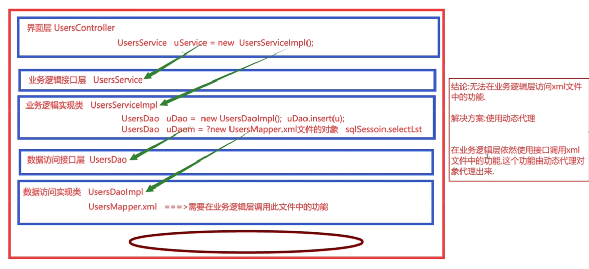
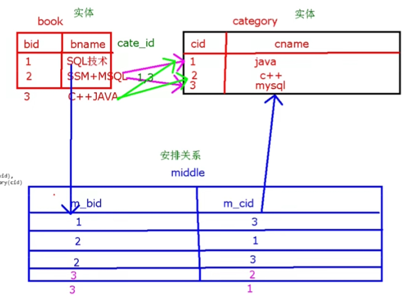
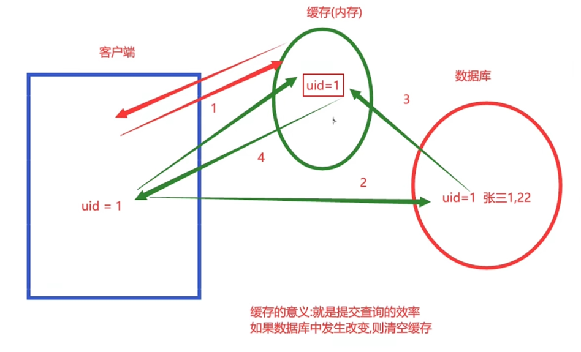

# ==Mybatis==

## 帮助官网

- https://mybatis.org/mybatis-3/
- 中文https://mybatis.net.cn/

## 三层架构

- 三层
  - 界面层(User Interface layer)
    - 接收用户请求（Servlet，展示用户处理结果（web界面和app）、
  - 业务逻辑层（Business Logic layer
    - 处理业务逻辑，从下层取得数据，为上层提供处理结果
  - 数据访问层（Data Access layer
    - 访问数据库，给上层提供数据
- 优点
  - 结构清晰，耦合度低，各层分工明确
  - 复用性、可维护性、可扩展性高
  - 有利于标准化

## 框架

- what
  - 半成品软件，封装了公共、重复的代码，帮助快速开发。具有可复用性、可扩展性

- SSM

  - Spring
    - 整合其他框架的框架，核心是IOC和AOP。

  - SpringMVC
    - spring家族的一员，专门优化控制器（Servlet），提供极简单数据提交、数据携带、页面跳转功能
    - 也是轻量级，代码无污染。优化控制层
    
  - Mybatis
    - 持久化存储，专注于sql语句。优化数据访问层

- mybatis
  - 减轻使用JDBC的复杂性，不用重复创建连接、关闭资源等，让开发者专注于编写SQL

## 配置步骤

- 创建一个表

```sql
create table st(
	id int(11) auto_increment primary key,
    name varchar(255) default null,
    email varchar(255) default null,
    age int(11) default null
)

//命令行运行能成功，可视化那个有待探索
//(name,eamil,age)可以用到自增主键，不能省略。否则要提供四个属性，不然报错。
insert into st(name,email,age) values ('tang','chuanmanqingmengyaxinghe','21');
insert into st(name,email,age) values ('wang','chunfengyouklvjiannanan','12');
```

- 添加依赖和资源路径

```xml
<dependencies>
    <dependency>
      <groupId>junit</groupId>
      <artifactId>junit</artifactId>
      <version>4.11</version>
      <scope>test</scope>
    </dependency>
    <!-- https://mvnrepository.com/artifact/org.mybatis/mybatis -->
    <dependency>
      <groupId>org.mybatis</groupId>
      <artifactId>mybatis</artifactId>
      <version>3.5.6</version>
    </dependency>

    <!-- https://mvnrepository.com/artifact/mysql/mysql-connector-java -->
    <dependency>
      <groupId>mysql</groupId>
      <artifactId>mysql-connector-java</artifactId>
      <version>8.0.22</version>
    </dependency>

  </dependencies>

  <build>
    <resources>
<!--   指定java目录下的配置也拷贝   -->
      <resource>
        <directory>src/main/java</directory>
        <includes>
          <include>**/*.xml</include>
          <include>**/*.properties</include>
        </includes>
      </resource>
    </resources>
  </build>

```

- 让数据库可视化
  - 在右侧Database中添加Data Source
  - User:root，Passwoed:beiyuan3721,Database:不用写(写beimysql好像也行）。测试下能否连接成功
  - QL图标可以书写SQL语句
  - 报错java.sql.SQLException: The server time zone value
    - mysql命令行下：set global time_zone='+8:00';
    - 是由于mysql驱动版本过高
  
- 创建mysql.properties
  
  - SqlMapConfig.xml中要用到
  
  ```properties
  driver=com.mysql.cj.jdbc.Driver
  url=jdbc:mysql://127.0.0.1:3306/beimysql
  username=root
  password=beiyuan3721
  ```

- 创建核心配置文件SqlMapConfig.xml
  - 放在resources下，名字好像无所谓?是的
- 创建配置StudentMapper.xml
  - 目前也放resources下吧
  - 完成sql编写，增删改查
- 创建JavaBean(Student)封装数据

```java
    private Integer id;//用封装类比较好？
    private String name;
    private String email;
    private Integer age;
    public Student(int id, String name, String email, int age) {}
    public Student( String name, String email, int age) {}//增加时可以不用id
    public Student() {}
	//再提供对应set，get等
```

## 基本使用

- SqlMapConfig.xml
  - 完成数据库基本配置


```xml
<?xml version="1.0" encoding="UTF-8" ?>
<!DOCTYPE configuration
        PUBLIC "-//mybatis.org//DTD Config 3.0//EN"

        "http://mybatis.org/dtd/mybatis-3-config.dtd">
<!--
.dtd文档类型定义。描述了当前xml文件的规范。如可以出现哪些标签，怎么使用
.xsd也差不多，是xml的
如
<!ELEMENT databaseIdProvider (property*)>
<!ATTLIST properties
resource CDATA #IMPLIED
url CDATA #IMPLIED
>
#()里是databaseIdProvider可以有的子标签.ATTLIST属性列表，如url

<!ELEMENT configuration (properties?, settings?,...)    这里还有先后顺序，如settings得出现在properties之后
-->
<configuration>
<!--  读取属性配置文件(mysql.properties)  resources:从资源目录下读取  url：绝对路径。从磁盘读取，如C盘之类-->
    <properties resource="mysql.properties"></properties>

<!--  配置数据库环境(连接信息)  -->

    <!--  可以有多套配置，不同时候可以选择不同配置  default="" 默认使用的-->
    <environments default="development">
        <!--    开发时    -->
        <environment id="development">
            <!--
            配置事务管理器
            type选项
                JDBC:程序员来控制事务
                MANAGED:由容器(如Spring)管理事务
            -->
            <transactionManager type="JDBC"/>
            <!--
            配置数据源
            type选项
                JNDI:java命名和目录接口，在服务端进行数据库连接池的管理
                POOLED:使用数据库连接池
                UNPOOLED:不使用
            -->
            <dataSource type="POOLED">
                <property name="driver" value="${driver}"/>
                <property name="url" value="${url}"/>
                <property name="username" value="${username}"/>
                <property name="password" value="${password}"/>
            </dataSource>
        </environment>

        <!--  在家  -->
        <environment id="home">
            <transactionManager type=""></transactionManager>
            <dataSource type=""></dataSource>
        </environment>

        <!--   上线-->
        <environment id="online">
            <transactionManager type=""></transactionManager>
            <dataSource type=""></dataSource>
        </environment>

    </environments>

<!--   注册mapper.xml  类->SqlMapConfig.xml->xxxMapper.xml->...    -->
    <!--  指定方式：resource,url,class.  class是动态代理下的 -->
    <mappers>
        <mapper resource="StudentMapper.xml"/>
    </mappers>
</configuration>
```

- StudentMapper.xml

```xml
<?xml version="1.0" encoding="UTF-8" ?>
<!DOCTYPE mapper
        PUBLIC "-//mybatis.org//DTD Mapper 3.0//EN"
        "http://mybatis.org/dtd/mybatis-3-mapper.dtd">

<!-- namespace:命名空间，用来区分不同mapper.xml文件-->
<mapper namespace="stu">
    <!--
    如查询全部学生信息
    函数形式:List<Student> getAll(){}
    selecct
        id:不同sql语句的标识
        resultType:结果集类型，如果是集合，则用泛型。底层通过反射创建JavaBean，所以要提供全限名称。一行数据一个对象
			如果是基本数据类型，可以不写

    -->
   <select id="getAll" resultType="org.example.Student" >
       select id,name,email,age from st
   </select>

    <!--
    传入参数
    Student getById(Integer id)
    可以写int，是Integer别名，映射为Java的Integer。
    #{id}中id名字可以乱写？
    -->
    <select id="getById" parameterType="int" resultType="org.example.Student">
        select id,name,email,age from st
        where id=#{id}
    </select>

    <!--
     模糊查询
     List<Student> getByName(String name)
     传递的字符串本身没有单双引号，like后面加上就好了

     #{}是占位符? PreparaedStatement，${}是字符串拼接 Statement
     此处只能是字符串拼接
     -->
    <select id="getByName" parameterType="String" resultType="org.example.Student">
        select id,name,email,age from st
        where name like '%${name}%'
    </select>

    <!--
    增删改不用手写返回值
    增加
    int insert(Student stu)
    values 对应的是Student中的属性
    -->
    <insert id="insertOne" parameterType="org.example.Student">
        insert into st(name,email,age) values(#{name},#{email},#{age})
    </insert>
</mapper>
```

- MybatisTest.java

```java
package org.example;
/**
 * @author: beiyuan
 * @className: MybatisTest
 * @date: 2022/6/14  9:47
 */
public class MybatisTest {
    @Test
    public void testStu() throws IOException {
        //使用输入流读取属性配置文件SqlMapConfig.xml
        InputStream in= Resources.getResourceAsStream("SqlMapConfig.xml");
        //创建SqlSessionFactory工厂
        SqlSessionFactory factory=new SqlSessionFactoryBuilder().build(in);
        //获取SqlSession对象。SqlSession是一个接口，定义了CRUD的一些方法，实现类是DefaultSqlSession。线程不安全
        SqlSession session=factory.openSession();
        //执行sql

        List<Student> list=session.selectList("stu.getAll");//通过List容器返回
        for(Student stu:list){
            System.out.println(stu);
        }

        Student student1=  session.selectOne("stu.getById",1);//单个
        System.out.println(student1);

        List<Student> list1=session.selectList("stu.getByName","ang");
        System.out.println();
        for(Student stu:list1){
            System.out.println(stu);
        }
        //关闭SqlSession
        session.close();
    }

    /*
    增删改查要手动提交事务
     */
    @Test
    public void testCRUD() throws IOException {
        InputStream in=Resources.getResourceAsStream("SqlMapConfig.xml");
        SqlSessionFactory factory=new SqlSessionFactoryBuilder().build(in);
        SqlSession session=factory.openSession();

        int res1=session.insert("stu.insertOne",new Student("libai","jingyesi",21));
        session.commit();
        session.close();
    }
}

```

## 优化

- 抽出重复的代码

- 注解优化测试类
  - 不能是其他方法，其他的用工具类吧
  - 因为@Before  @After是org.junit中的注解

```java
package org.example;
import org.junit.After;
import org.junit.Before;
import org.junit.Test;
/**
 * @author: beiyuan
 * @className: MybatisTest
 * @date: 2022/6/14  9:47
 */
public class MybatisTest {

    SqlSession session;
    
    @Before//每个测试方法执行前都会执行
    public void before() throws IOException {
        //使用输入流读取属性配置文件SqlMapConfig.xml
        InputStream in= Resources.getResourceAsStream("SqlMapConfig.xml");
        //创建SqlSessionFactory工厂
        SqlSessionFactory factory=new SqlSessionFactoryBuilder().build(in);
        //获取SqlSession对象
        session=factory.openSession();
    }

    @After//同理
    public void after(){
        //关闭SqlSession
        session.close();
    }
    @Test
    public void testStu() throws IOException {
        //执行sql
        List<Student> list=session.selectList("stu.getAll");//通过List容器返回
        for(Student stu:list){
            System.out.println(stu);
        }

    }

    /*
    增删改查要手动提交事务
     */
    @Test
    public void testCRUD() throws IOException {
        int res1=session.insert("stu.insertOne",new Student("libai","jingyesi",21));
        session.commit();//这里还是得手动提交
    }

```

- 给StudentMapper.xml中的类型注册别名

  - org.example.Student->Student

  - SqlMapperConfig.xml中

  ```xml
      <typeAliases >
      <!--  单个实体类注册。缺点：如果由几百张表，几百个实体类。。  -->
  <!--        <typeAlias type="org.example.Student" alias="Student"></typeAlias>-->
      <!--  批量注册,一般是没有名字冲突的采用吧。就是导入包  直接使用类名Student或student都行-->
          <package name="org.example"/>
      </typeAliases>
  ```


## 设置日志输出

- 可以看到底层SQL执行过程
- SqlMapConfig.xml

```xml
    <settings>
        <!--   输出日志到控制台   -->
        <setting name="logImpl" value="STDOUT_LOGGING"/>
    </settings>
```

 ## Mybatis动态代理

- 作用
  - 可以在三层架构中使用数据访问层的功能。上层调用接口
  - mapper.xml不能直接创建对象，但又想使用其功能，可以通过创建接口mapper.java的代理对象获取

- 结构
  - 以前：SqlMapConfig.xml、StusMapper.xml
  - 动态代理：SqlMapConfig.xml、StusMapper.xml、接口StusMapper.java




- 规范
  - mapper.java和mapper.xml放在同一目录
  - mapper.java和mapper.xml除了后缀，文件名一致
  - sql标签id值和接口方法名一致
  - paramterType值和方法参数一致
  - resultType值和方法返回值一致
  - namespace值是接口的完全限定名
  - SqlMapperConfig.xml注册时用：class=接口完全限定名

- 注意
  - mapper.java是数据访问层的接口，由mybatis提供代理实现类
  - 这么看，一个接口对应一个mapper

## 步骤

- 批量注册

```xml
   <mappers>
        <!--<mapper class="mybatisProxy.StusMapper" />-->
        <package name="mybatisProxy"/>
    </mappers>
```

- 按照上面规范写接口和mapper

  - StusMapper.java

  ```java
  public interface StusMapper {
      List<Student> getAll();
  }
  ```

  - StusMapper.xml

  ```xml
  <?xml version="1.0" encoding="UTF-8" ?>
  <!DOCTYPE mapper
          PUBLIC "-//mybatis.org//DTD Mapper 3.0//EN"
          "http://mybatis.org/dtd/mybatis-3-mapper.dtd">
  <!-- namespace:命名空间，用来区分不同mapper.xml文件-->
  <mapper namespace="mybatisProxy.StusMapper">
     <select id="getAll" resultType="Student" >
         select id,name,email,age from st
     </select>
  </mapper>
  ```

- 使用

```java
/*
以前
List<Student> list=session.selectList("stu.getAll");
现在
StusMapper mapper=session.getMapper(StusMapper.class);
List<Student>list=mapper.getAll();
*/

public class ProxyMybatisTest {
       SqlSession session;
       StusMapper mapper;
       @Before
    public void before() throws IOException {
        InputStream in= Resources.getResourceAsStream("SqlMapConfig.xml");
        SqlSessionFactory factory=new SqlSessionFactoryBuilder().build(in);
        session=factory.openSession();
        //获取动态代理对象
        mapper=session.getMapper(StusMapper.class);
    }

    @After
    public void after(){
        session.close();
    }

    @Test
    public void getAll(){
        //调用接口方法
        List<Student>list=mapper.getAll();
        for(Student stu:list){
            System.out.println(stu);
        }
    }
}
```

## #{}、${}以及参数

- #{}占位符，底层PreparedStatement，安全。解释为占位符?
- ${}字符串拼接，底层Statement,有SQL注入风险，常用于模糊查询、排序等

- parameterType
  - 单个简单类型(8种基本或封装+String)：{}中可以任意。
  - 实体类:{}中写字段名，且区分大小写（就都一样就行了）。

- 模糊查询
  - 解决sql注入

```sql
where name like '%${name}%'    #有sql注入风险
where name like concat('%',#{name},'%')    #解释为占位符where name like concat('%',?,'%')
```

## 方法多个参数

- 注解
  - 方法中多个参数时，不写parameterType。是数组也不写

```java
    //查找某属性=某值的列。@Param指定在数据库的列名
    List<Student> getByName(
            @Param("conlumnName") String conlumnName,
            @Param("conlumnValue") String conlumnValue
    );
    <select id="getByName" resultType="Student">
        select id,name,email,age from  st
        where ${conlumnName} like concat('%',#{conlumnValue},'%')
    </select>
   //名字要对应，此处只能$，字符串替换。换成#就查不到结果
```

- 位置参数

  - 有注解情况下

  ```sql
  Available parameters are [conlumnName, conlumnValue, param1, param2]
  ```

  - 无注解情况下

  ```sql
  Available parameters are [arg1, arg0, param1, param2]
  ```

  - where那里直接拿出来用就行了

  ```sql
      <select id="getByName" resultType="Student">
          select id,name,email,age from  st
          where ${arg1} like concat('%',#{arg0},'%')
      </select>
  ```

- Map
  
  - 和注解相比，不用手动定义，更简洁；和位置参数相比，参数名有明确语义

```java
//顺便处理下日期类。目前就只建库吧
create table stt (
    id int primary key auto_increment,
    name varchar(255),
    age date
);
insert into stt values
(1,'bei','2001-03-02'),
(2,'li','1994-03-02')

List<Student> getByMap(Map map);
//通过key来获取属性
<select id="getByMap" resultType="Student">
    select <include refid="allColumns"></include>#此处是下面的动态SQL定义的代码片段
    from stt
    where age between #{birthgin} and #{birthEnd}
</elect>

@Test
public void testGetByMap(){
    SimpleDateFormat sf=new SimpleDateFormat("yyyy-MM-dd");
    Date begin=sf.parse("1992-02-03");
    Date end=sf.parse("2010-01-02");
    Map map=new HashMap<>();
    map.put("birthBegin",begin);
    map.put("birthEnd",end);
    List<Student>list=mapper.getByMap(map);
}
```

## 主键

- 用与业务无关的id，如果用其他的不好控制不重复主键

- 获取上一条插入数据的id
  - 加了<selectKey>后，会把id写进入参Student stu对象并返回

```sql
select last_insert_id();

//在mapper.xml
//不加
<insert id="insert" parameterType="Student">
        insert into st (name,email,age) values (#{name},#{email},#{age})
</insert>
Student{id=null, name='Tartaglia', email='zhidong', age=18}
            
#加了后
#keyProperty中对应的值是实体类的属性，而不是数据库的字段
<insert id="insert" parameterType="Student">
        <selectKey keyProperty="id" resultType="int" order="AFTER">#主键属性、主键类型、执行插入前还是后
            select last_insert_id()
        </selectKey>
        insert into st (name,email,age) values (#{name},#{email},#{age})
    </insert>
Student{id=8, name='Tartaglia', email='zhidong', age=18}#每次插入，即使后面没有提交事务，也会是下一次id自增。。

#test.java
    @Test
    public void insert(){
        Student stu=new Student("Tartaglia","zhidong",18);
        mapper.insert(stu);
        session.commit();
        System.out.println(stu);
    }
```

- 若要唯一id

  - 一张表放不下这么多列数据，分表时主键id都自增的话可能重复
  - 用不同的id区分不同数据，否则出现覆盖、报错等情况
  - 用java的UUID类：全球唯一36位字符串.想怎么用就自己修剪

  ```java
  UUID uuid=UUID.randomUUID();
  System.out.println(uuid.toString());//f625f1a2-1d3d-4cc4-86ad-7ac2925154d3
  ```

  - 数据库中

  ```sql
  select uuid();#d9a3fecb-eca5-11ec-b662-3c7c3f1b96b1
  ```

## 动态SQL

- 有些逻辑写在业务逻辑层会比较复杂，在数据访问层写比较灵活
  - 提供定义代码片段，逻辑判断等功能
  - 通过相应标签完成功能
- 代码片段
  - 提高复用性


```xml
<!--  代码片段 sql和include -->
    <sql id="allColumns">
        id,name,email,age
    </sql>

    <select id="selAll" resultType="Student">
        select <include refid="allColumns"></include>
        from st
    </select>
```

- 条件

```xml
<!--  多条件判断  -->
    <select id="selCons" resultType="Student" parameterType="Student">
        select <include refid="allColumns"></include>
        from st
        <where>
            <!-- 模糊查询-->
            <if test="name !=null and name !=''">
                and name like concat('%',#{name},'%')
            </if>
            <!-- 等值查询-->
            <if test="age !=0">
                and age=#{age}
            </if>
        </where>
    </select>
	<!-- 有if成立则加上，没有则减去-->
	<!--select id,name,email,age from st WHERE name like concat('%',?,'%')-->
	<!--select id,name,email,age from st WHERE name like concat('%',?,'%') and age=?-->


<!--  条件更新  -->
    <!--旧的存在问题，如果某个值没有赋值，如name，则会被更新为null。2,null,null,21
-->
    <update id="updateNor" parameterType="Student">
        update st set name =#{name},email=#{email},age=#{age}
        where id=#{id}
    </update>

    <update id="updateCons" parameterType="Student">
        update st
        <set>
            <!--所以先判读有没有值-->
            <if test="name!=null and name!=''">
                name=#{name},
            </if>
            <if test="email!=null and email!=''">
                email=#{email},
            </if>
            <if test="age!=0">
                age=#{age}
            </if>
        </set>
        where id=#{id}
    </update>
	<!--新旧至少要更新一列，否则报错-->
	<!--正常update st SET name=?, email=?, age=? where id=?-->
    <!--一列都不更新，如只给了id。update st where id=?      set字都没有了-->
```

- 遍历批量处理
  - 是传入的参数有多个
  
  ```xml
  	List<Student> getByIds(Integer []arr);
  	<!--  查询多个指定id的学生信息  -->
  	<select id="getByIds" resultType="Student">
  	    select <include refid="allColumns"></include>
  	    from st
  	    where id in
  	        <foreach collection="array" item="id" separator="," open="(" close=")">
  	            #{id}
  	        </foreach>
  	</select>
  //<foreach>参数
  collection:传入的集合类型。List则写list，Map则map，数组则array
      例如是list，map，则用.来访问字段，如item='stu' stu.age
  item：名字随意，遍历的元素
  separator：每次遍历的分隔符
  open：遍历前增加的字符
  close：遍历后增加的字符
  这些参数来实现sql语句的拼接
  ```
  
  - 批量增加、删除、查不用设置什么
  
    - 因为这三个都是在一条语句内，即使改变了多条数据
  
  - 而批量更新要设置一个参数
  
    - 一个update的sql语句只能更新一条，所以这里的<foreach>的分隔符是";"来形成多条语句。也就是说是多条语句更新 了多条记录。要设置参数允许多行操作
    - mysql.properties
      - 有些参数有秒用如：&characterEncoding=utf-8
  
    ```properties
    driver=com.mysql.cj.jdbc.Driver
    url=jdbc:mysql://127.0.0.1:3306/beimysql
    username=root
    password=beiyuan3721
    &allowMultiQueries
    ```
  
    - StudentMapper.xml
  
  ```xml
  <update id="updateSet">
  	<foresch collection="list" item="stu" separator=";">//注意这里是分号，一个分号代表一个sql语句的结束
          update st
          <set>
          	...
          </set>
          where id=#{stu.id}
      </foresch>
  </update>
  ```

## 返回值是Map

- 应用，如：多张表，每张都返回一点数据，这时就无法用实体类封装了
- 一行

```xml
//单行
Map getMap(Integer id);
//多行
List<Map> getMaps();

<!--  单行用Map  -->
    <select id="getMap" resultType="map" parameterType="int">
        select name,age
        from st
        where id=#{id}
    </select>
/*
已经放map.put好了，直接拿出来用
Map map=mapper.getMap(2);
System.out.println(map);
结果
没有空值则：{name=tang, age=21}
当name=null：{age=21}
*/

<!--  多行用List<Map>  -->
    <select id="getMaps" resultType="map">
        select name,age
        from st
    </select>
//结果
   	{name=tang, age=21}
	{age=21}
	{name=libai, age=21}
	{name=Kazuha, age=21}
	{name=Tartaglia, age=18}
```

## 字段和列名不一致

- 更准确来说是set方法名和列名不一致
- 列名是否匹配
  - insert into st values(#{name},#{email},#{age})      //No，不是全列名要指定
  - insert into st (name,email,age) values(#{name},#{email},#{age})       //Ok，提供了全列名。即使没有setId
  - insert into st values(2,#{name},#{email},#{age})     //Ok，即使没有提供setId(当时实体类连id字段都忘了设置)


```xml
<!--
	List<Book> getAll();
	实体类
		private Integer id;
		private String name;
		本质上是调用set方法赋值，所以得是setId(),setName().
		若是setBookid(),setBookname()则还是能拿到数据
	数据库
		bookid
		bookname
	不匹配导致拿到的实体对象的属性为null
-->
<!--1.取别名-->
<select id="getAll" resultType="Book">
	select bookid id,bookname,name
    from book
</select>

<!--2.使用resultMap做字段和列名得映射-->
<!-- 映射  -->
	<!--property是实体类中字段名，column是数据库列名或取的别名-->
    <resultMap id="bookMap" type="book">#type是实体类
        <!--主键用id标签-->
        <id property="id" column="bookid"></id>
        <!--其他字段用result标签-->
        <result property="name" column="bookname"></result>
    </resultMap>
<!--  使用  -->
    <select id="getAll" resultMap="bookMap">
        select bookid,bookname
        from book
    </select>
```

## 关联关系

- 一对多（连接表

  - 一个客户可以下一个订单，一个订单只属于一个客户

  ```sql
  cerate table customer(
  	id int primary key auto_increment,
      name varchar(255),
      age int 
  );
  insert into customer values 
  (1,'zhangsan',22),
  (2,'lisi',21),
  (3,'wangwu',23)
  
  creater table orders(
  	id int primary key auto_increment,
      number varchar(255),
      price double,
      customer_id int,
      foreign key(customer_id) references customer(id)
  );
  
  insert into orders values 
  (11,20,22,22.1,1),
  (12,60,3.2,1),
  (13,31,45.3,2)
  ```

  - 查找用户和其订单

    - sql

    ```sql
    select c.id cid,name,age,o.id oid,number,price,customer_id
    from customer c left join orders o on c.id=o.customer_id
    where c.id=1
    #此处应该用了left join。用inner join得话会出现如果没有订单，则也查不到该用户
    ```

    - mybatis

      - 用collection标签
      - 实体类

      ```java
      //客户类
      public class Customer{
          //自己得字段
          private Integer id;
          private String name;
          private Integer age;
          //名下得订单
          private List<Order> orlist;
          ...四个字段对应得set和get
      }
      //订单类
      public class Order{
          private Integer id;
          private String number;
          private Double price;
          
          private Customer customer;
          ...对应set和get
      }
      ```

      - mapper.xml

      ```xml
      <!--
      	用resultMap指定列名和字段得关系
      	Customer getById(Integer id);
      -->
      	<resultMap id="cusMap" type="Customer">
      		<!--主键绑定-->
              <id property="id" column="cid"></id>
              <!--非主键绑定-->
              <result property="name" column="name"></result>
              <result property="age"  column="age"></result>
              <!--一对多列表映射-->
              <collection property="orList" ofType="Order">
              	<id property="id" column="oid"></id>
                  <result property="number" column="number"></result>
                  <result property="price" column="price"></result>
              </collection>
      	</resultMap>
      	<select id="getById" paramterType="int" resultMap="cusMap">
      		select c.id cid,o.id oid,name,age,number,price 
              from customer c left join orders on c.id=o.customer_id
              where c.id=#{id}
      	</select>
      ```

- 一对多（子查询

  - 设置collection得select属性完成另一个实体类的赋值

  ```xml
  	<resultMap id="cusMap" type="Customer">
          <id property="id" column="cid"></id>
          <result property="name" column="name"></result>
          <result property="age"  column="age"></result>
          <!--column表示从上一个select标签传来的值。select * from customer where id=#{id}中的第二个id-->
          <collection property="orList" ofType="Order" column="id" select="getOrder"></collection>
  	</resultMap>
  
  	<select id="getById" paramterType="int" resultMap="cusMap">
  		select * from customer where id=#{id}
  	</select>
  	<select id="getOrder" paramterType="int" resultType="Order">
  		select * from order where customer_id=#{id}
  	</select>
  ```

  - 改进

    - 通常一个mapper.xml只对一个表操作，方便管理。所以可以引用其他mapper的select语句

    - 通过包名.mapper.selectid来引用

    ```xml
    <collection property="orList" ofType="Order" column="id" select="demo.OrderMapper.getOrder"></collection>
    //其中OrderMapper.xml中有
    <select id="getOrder" ...
    ```

- 多对一

  - 用association标签
  - 数据和一堆多时一样

  ```xml
  <!--
  	Order getById(Ingeter id);
  -->
  	<resultMap id="orMap" type="Order">
  		<id property="id" column="o.id"></id>
          <result property="number" column="number"></result>
          <result ptoperty="price" column="price"></result>
          <association property="customer" javaType="Customer">
          	<id property="id" column="c.id"></id>
              <result property="name" column="name"></result>
              <result property="age" column="age"></result>
          </association>
  	</resultMap>
  	<select id="getById" paramteType="int" resultMap="orMap">
          select o.id oid,c.id cid name,age,number,price 
          from orders o  inner join customer o  on o.id=c.id     //如果订单存在，则一定存在其客户，故用默认内连接即可
          where o.id=#{id}
  	</select>
  ```

- 多对多

  - 转化为多对一
  - 或者用中间表来描述映射关系

  

- 总结
  - collection和association标签来指定其他表列名得映射，可以嵌套。
    - 是集合用collection，是单个实体用association

## 缓存

- 将用户经常查询的数据放入缓存(内存,再次查询则不用从磁盘的关系数据文件中读取,用于提高查询效率(只是查询),提高了性能
- 缓存流程
  - 从缓存中找,找得到则拿.否则从数据库中查询,放入缓存,返回给用户
  - 缓存中的数据不属于数据库,是java的对象
  - 
  - 如果数据表发生了改变,发生了commit操作(一般增删改),则清空缓存,因为更新缓存代价较大.
- 各级缓存
  - 一级缓存
    - 使用SqlSession作用域,同一个sqlSession公用一个
    - mybatis默认开启
  - 二级缓存
    - 使用mapper作用域,可被多个sqlSession共享

- 验证一级缓存

```java
    @Test
    public void testGetOt(){
        Student stu=mapper.getOt(1);
        System.out.println(stu);

        System.out.println("==================");
        Student stu1=mapper.getOt(1);
        System.out.println(stu1);
        System.out.println(stu.equal(stu1));
    }

//第一次打印了数据库操作的相关信息,第二次没有.而且得到的是同一对象
Opening JDBC Connection
Created connection 1306246648.
Setting autocommit to false on JDBC Connection [com.mysql.cj.jdbc.ConnectionImpl@4ddbbdf8]
==>  Preparing: select id,name,age,email from st where id=?
==> Parameters: 1(Integer)
<==    Columns: id, name, age, email
<==        Row: 1, tang, 21, chuanmanqingmengyaxinghe
<==      Total: 1
Student{id=1, name='tang', email='chuanmanqingmengyaxinghe', age=21}
==================
Student{id=1, name='tang', email='chuanmanqingmengyaxinghe', age=21}
true
```

- 开启二级缓存步骤

  ````xml
  //SqlMapConfig.xml中增加
  <settings>
  	<setting name="cacheEnabled" value="true"></setting>
  </settings>
  
  //具体的mapper.xml中增加
  <mapper namespace="mybatisProxy.StusMapper">
      	<cache></cache>
  </mapper>
  
  //实体类实现serializable接口,可序列化
  ````

## ORM

- Object Relational Mapping 对象关系映射
  - 以面向对象方式处理数据,以数据库关系表的方式存取数据
  - 说的是对象的成员变量和表的列名的映射
  - mybatis是ORM做得非常优秀的框架

# ==mybatis-plus==

## 配置

- 目前创建的是quickstart
- 引入依赖

```xml
<parent>
    <groupId>org.springframework.boot</groupId>
    <artifactId>spring-boot-starter-parent</artifactId>
    <version>2.3.12.RELEASE</version>
  </parent>
 <dependencies>
    <dependency>
      <groupId>org.springframework.boot</groupId>
      <artifactId>spring-boot-starter</artifactId>
    </dependency>
    <dependency>
      <groupId>org.springframework.boot</groupId>
      <artifactId>spring-boot-starter-test</artifactId>
      <scope>test</scope>
    </dependency>
    <dependency>
      <groupId>com.baomidou</groupId>
      <artifactId>mybatis-plus-boot-starter</artifactId>
      <version>3.5.1</version>
    </dependency>
    <dependency>
      <groupId>org.projectlombok</groupId>
      <artifactId>lombok</artifactId>
      <optional>true</optional>
    </dependency>
    <dependency>
      <groupId>mysql</groupId>
      <artifactId>mysql-connector-java</artifactId>
      <scope>runtime</scope>
    </dependency>
  </dependencies>
```

- application.yaml中配置数据源

```yaml
spring:
  datasource:
    url: jdbc:mysql://localhost:3306/beimysql?serverTimezone=GMT%2B8
    username: root
    password: beiyuan3721
    driver-class-name: com.mysql.cj.jdbc.Driver
  configuration:
    log-impl: org.apache.ibatis.logging.stdout.StdOutImpl   #添加日志到控制台（还可以到其他
```

## 代码生成器

- 安装MybatisX插件->idea连接数据库->选中某张表右键->MybatisX Generator->...
  - 可以生成entity、mapper、service层的对象以及mapper.xml
  - 如果module path发生了变更，要在后面一步点击小圆圈刷新下，否则不会放在新的目录

## MybatisX生成sql

- 步骤
  - mapper接口写方法名getOneByUsername			(有小鸟图标的都是可以生成的)
  - Alt+回车
  - [MybatisX]Generate Mybatis Sql

## 注意点

- @Data提供了无参，set，get，hashcode，equal，tostring，canequal，没有有参构造。可以在target目录反编译.class文件中查看
- service层的saveXXX功能：id同则修改，没有id则新增
- mapper没有values()对应的一条sql插入多条数据的方法：实际业务中一次新增很多条数据，这样一条sql太长了。service的批量插入是多次调用mapper层的insert方法（一次插入一条数据
- 逆向工程是不是自动生成代码？