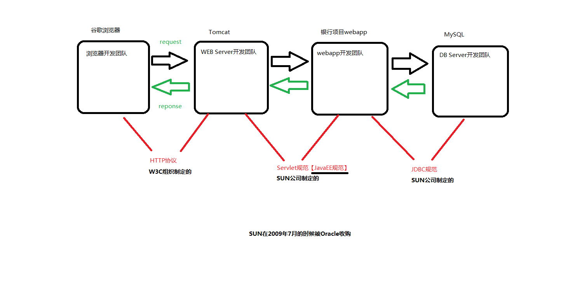

# ==Servlet==

## Servlet（Server Applet）

- Servlet技术上没有过时，应用上过时了
- 简介
  - Java的Servlet是一个基于Java语言的Web组件，它提供了接收和响应HTTP请求的标准接口
  - Servlet运行在服务器端，用于生成动态内容，处理来自Web客户端（如浏览器）的请求，并向客户端返回响应
  - 狭义：java语言实现的一个接口
  - 广义：任何实现了Servlet接口的类
- 特性
  - 可移植性：由于Servlet是用Java编写的，因此它们具有跨平台的特性，可以在任何支持Java的Web服务器或应用服务器上运行。
  - 生命周期管理：Servlet具有明确的生命周期，包括加载、初始化、服务请求、销毁等阶段，这些阶段由Web容器（如Tomcat、Jetty）自动管理。

  - 多线程支持：Servlet容器可以为每个请求创建一个新的线程，或者复用线程池中的线程，以并发处理多个请求，从而提高了服务器的响应能力和效率。

  - 请求和响应处理：Servlet通过`HttpServletRequest`对象接收客户端请求，该对象包含了所有请求信息，如请求参数、HTTP头等。处理完请求后，Servlet使用`HttpServletResponse`对象来构建并发送响应给客户端。

  - 可配置性和灵活性：Servlet可以通过Web应用的部署描述符（web.xml）或注解来配置，包括URL映射、初始化参数等，这为Web应用的部署和管理提供了灵活性。

  - 过滤器和监听器支持：Servlet规范还包括了Servlet过滤器（Filter）和监听器（Listener），它们可以用来拦截请求、响应处理过程，或者监听ServletContext、Session、ServletRequest等对象的生命周期事件，从而实现了更细粒度的控制和扩展功能。
- Spring MVC的核心控制器是`DispatcherServlet`，一个前端控制器，是框架的入口点，负责拦截所有进入的HTTP请求，并根据请求的具体情况分发给合适的处理器（Controller）进行处理

## 软件系统架构

- C/S架构(Client/Server--客户端-服务器 
  - 优点
    - 速度快--大量数据已经在客户端
    - 界面酷炫
      - 专门语言去写，更加灵活
    - 服务器压力小
    - 安全
      - 数据在客户端有缓存，服务器崩了也影响不大
  - 缺点
    - 升级维护难
      - 每个客户端都要更新
- B/S架构(Browser/Server) --浏览器-服务器
  - 优点
    - 升级维护方便
      - 只需要升级浏览器即可
    - 不需要下载特定的客户端
  -  缺点
    - 速度慢
    - 体验差
       - Browser只支持三种语言
    - 不安全
       - 服务器崩溃了就没了

## 服务器软件

- Web服务器
  - 实现了JavaEE的Servlet和Jsp两个核心规范
  - TomCat
  - Jetty

- 应用服务器
  
- 实现了JavaEE的所有规范（13个）
  - Jboss

  - WebLogic

  - WebSphere
  
- 应用服务器包含了Web服务器
  
  - Jboss内嵌了一个TomCat服务器
  
- TomCat（又名Catalina)
     - Apche旗下，免费开源的轻量级服务器，体积小，运行速度快
     - java语言编写
     - 作者在该风景秀丽的岛Catalina上开发了该服务器
     
- Tomcat服务器要想运行，需要先有jre，所以要先安装JDK，配置java运行环境

     ```java
     // 下载
     Apache官网下载Core-Zip，直接解压即可
     放在了C:\Program Files\Java中
     	
     // apache-tomcat目录介绍
     	bin：命令文件存放
     		如启动TomCat，关闭TomCat
     	conf：配置文件
     		如server.xml中可以配置端口号，默认为8080
     	lib：核心程序目录
     		jar包中都是.class文件
     	logs：日志目录
     	temp：临时目录
     	webapps：存放webapp
     	work：存放jsp文件翻译后的Java文件以及编译后的class文件
     
     // 启动/关闭
     	使用时可以不带.bat
     	bin目录下的start.bat或者start.sh
     		start.bat调用catalina.bat。catalina.bat执行Bootstrap.java的mian方法
     	shutdown.bat和shutdown.sh
     		由于shutdown是windows的关机命令，可以改为stop.bat
         
     // 访问
     	http://127.0.0.1:8080
     	localhost:8080
     
     // 编写webapp
     	webapps目录下一个目录代表一个app
     	超链接中的ip和端口号可以省略
     		如："http://127.0.0.1:8080/oa/login.html"可以写为"/oa/login.html"
     
     // TomCat中流不需要刷新和关闭，由TomCat服务器来维护。不好说，有待验证
     如flush()、close()
     
     
     // 日志存放路径
     C:\Program Files\Java\apache-tomcat-10.0.16\logs
     ```


## 资源

- 一个路径代表一个资源
- 可能是静态。或者动态资源（Java小程序）
- 请求路径和Servlet之间有对应关系

##  协议



## JavaEE版本

- 如果你之前的项目还是在使用javax.servlet.Servlet，那么你的项目无法直接部署到Tomcat10+版本上。
- 你只能部署到Tomcat9-版本上。在Tomcat9以及Tomcat9之前的版本中还是能够识别javax.servlet这个包。
## Servlet对象生命周期

- Servlet对象由Web Container来维护

  - Tomcat服务器也被称为Web容器
  - 创建、调用、销毁等由Tomcat来管理
  - Web容器底层维护一个HashMap存储请求路径和Servlet对象的映射关系
    - 如key=/sutdent			value=ServletList对象

  - 自己手动new的Servlet对象不受Tomcat管理

- 服务器启动时不会创建Servlet对象，只有对响应路径发送了请求才创建。减少了内存开销
  - 怎么让服务器启动的时候创建Servlet对象呢？
  - 在servlet标签中添加<load-on-startup>子标签，在该子标签中填写整数，越小的整数优先级越高。

```xml
<servlet>
    <servlet-name>aservlet</servlet-name>
    <servlet-class>com.bjpowernode.javaweb.servlet.AServlet</servlet-class>
    <load-on-startup>0</load-on-startup>
</servlet>
<servlet-mapping>
    <servlet-name>aservlet</servlet-name>
    <url-pattern>/a</url-pattern>
</servlet-mapping>
```

- 生命周期
  - 默认情况下服务器启动的时，Servlet对象并没有被实例化
  - 用户发送第一次请求的时

	```java
	Servlet无参数构造方法执行了				//调用无参数构造方法。创建对象
	Servlet's init method execute!		   //执行init，完成初始化。此时已经存在对象
	Servlet's service method execute!		//执行service，提供服务
	```

	- 用户每发送一次请求都执行一次service()
	- 服务器关闭时，调用destory()方法，此时对象还存在。destory()执行结束后，内存被Tomcat释放
	
- 是假单例模式。对象只有一个，但是构造方法不是私有化

## init()和无参构造

- 当我们Servlet类中编写一个有参数的构造方法，没有无参数的构造方法时。会导致出现500错误，无法实例化Servlet对象
- 能代替吗
  - Servlet规范中有要求，作为javaweb程序员，编写Servlet类的时候，不建议手动编写构造方法，因为编写构造方法，很容易让无参数构造方法消失，这个操作可能会导致Servlet对象无法实例化。所以init方法是有存在的必要的。
- 什么时候使用init方法
  - 很少用
  - 通常在init方法当中做初始化操作，并且这个初始化操作只需要执行一次。例如：初始化数据库连接池，初始化线程池....
- 什么时候使用init方法
  - 也是很少用
  - 关闭资源等

## 适配器模式改造Servlet

- Servlet的实现类只有2个
  - All Known Implementing Classes:GenericServlet`, `HttpServlet

- 背景
  - 通常只需要service方法，其他方法大部分情况下是不需要使用的。
  - 为了不每次都要实现其他四个方法，代码更加简洁优雅
- 编写GenericServlet类。
  - 实现Servlet接口除service的四个方法。
  - 将service设为抽象方法
  - 子类继承GenericServlet类，只实现service即可

```java
public abstract class GenericServlet implements Servlet{
    //transient 修饰后不可序列化
    private transient ServletConfig config;//为了保留init中的参数(局部变量)servletConfig
    
    //final不希望重写。因为重写后有可能忘了设置config。出现null引用异常
    public final void init(ServletConfig servletConfig) throw ServletException{//有ServletConfig参数的一定会被Tomcat执行
        this.config=servletConfig;
        this.init();//提供可能
    }
    
    //留一个不同参数的给子类重写
    public void init() throw ServletException{
        
    }
    
    public abstract void service(ServletRequest request,ServletResponse response)
        throw ServletException,IOException;
    
    public ServletConfig getServletConfig(){//拿到ServletConfig的信息
        return config;
    }
    ... 
}
```

- Tomcat服务器伪代码
  - 这些类都是Servlet规范里的。Tomcat只是实现
```java
public class Tomcat {
        public static void main(String[] args){
            // .....
            // Tomcat服务器伪代码
            // 创建LoginServlet对象（通过反射机制，调用无参数构造方法来实例化LoginServlet对象）
            Class clazz = Class.forName("LoginServlet");
            Object obj = clazz.newInstance();
            
            // 向下转型
            Servlet servlet = (Servlet)obj;
            
            // 创建ServletConfig对象
            // Tomcat服务器负责将ServletConfig对象实例化出来。
            // 多态（Tomcat服务器完全实现了Servlet规范）
            ServletConfig servletConfig = new org.apache.catalina.core.StandardWrapperFacade();
            
            // 调用Servlet的init方法
            servlet.init(servletConfig);//调用的是有参的、不希望重写的那个
            
            // 调用Servlet的service方法
            // ....
            
        }
    }
```

## ServletConfig

- 什么是ServletConfig？
  - Configuration
  - Servlet对象的配置信息对象。
  - ServletConfig对象中封装了<servlet></servlet>标签中的配置信息。（web.xml文件中servlet的配置信息）

- 相关

  - Tomcat解析web.xml文件，将<servlet></servlet>标签的配置信息封装到ServletConfig对象中
  - Tomcat服务器调用Servlet对象的init方法的时候需要传一个ServletConfig对象的参数给init方法

  - ServletConfig接口的实现类是Tomcat服务器提供

  - 一个Servlet对象对应有一个ServletConfig对象。

- 配置信息

```xml
<servlet>
        <servlet-name>conf</servlet-name>
        <servlet-class>ServletConfig02</servlet-class>

        <init-param>
            <param-name>driver</param-name>
            <param-value>com.mysql.cj.jdbc.Driver</param-value>
        </init-param>

    </servlet>
```


- 获取信息

```java
//继承GenericServlet类后
ServletConfig conf=this.getServletConfig();

//获取配置信息
String driver=conf.getInitParameter("dirver");
//也可以直接通过this调用。因为GenericServlet实现了ServletConfig接口
String driver=this.getInitParameter("dirver");
/*
public ServletContext getServletContext() {
        return this.getServletConfig().getServletContext();
    }//所以调用的是同一个
*/
```

## ServletContext

- Servlet上下文（Servlet的四周环境对象）。也叫应用域
  - 一个webapp对应一个ServletContext对象，通常对应web.xml文件
  - 封装了全局配置信息。所有Servlet对象都可以访问
- 用来存放全局数据
  - 数据量小、所有用户共享、又不修改，这样的数据放到ServletContext这个应用域当中，会大大提升效率。
  - 因为应用域相当于一个缓存，放到缓存中的数据，用的时候，不需要从数据库中再次获取

- 配置信息

```xml
    <context-param>
        <param-name>pageSize</param-name>
        <param-value>10</param-value>
    </context-param>
```

- 获取信息

```java
ServletContext application=this.getServletContext();
String pageSize=application.getInitParameter("pageSize");
```

- 存储数据

```java

public void setAttribute(String name, Object value); // map.put(k, v)

public Object getAttribute(String name); // Object v = map.get(k)

public void removeAttribute(String name); // map.remove(k)
```

- 其他信息

```java
public String getContextPath();//webapp的根路径。可以不写死

public String getRealPath(String path);// 通过相对路径获取文件的绝对路径（真实路径）。文件IO

/*
通过ServletContext对象也是可以记录日志的。存放在CATAKINA_HOME/logs
IDEA的Tomcat是一个副本，所以CATAKINA_HOME是
C:\Users\beilinanju\AppData\Local\JetBrains\IntelliJIdea2020.1\tomcat\Tomcat_9_0_60_Servlet\logs
*/
/*
日志文件
catalina.2021-11-05.log 服务器端的java程序运行的控制台信息。
localhost.2021-11-05.log ServletContext对象的log方法记录的日志信息存储到这个文件中。
localhost_access_log.2021-11-05.txt 访问日志
*/
public void log(String message);
public void log(String message, Throwable t);
```

## 缓存机制

- 向ServletContext应用域中存储数据，也等于是将数据存放到缓存cache当中了。
- 堆内存当中的字符串常量池。
  - "abc" 先在字符串常量池中查找，如果有，直接拿来用。如果没有则新建，然后再放入字符串常量池。
- 堆内存当中的整数型常量池。
  - [-128 ~ 127] 一共256个Integer类型的引用，放在整数型常量池中。没有超出这个范围的话，直接从常量池中取。
- 连接池(Connection Cache)
  - 这里所说的连接池中的连接是java语言连接数据库的连接对象：java.sql.Connection对象。
  - JVM是一个进程。MySQL数据库是一个进程。进程和进程之间建立连接，打开通道是很费劲的。是很耗费资源的。怎么办？可以提前先创建好N个Connection连接对象，将连接对象放到一个集合当中，我们把这个放有Connection对象的集合称为连接池。每一次用户连接的时候不需要再新建连接对象，省去了新建的环节，直接从连接池中获取连接对象，大大提升访问效率。
  - 连接池
    - 最小连接数
    - 最大连接数
    - 连接池可以提高用户的访问效率。当然也可以保证数据库的安全性。
- 线程池
  - Tomcat服务器本身就是支持多线程的。
  - Tomcat服务器是在用户发送一次请求，就新建一个Thread线程对象吗？
    - 当然不是，实际上是在Tomcat服务器启动的时候，会先创建好N多个线程Thread对象，然后将线程对象放到集合当中，称为线程池。用户发送请求过来之后，需要有一个对应的线程来处理这个请求，这个时候线程对象就会直接从线程池中拿，效率比较高。
    - 所有的WEB服务器，或者应用服务器，都是支持多线程的，都有线程池机制。
- redis
  - NoSQL数据库。非关系型数据库。缓存数据库。
- mongoDB

## 模板方法

- 定义核心的算法骨架，具体的实现步骤可以延迟到子类中实现
- 什么是设计模式？
  - 某个问题的固定的解决方案。(可以被重复使用)
- 核心算法通常是final(也可以不是)。有(抽象)方法给子类实现

```java
public abstract class Person{
    //final防止覆盖了核心算法被覆盖，得到了保护，提高了代码的复用性
    public final void day(){//固定的步骤
        //首先
        qiChuang();
        
        //第二步
        chiZao();
        
        //第三步
        doSome();
        
        //第四步
        chiWan();
        
        //最后
        goBed();
    }
    
    //子类的某些行为是相同的，可以先在模板类中定义，得到复用
    public void qiChuang(){}
    public void chiZao(){}
   	
    //具体的步骤留给子类实现
    public abstract doSome();
    
    public ...
}
```

## HttpServlet源码分析

```java
// HttpServlet模板类。
public abstract class HttpServlet extends GenericServlet {//init方法在GenericServlet
    // 用户只要发送一次请求，这个service方法就会执行一次。
    @Override
    //req和res传递进来时本身是由Tomcat创建的HttpServletRequest，HttpServletResponse。只不过是用父类引用创建的吧
    public void service(ServletRequest req, ServletResponse res)
        throws ServletException, IOException {

        HttpServletRequest  request;
        HttpServletResponse response;

        try {
            // 将ServletRequest和ServletResponse向下转型为带有Http的HttpServletRequest和HttpServletResponse
            //为什么可以向下转型？？？只是对引用向下转而已
            request = (HttpServletRequest) req;
            response = (HttpServletResponse) res;
        } catch (ClassCastException e) {
            throw new ServletException(lStrings.getString("http.non_http"));
        }
        // 调用重载的service方法。
        service(request, response);
    }
    
    // 这个service方法的两个参数都是带有Http的。
    // 这个service是一个模板方法。
    // 在该方法中定义核心算法骨架，具体的实现步骤延迟到子类中去完成。
    protected void service(HttpServletRequest req, HttpServletResponse resp)
        throws ServletException, IOException {
        // 获取请求方式
        // 这个请求方式最终可能是：""
        // 注意：request.getMethod()方法获取的是请求方式，可能是七种之一：
        // GET POST PUT DELETE HEAD OPTIONS TRACE
        String method = req.getMethod();

        // 如果请求方式是GET请求，则执行doGet方法。
        if (method.equals(METHOD_GET)) {
            long lastModified = getLastModified(req);
            if (lastModified == -1) {
                // servlet doesn't support if-modified-since, no reason
                // to go through further expensive logic
                doGet(req, resp);
            } else {
                long ifModifiedSince;
                try {
                    ifModifiedSince = req.getDateHeader(HEADER_IFMODSINCE);
                } catch (IllegalArgumentException iae) {
                    // Invalid date header - proceed as if none was set
                    ifModifiedSince = -1;
                }
                if (ifModifiedSince < (lastModified / 1000 * 1000)) {
                    // If the servlet mod time is later, call doGet()
                    // Round down to the nearest second for a proper compare
                    // A ifModifiedSince of -1 will always be less
                    maybeSetLastModified(resp, lastModified);
                    doGet(req, resp);
                } else {
                    resp.setStatus(HttpServletResponse.SC_NOT_MODIFIED);
                }
            }

        } else if (method.equals(METHOD_HEAD)) {
            long lastModified = getLastModified(req);
            maybeSetLastModified(resp, lastModified);
            doHead(req, resp);

        } else if (method.equals(METHOD_POST)) {
            // 如果请求方式是POST请求，则执行doPost方法。
            doPost(req, resp);

        } else if (method.equals(METHOD_PUT)) {
            doPut(req, resp);

        } else if (method.equals(METHOD_DELETE)) {
            doDelete(req, resp);

        } else if (method.equals(METHOD_OPTIONS)) {
            doOptions(req,resp);

        } else if (method.equals(METHOD_TRACE)) {
            doTrace(req,resp);

        } else {
            //
            // Note that this means NO servlet supports whatever
            // method was requested, anywhere on this server.
            //

            String errMsg = lStrings.getString("http.method_not_implemented");
            Object[] errArgs = new Object[1];
            errArgs[0] = method;
            errMsg = MessageFormat.format(errMsg, errArgs);

            resp.sendError(HttpServletResponse.SC_NOT_IMPLEMENTED, errMsg);
        }
    }
    
    
    protected void doGet(HttpServletRequest req, HttpServletResponse resp)
        throws ServletException, IOException{
        // 报405错误
        String msg = lStrings.getString("http.method_get_not_supported");
        sendMethodNotAllowed(req, resp, msg);
    }
    
    protected void doPost(HttpServletRequest req, HttpServletResponse resp)
        throws ServletException, IOException {
        // 报405错误
        String msg = lStrings.getString("http.method_post_not_supported");
        sendMethodNotAllowed(req, resp, msg);
    }
    
}

/*
通过以上源代码分析：
	假设前端发送的请求是get请求，后端程序员重写的方法是doPost
	假设前端发送的请求是post请求，后端程序员重写的方法是doGet
	会发生什么呢？
		发生405这样的一个错误。（因为调用的是父类HttpServlet的doGet或doPost）
		405表示前端的错误，发送的请求方式不对。和服务器不一致。不是服务器需要的请求方式。
	
	通过以上源代码可以知道：只要HttpServlet类中的doGet方法或doPost方法执行了，必然405.

怎么避免405的错误呢？
	后端重写了doGet方法，前端一定要发get请求。
	后端重写了doPost方法，前端一定要发post请求。
	这样可以避免405错误。
	
	这种前端到底需要发什么样的请求，其实应该后端说了算。后端让发什么方式，前端就得发什么方式。
	
有的人，你会看到为了避免405错误，在Servlet类当中，将doGet和doPost方法都进行了重写。
这样，确实可以避免405的发生，但是不建议，405错误还是有用的。该报错的时候就应该让他报错。
如果你要是同时重写了doGet和doPost，那还不如你直接重写service方法好了。这样代码还能
少写一点。
*/
```

## HttpServletRequest接口

- 简介
  - HttpServletRequest接口的实现类由Tomcat写的，并创建实现类的对象。
    - 实现类RequestFacade:out.write(request);//org.apache.catalina.connector.RequestFacade
  - 用户发送请求的时，遵循了HTTP协议，发送的是HTTP的请求协议，Tomcat服务器将HTTP协议中的信息以及数据全部解析出来，然后Tomcat服务器把这些信息封装到HttpServletRequest对象当中
  - javaweb程序员面向HttpServletRequest接口编程，调用方法就可以获取到请求的信息

- request和response对象的生命周期

  - request对象和response对象，一个是请求对象，一个是响应对象。这两个对象只在当前请求中有效。
  - 一次请求对应一个request。
  - 两次请求则对应两个request。
  - .....
- 获取前端form提交的数据

```java
Map<String,String[]> getParameterMap() //这个是获取Map
Enumeration<String> getParameterNames() //这个是获取Map集合中所有的key
String[] getParameterValues(String key) //根据key获取Map集合的value。复选框提交的可以用这个
String getParameter(String key)  //获取value这个一维数组当中的第一个元素。这个方法最常用。
```

- 其他常用方法

```java
// 获取客户端的IP地址
String remoteAddr = request.getRemoteAddr();

// get请求在请求行上提交数据。
// post请求在请求体中提交数据。

/*
POST请求的乱码问题
	设置请求体的字符集。（显然这个方法是处理POST请求的乱码问题。这种方式并不能解决get请求的乱码问题。）
	Tomcat10之后，request请求体当中的字符集默认就是UTF-8，不需要设置字符集，不会出现乱码问题。
	Tomcat9前（包括9在内），如果前端请求体提交的是中文，后端获取之后出现乱码，怎么解决这个乱码？执行以下代码。
*/
request.setCharacterEncoding("UTF-8");

/*
乱码显示?
	在Tomcat9之前（包括9），响应中文也是有乱码的，怎么解决这个响应的乱码？
	在Tomcat10之后，包括10在内，响应中文的时候就不在出现乱码问题了。以上代码就不需要设置UTF-8了
	只在HttpServlet中有这个方法。Servlet和GenericServlet中都没有
*/
response.setContentType("text/html;charset=UTF-8");


/*get请求乱码问题怎么解决？
	修改CATALINA_HOME/conf/server.xml配置文件
	不过从Tomcat8之后，URIEncoding的默认值就是UTF-8，所以GET请求也没有乱码问题了。
*/
<Connector URIEncoding="UTF-8" />

    
// 获取应用的根路径
String contextPath = request.getContextPath();

// 获取请求方式
String method = request.getMethod();

// 获取请求的URI
String uri = request.getRequestURI();  // /aaa/testRequest

// 获取servlet path
String servletPath = request.getServletPath(); //   /testRequest
```


## 前端提交数据格式

- 前端的form表单提交了数据username=abc&userpwd=111&aihao=s&aihao=d&aihao=tt

```java
Map<String,String>
    key存储String
    value存储String
    这种想法对吗？不对。
    如果采用以上的数据结构存储会发现key重复的时候value覆盖。
    key         value
    ---------------------
    username    abc
    userpwd     111
    aihao       s
    aihao       d
    aihao       tt
    这样是不行的，因为map的key不能重复。
Map<String, String[]>
    key存储String
    value存储String[]
    key				value
    -------------------------------
    username		{"abc"}
    userpwd			{"111"}
    aihao			{"s","d","tt"}
```

- 前端永远提交的是字符串，后端获取的也永远是字符串

## 应用域对象

- ServletContext （Servlet上下文对象。）
- 什么情况下会考虑向ServletContext这个应用域当中绑定数据呢？

  - 第一：所有用户共享的数据。
  - 第二：这个共享的数据量很小。
  - 第三：这个共享的数据很少的修改操作。
  - 实际上向应用域当中绑定数据，就相当于把数据放到了缓存（Cache）当中，然后用户访问的时候直接从缓存中取，减少IO的操作，大大提升系统的性能，所以缓存技术是提高系统性能的重要手段。

## 请求域对象

- ServletRequest

  - 一个请求对应一个请求域对象。请求域只在一次请求内有效。
  - “请求域”对象要比“应用域”对象范围小很多。生命周期短很多。

- 请求域对象也有这三个方法
 ```java
 void setAttribute(String name, Object obj); // 向域当中绑定数据。
 Object getAttribute(String name); // 从域当中根据name获取数据。
 void removeAttribute(String name); // 将域当中绑定的数据移除
 
 //使用
 request.setAttribute("name",obj);
 ```

- 请求域和应用域的选用原则？

  - 尽量使用小的域对象，因为小的域对象占用的资源较少。

## 转发

- 保证是一次请求
  - 实现两个Servlet怎么共享数据
  - forward()调用后会跳转到目标路径
- 不能直接在AServlet中new  BServlet。
  - 可以实现数据共享，但是因为自己创建的Servlet对象不受Tomcat管理，是非法对象。不被销毁等

```java
//第0步：可以用request.setAttribute()存一些数据

// 第一步：获取请求转发器对象
RequestDispatcher dispatcher = request.getRequestDispatcher("/student");//转发的路径以“/”开始，不加项目名。
// 第二步：调用转发器的forward方法完成跳转/转发
dispatcher.forward(request,response);
// 第一步和第二步代码可以联合在一起。
request.getRequestDispatcher("/b").forward(request,response);
```


## 重定向

- 形式

```java
//要加项目名，因为是前端发送请求。服务器中可能有多个webapp
response.sendRedirest(request.getContextPath()+"/dept/list");
```

- 发送响应到浏览器，浏览器根据响应发送一次请求到所给地址
- 浏览器一共发送了2次请求，浏览器地址栏上显示的是最后一次请求的地址
- 浏览器查看重定向：response header中

## 转发or重定向

- 相同
  - 转发的目标可以是(servlet, JSP file, or HTML file)
  - 都是实现资源跳转
- 不同
  - 跳转页面后，由于地址栏信息不变。转发-刷新页面会再发一次第一个页面的请求（可能导致刷新问题，也就是重复服务而出错）。重定向-刷新则是发送第二个页面的请求。（第一个页面是服务，第二个页面是处理结果展示的情况下）
  - 转发是服务器内部完成，重定向是浏览器再次发送新的请求
- 选择
  - 如果一个Servlet向request域中绑定了数据，希望转给另一个Servlet，则使用转发。
    - 如使用JavaBean实现Servlet到JSP传递数据
  - 其他的均使用重定向（因为转发有刷新问题）

## 注解

- 简介

  - Servlet3.0后推出，简化配置，提高开发效率

  - 不会经常修改的信息写在注解，可动态修改的信息写在.xml文件


- 注解使用
  - @注解名(属性名=值,属性名=值...)


```java
@WebServlet(name = "HelloName",urlPatterns = {"/hello"},loadOnStartup = 1,
initParams = {@WebInitParam(name="username",value="root"),@WebInitParam(name = "password",value = "312")})
public class HelloServlet extends HttpServlet {
    @Override
    protected void doGet(HttpServletRequest req, HttpServletResponse resp) 
            throws ServletException, IOException {
        //获取注解中name
        String serName=getServletName();
        
        //获取当前url，也就是urlPatterns中一个
        String url=req.getServletPath();
        
        //通过枚举获取所有初始化参数
        Enumeration<String> names=getInitParameterNames();
        while (names.hasMoreElements()){
            String name=names.nextElement();
            String value=getInitParameter(name);
        }
        String name1=getInitParameter("username");//也可以直接获取
    }
}


name		<servlet-name>//Servlet名字    
String[] value() default {};	<url-pattern>     //也是请求路径。可写多个
String[] urlPatterns() default {};	<url-pattern>     //请求路径。可写多个
loadOnStartUp     <load-on-startup>    //服务器启动时是否加载
WebInitParam[] initParams()default{}     //是一个注解数组
    <init-param> <param-name> </param-name> <param-value></param-value> </init-param>
```

- 更加洁的使用

```java
/**
 * 当注解中属性是一个数组，并且只有一个元素时，大括号可以shenglve
 * @WebServlet(urlPatterns="/welcome")
 *
 * 属性value和urlPatterns都是指定Servlet映射路径，也就是请求路径
 * @WebServlet(value={"/welcome1","/welcome2"}
 *
 * 如果注解的属性名是value,属性名也可以省略
 * @WebServlet("/wel")          等价于@WebServlet=(value="/wel")
 * @WebServlet({"/dept/list","/dept/edit"})
 *
 * 目前来看，只能指定一个，若同时指定value和urlPatterns会保存
 * @WebServlet(value = "/wel1",urlPatterns = {"/Wel"})//报错
 */
@WebServlet("/wel")
```

## JavaBean

- 符合某些规范的类
  - 有无参数构造方法
  - 属性私有化,对外提供set和get方法
  - 实现java.io.Serializable接口(序列化)
  - 重写hashCode和equal方法
  - 重写toString方法
  - ...
- 优点
  - 具有很强的通用性
  - 升级方便
  - 不依赖于平台
- 数据bean：封装数据
- 业务bean：封装业务逻辑、数据库操作等

## Session

- 概述

  - 一次会话：用户打开浏览器，进行一系列操作，到关闭浏览器。

  - 一次会话可包含多个请求

  - session对象存储在服务器端，用来保存会话状态
    - HTTP协议是无状态协议
      - 连接需要消耗，减少服务器压力
    - 请求结束后连接就断开了
    - 服务器不知道浏览器何时关闭，会话超时则销毁session对象

  - request请求域 （HttpRequest）<    session会话域(HttpSession)  <   application 应用域（ServletContext）   
    - 三个域都可以存储数据
    - 使用原则：尽量使用小的域

  - 请求相当于商品，会话相当于购物车。application是所有人共享的购物车，购物时没有意义

  - session代码很简单，但是设计思想很巧妙。设计源于生活，如标记篮球，下次来的时候还拿上次标记的篮球


- 相关方法

```java
//没有获取session对象则新建
HttpSession session= req.getSession();

//没有获取session对象也不会新建，返回null
HttpSession session= req.getSession();

getAttribute();
setAttribute();
removeAttribute();

invalidate();//手动销毁session对象
```

- 实现原理

  - 服务器端存储：session列表（Map集合）
    - key:sessionid
    - value：session对象

  - 浏览器
    - sessionid以Cookie形式存储
    - JSESSIONID=xxxx


- 为什么关闭浏览器，会话会结束？

  - 创建session对象，并将sessionid放在Cookie中返回给浏览器。

  - 用户之后发送请求，也将浏览器缓存中的sessionid发送过去，从而找到之间的session对象

  - 关闭浏览器后，缓存清空。

  - 再打开浏览器发送请求时没有sessionid。找不到session对象，可以等同于会话结束


- 何时销毁

  - 超时销毁

    - web.xml中配置

    ```xml
    <session>
        <session-timeout>30</session-timeout>
    </session>
    <-- 默认是30分钟 -->
    ```

    


  - 手动销毁


- 使用场景
  - 用户相关
    - 如显示欢迎某某，会一直在，因为回话没结束。不用request，因为页面是不是请求

## Cookie

- 禁用Cookie

  - 浏览器支持禁用Cookie

  - 禁用后，服务器正常发送Cookie给浏览器，但是浏览器拒收


- URL重写机制	

  - Cookie禁用后，还能实现session机制

  - 格式：加个分号;,补上sessionid
    - http://localhost:8080/CRUD03;jsessionid=xxxx

  - 提高了开发者成本，编写任意请求路径时都要在后面添加动态sessionid

  - 所以很多网站设计思路：要是禁用了session，那就无法访问该网站


- 保存位置

  - 浏览器运行内存（关闭后删除

  - 硬盘文件中


- 作用

  - 和session一样，是为了保存会话状态

  - 只不过cookie是保存在浏览器客户端


- 经典案例

  - 以前京东不登陆也能购物车放东西，关闭浏览器后再打开，购物车物品还在，结算才要登录.
    - 将购物车的商品信息放在cookie中，cookie保存在硬盘。再次启动浏览器时，加载硬盘cookie的信息
    - 以前没有那么牛，如果还要登录，客户闲麻烦跑了呢。现在大家都认可了，就是要你登录。淘宝甚至不登陆则不让你浏览商品 


  - 免登录
    - 用户登录成功，并选择免密登录后，浏览 以cookie形式保存用户名和密码。
    - 防止密码泄露
      - 公用电脑浏览器用了后，清一下cookie
      - 忘了清：回家该密码，让cookie失效
      - 现在网吧电脑还原卡，一关机开机就恢复原来状态，比原来好了点


- 相关方法

  - Http协议规定：任何 一个cookie都是有name和value组成（都是字符串类型
  - 创建Cookie


    ```java
    //创建Cookie对象
    Cookie cookie=new Cookie("productid","1242141");
    
    /*设置有效时间
     默认或者有效期<0
      保存在浏览器运行内存中，浏览器关闭后失效
     有效时间=0.cookie
      	响应给浏览器后，删除浏览器上的同名cookie
     有效时间>0
      	浏览器会将cookie存储在硬盘。并且服务器在有效时间后认为cookie失效
    */
    cookie.setMaxAge(0);//删除时记得重新设置下路径，解决因路径而不能完成cookie覆盖
    cookie.setMaxAge(60*60);//一小时
    
    //设置cookie的关联路径。该路径以及所有子路径都被关联
    cookie.setPath("/cookie");//http://localhost:8080/cookie
    
    //将cookie发送给浏览器
    response.addCookie(cookie);
    ```

  - 使用Cookie

   ```java
   //通过请求对象获取。如果浏览器没有提交coolie，则返回null，而不是长度为0的数组
   Cookie[] cookies=request.getCookies();
   
   if(cookies!=null){
       for(Cookie cookie:cookies){
           String name=cookie.getName();
           String value=cookie.getValue();
       }
   }
   
   ```

  

- cookie关联的请求路径

  - 如果时是关联的路径，则浏览器在发送请求时会将响应的cookie发送过去
  - 默认关联的是上一级以上一级的所有子路径
    - http://localhost:8080/oa/cookie/a
    - 则关联的是：http://localhost:8080/oa/cookie

- 


## Filter过滤器

- 简介

  - Filter可以为Servlet添加过滤代码。可以在Servlet执行之前过滤，也可以之后
  - Filter和Servlet一样，也是和请求路径对应
  - 过滤器可以有多个
  - 一般在过滤器中编写公共代码，减少代码冗余

- 和Servlet比较

  - 默认在服务器启动时是否会创建对象
    - Servlet不会，Filter会
  - Servlet和Filter都是单例的
  - Filter的优先级比Servlet高
    - 同样是"/abc"路径。必定是先执行Filter，然后Servlet

- 代码

  - 编写一个Java类实现jakarta.servlet.Filter接口

    - init():创建时被调用
    - doFilter:用户发送一次请求则执行一次。在该方法中编写过滤规则
    - destory()：销毁前调用
  - 或者继承HttpFilter     //就不用考虑强制类型转换等

  ```java
  public void doFilter(ServletRequest request, ServletResponse response, FilterChain chain) {}
  
  protected void doFilter(HttpServletRequest request, HttpServletResponse response, FilterChain chain) throws IOException, ServletException {
          chain.doFilter(request, response);
  }
  ```

  - 实现方法

  ```java
      public void doFilter(ServletRequest request, ServletResponse response, 
                           FilterChain chain) throws IOException, ServletException {
          System.out.println("执行前过滤");
          
          /*
          执行下一个过滤器，若是最后一个过滤器则执行Servlet
           */
          chain.doFilter(request,response);
          
          System.out.println("执行后过滤");
      }
  ```

  

- 配置路径

  - 注解配置

    - 缺点：以类的字典顺序作为先后执行顺序

    ```java
    @WebFilter("/abc")
    ```

  - web.xml配置

    - 优点：以<filter-mapping>的上下顺序来决定Filter的执行顺序

    ```xml
    //和Servlet配置差不多
    <filter>
          <filter-name>a</filter-name>
          <filter-class>AFilter</filter-class>   
    </filter>
    <filter-mapping>
          <filter-name>a</filter-name>
          <url-pattern>/abc</url-pattern>
    </filter-mapping>
    ```

  - 一些路径匹配

    ```java
    "*.do"	//后缀匹配
    "/dept/*"	//前缀匹配
    "/*"		//全局匹配
    ```

- 注意

  - 下一个Filter或目标Servlet是否执行
    - 请求路径一致
    - 且编写了chain.doFilter(req,resp);//不编写则不会交给下一级

  - 多个Filter执行顺序和栈的调用顺序差不多

- 责任链设计模式

  - 在程序运行期间动态组合程序的调用顺序。（当然也可增，可删
  - <filter-mapping>中的调用顺序是在运行阶才确定的

## Listener监听器

- 简介

  - Filter一样，监听器也是Servlet规范中规定的
  - Listener是Servlet规范留给程序员的特殊时期。
    - 就像静态代码块提供类加载时机一样，如果想在特殊时期执行一些代码，则可以使用对应监听器
  - Listener中的方法都不用程序员调用。服务器 会在事件发生时自动调用
  - 监听器监听的所有同类对象
    - 如ServletRequest中。requestInitialized()方法在每创建一次请求对象时被调用
    - 而与request对象的路径，执行的Servlet无关

- 有哪些

  - 此处简写了。后面都要加上Listener
  - jakarta.servlet包下
    - ServletContext
    - ServletContextAttribute
    - ServletRequest
    - ServletRequestAttribute
  - jakarta.servlet.http
    - HttpSession
    - HttpSessionAttribute
    - HttpSessionBinding
    - HttpSessionId
      - session的id发生变化时，该监听器中的唯一方法被执行
    - HttpSessionActivation
      - 监听session对象的钝化和活化
      - 钝化：session对象从浏览器内存 存储到硬盘
      - 活化：把session从硬盘加载到内存

- 代码

  - 继承以上之一接口并实现方法
  - 三类对象ServletContext、ServletRequest、HttpSession

  ```java
  @WebListener
  public class CListener implements ServletContextListener {
  
      //都有默认实现。 default void contextInitialized(ServletContextEvent sce) {}
      //    可以选择性实现
      @Override
      public void contextInitialized(ServletContextEvent sce) {
          //ServletContext被创建时调用。服务器启动时
      }
  
      @Override
      public void contextDestroyed(ServletContextEvent sce) {
          //ServletContext被销毁时调用。服务器关闭时
      }
  }
  ```

  - 三个域ServletContextAttribute、ServletRequestAttribute、HttpSessionAttribute。
    - 不管放的是什么类。监听是该域，只要数据变化则调用。

  ```java
  	@Override
      public void attributeAdded(HttpSessionBindingEvent se) {
          //往session域中存数据时调用
      }
  
      @Override
      public void attributeRemoved(HttpSessionBindingEvent se) {
          //移除数据
      }
  
      @Override
      public void attributeReplaced(HttpSessionBindingEvent se) {
          //通过key更新value
      }
  ```

  

  - HttpSessionBindingAttribute

    - 用一个JavaBean实现该接口
    - 监听的是该类，只要类的对象被绑定或解绑，则调用

    ```java
    public class bindbean  implements HttpSessionBindingListener {
        private String name;
    
        @Override
        public void valueBound(HttpSessionBindingEvent event) {
            //该类的对象被绑定到session域时调用。session.setAttribute("bind",new bindbean());
        }
    
        @Override
        public void valueUnbound(HttpSessionBindingEvent event) {
            //解绑时调用
        }
    
        public bindbean(){
            
        }
        public void setName(String name) {
            this.name = name;
        }
    
        public String getName() {
            return name;
        }
    }
    ```

  - 配置

    - 在web.xml中配置

      ```xml
       <listener>
              <listener-class>CListener</listener-class>
          </listener>
      ```

    - 或者注解：@WebListener

  

# ==JSP==

## JSP

- 概述
  - Java Servlet Page
  - JavaEE的13个子规范之一
  - 每一个web容器都内置一个JSP翻译器

- 解决在直接java中写前端代码问题的思路
  - 能不能不手写Servlet类，而是让机器自动生成？我们只负责写“前端代码”，机器自动翻译为Servlet这样的java程序。然后机器自动将其编译成.class文件,JVM调用.class文件中方法.
- 翻译后生成的Servlet类和编译后的class文件的位置

```java
CATALINA_BASE:     C:\Users\beilinanju\AppData\Local\JetBrains\IntelliJIdea2020.1\tomcat\Tomcat_9_0_60_CRUD改进_3
    
C:\Users\beilinanju\AppData\Local\JetBrains\IntelliJIdea2020.1\tomcat\Tomcat_9_0_60_CRUD改进_3\work\Catalina\localhost\JSP\org\apache\jsp

//index.jsp->index_jsp.java和index_jsp.class			1.jsp->_1_jsp.java
```

- 为什么给客户演示项目时，先把JSP文件访问一遍？
  - 第一次访问较慢
    - .jsp翻译为.java
    - .java编译为.class
    - 创建对象，调用service()方法
  - 之后较快
    - 直接调用单例servlet对象的service方法

## JSP和Servlet

- JSP实际上是一个Servlet

  - index_jsp继承HttpBase，而HttpBase继承HttpServlt

  - 和Servlet一样，JSP也是单例的（假单例

- 区别:职责不一样

  - Servlet:收集数据
    - 逻辑处理,业务处理等
  - JSP:展示数据

## JSP语法

- 注释

```jsp
<%--JSP 注释 --%>

如果是在<%  %>  <%= %>等编写java代码的地方使用注释,则应该使用java的注释//  /**/  /**  */
```

- 直接编写
  - 当作字符串输出到浏览器。out.writer("str");
  - 如果只是普通字符串或者前端代码,直接输出就行了.没必要用其他形式 

- <%   %>
  - 要以分号结尾
  - Java程序，翻译到service方法中。
  - 和Java方法内编写规则一致,如不能定义修饰符的成员变量,不能有代码块等
  - 多个<% %>  <%= %>是有上下执行顺序的,因为都是翻译到service方法中
- <%!  %>
  - 要以分号结尾
  - Java程序块,翻译到类体中,也就是service方法外
  - 多个<%!  %>之间有顺序.但是<%! %>和<% %>没有上下顺序,因为一个在方法内,一个在方法外.
  - 这个语法很少用,也不建议使用.为什么?
    - JSP是Servlet,Servlet是单例的.
    - Tomcat支持多线程环境
    - 在多线程环境下,静态变量和实例变量一旦涉及修改,就会导致线程安全问题
  - 可以用来定义成员方法
- <%=  %>
  - 取值<%= name %>   可以是表达式,变量名等
  - 翻译成out.print(name)   .放到service方法中
  - 不能有分号结尾,内部可以有任意空格
  - 用于 输出动态数据
- 若JSP中有Java语法错误，则能够翻译生成java文件.但是编译无法通过

## JSP内置对象

- 都是在service方法内有效,也就是<% %>或直接编写的代码中

- out
  - JspWriter  out;
  - 向浏览器输出

## JSP指令

- page

  - 解决response乱码

  ```jsp
  <%@page contentType="text/html;charset=UTF-8"%>	
  ```

  - 导包

  ```jsp
  <%@ page import="java.util.List" %>
  ```

  - 不创建session

  ```jsp
  <%@page session="false"%>
  ```

  - 

## JSP文件后缀名一定是.jsp吗

- 不是固定的,可以配置

- CATALINA_HOME/conf/web.xml中

- ```xml
  <servlet-mapping>
  	<servlet-name>jsp</servlet-name>
      <url-pattern>*.jsp</url-pattern>
      <url-pattern>*.jspx</url-pattern>
  </servlet-mapping>
  ```

- 在Tomcat看来,xx.jsp文件只是普通文本文件.真正执行时和jsp文件没有关系

## JSP指令

- 指导JSP翻译引擎如何工作

- 指令格式

  - <%@指令名 name=value   name=value...  %>

- 指令有哪些

  - include指令：包含指令，在JSP中完成静态代码块的包含（很少用

  - taglib指令：引入标签库。

  - page指令

    ```jsp
    //是否启用session内置对象。禁用时则无法使用
    <%@page session="true|false" %>
    
    //设置响应类型
    <%@page contentType="text/html"  %>  
    <%@page contentType="text/json"  %>
    
    //设置响应类型和响应字符集
    <%@page contentType="text/html;charset=UTF-8"   %>
    <%@page contentType="text/html" pageEnding="UTF-8" %>
    
    //导入Java包。可用逗号隔开
    <%@page import="java.util.List,java.util.Date" %>
    
    /*
    当前Jsp页面发生错误时跳转的页面
    	不会在浏览器和控制台打印错处信息
    一般会在error.jsp中添加友好的提示。
    	因为就算打印出错信息到浏览器，用户也看不懂
    	<h1>
        	服务器繁忙，请稍后    
    	</h1>
    一般也可以在error.jsp中添加如下代码打印信息到控制台
    	启用Jsp9大内置对象exception
    <% page isErrorPage="true" %>
    	<%
    		exception.printStackTrace();
    	%>
    
    */
    <%@page errorPage="/JSP/error.jsp" %> 
    
    //启用内置对象exception.默认是false
    <% page isErrorPage="true" %>
    
    //忽略EL表达式
    <%@page isELIgnored="true" %>
    ```

## JSP9大内置对象

- 有哪些

  - pageContext

  - request

  - session

  - application

    - application是ServletContext  
    - 存取数据时，尽量使用小的域

    

  - exception

    - Throwable类型

  

  - servletConfig

    - 配置 信息

    

  - page

    - page是页面对象，也就是当前jsp，相当于this

    

  - out

    - JspWriter。负责输出

  - response

    - 负责响应

## EL表达式

- 简介

  - Expression Language （表达式语言
  - EL可以代替JSP中的java代码，让程序开启来更加美观、优雅。更容易维护
  - EL表达式可以算是JSP语法的一部分
    - 最终还是翻译生成java代码
  - 

- 作用

  - 从某个域中取出数据

    - pageContext、request、session、application

    - 只能把数据存进这四个域之一后，才能使用${}取值

    - <%%><%!%>直接定义的变量不能取

      - ```jsp
        <%
            pageContext.setAttribute("user","admin");
            String name="lisi";
        %>
        <%!
            String str="yes";
        %>
        //取得到
        ${user}
        
        //取不到。
        ${name}
        ${str}
        
        ```

  - 将取出的数据转为字符串

    - 如果是对象，自动调用对象的toString()方法

  - 将字符串输出到浏览器

    - 相当于<%= %>

- 语法

  - ${表达式}
  - 从哪里取
    - 不指定范围：优先取范围小的域的数据，取不到大范围的同名数据
    - 指定：
      - ${pageScope.data}
      - ${requestScope.data}
      - ${sessionScope.data}
      - ${applicationScope.data}
    - 实际开发中，存数据时name都是不相同。所以xxScope可以省略

  ```jsp
  //取变量的值
  ${name}
  
  /*
  取对象属性
  	底层调用getName()方法。与类有没有name这个属性无关。
  	没有get方法则报错
  */
  ${obj.name}
  ${obj.["name"]}//可用于name中有特殊字符如${obj["abc.def"]}
  ${obj1.obj2.name}
  
  //输出字符串常量。加个双引号就行
  ${"str"}
  
  //Map
  map.put("name","zhangsan");
  request.setAttribute("userMap",map);
  //${map.key}
  ${userMap.name}
  ${userMap["name"]}//也行
  
  //数组
  ${arr[0]}//越界或者找不到则不显示任何东西
  
  //List
  ${list[3]}//和数组一样
  
  //Set.好像不行
  ```

  - 空值处理

    - <%=%>取不到时会显示null
    - EL表达式：浏览不显示任何信息。包括null，更加友好，因为用户不知道null是什么
      - EL表达式本身作用就是用来页面展示的

  - 忽略EL表达式

    ```jsp
    /*
    该页面下，所有EL表达式失效
    	即${name} 会直接变成字符串"${name}"输出到浏览器 
    */
    <%@page isELIgnored="true" %>
    
    //忽略单个
    \${name}
    ```

    

- 使用JSP九大内置对象

  ```jsp
  //从以下代码来看。pageContext.getRequest()没啥用
  <%=pageContext.getRequest()%>
  <%=request%>//都可以拿到request对象
  
  /*
  EL表达式中没有request这个隐式对象。但是有pageContext
  只能这样拿。其他没有的对象也可以通过pageContext拿
  */
  //因为提供了getRequest()方法，所以用.直接拿
  ${pageContext.request}
  
  //获取根路径。<%=%>拿到的是ServletRequest
  <%=((HttpServletRequest)pageContext).getContextPath()%>//Http才有最后那个
  ${pageContext.request.contextPath}
  ```

- EL表达式的其他隐含对象

  - 有哪些

    - pageContext
    - param
    - paramValues
    - initParam
    - ...

  - 怎么用

    ```jsp
    //以下写等价式
    
    //获取用户提交的数据。htpp://localhost:8080/jsp/3.jsp?username=lisi
    //如果是提交多个同名的数据，则都是获取第一个元素
    <%=request.getParamter("username")%>
    ${param.username}
    
    //经典复选框提交多个同名数据。http://localhost:8080/jsp/3.jsp?whos=lisi&whos=wangwu
    ${param.whos[0]},${param.whos[1]}
    
    //获取ServletContext上下文初始化参数。即在web.xml中配置的全局参数
    <%=application.getInitParamter("pageSize")%>
    ${initParam.pageSize}
    ```

- EL表达式中的运算符

  - 有哪些

  ```jsp
  <%--
  	算术运算符
      	+	-	/	%
      关系运算符
      	==	!=	<	>	
      	eq	gt	lt
      	//!=\==和eq调用的都是equal()方法
      逻辑运算符
      	!	&&	||
      	not	and	or
      三木运算符
      	?	:
  	取值运算符
          .	[]
      是否为空
          empty
  --%>
  //加法。不会进行字符串拼接，
  ${10+20}		30
  ${10+"20"}		30
  ${10+"abc"}		报错
  
  //三目
  
  //是否为空
  ${empty param.username}//返回true或false
  ```

## JSTL标签库

- 概述

  - Java Standard Tag Lib
  - JSTL标签库和EL表达式结合来做页面展示，为了让Jsp中的java代码消失

- 配置步骤

  - 以下网址Tomcat9使用的JSTL版本的教程

    - https://m.runoob.com/jsp/jsp-jstl.html

    - 将**standard.jar** 和 **jstl.jar** 文件拷贝到 **/WEB-INF/lib/** 下。

    - 将需要的库的tld文件放在WEB-INF下。如

      - c.tld

    - 将需要的库配置web.xml

      ```xml
         <jsp-config>
              <taglib>
                  <taglib-uri>http://java.sun.com/jsp/jstl/core</taglib-uri>
                  <taglib-location>/WEB-INF/c.tld</taglib-location>
              </taglib>
          </jsp-config>
      ```

    

  - TomCat10中

    - 在WEB-INF中放入就可以了
      - jakarta.servlet.jsp.jstl-2.0.0.jar
      - jakarta.servlet.jsp.jstl-api-2.0.0.jar
    - 这包里已经有了.tld文件，也不用就行web.xml配置

  - 在Jsp中用taglib指令引入

  ```jsp
  //c是前缀。可以随意取
  <%@ taglib prefix="c" uri="http://java.sun.com/jsp/jstl/core" %>//核心标签库
  /*
  uri指向一个xxx.tld文件
  .tld文件是一个xml配置文件，描述了标签和类之间的关系
  ```

  -

  - .tld解析

  ```xml
   <tag>
      <description>
          //描述
      </description>
      <name>catch</name>//标签名
      <tag-class>org.apache.taglibs.standard.tag.common.core.CatchTag</tag-class>//对应java类
      <body-content>JSP</body-content>//标签体中可以出现的内容类型
      <attribute>
          <description>
  		//对属性的描述
          </description>
          <name>var</name>//属性名
          <required>false</required>//属性是否为必需
          <rtexprvalue>false</rtexprvalue>//是否支持EL表达式。即该属性的值是否可以为EL
      </attribute>
    </tag>
  ```

  

- 用法

  - 通过前缀使用标签


```jsp
//遍历
<c:forEach items="${list}" var="name">
    ${name}<br>
</c:forEach>
<c:forEach var="i" begin="0" end="9" step="1">
    ${i}//i被存到某个域中了，（目前来看是pageScope）才能用EL取出
</c:forEach>
<c:forEach items="${list}" var="name1" varStatus="num">
    ${name1}<br>${num.count}// varStatus状态对象的count属性可以获取循环过程的序号
</c:forEach>

//判断
<c:if test="${empty param.username}">
    <h3>用户名不能为空</h3>
    <h3>test的结果只能是true或false</h3>
</c:if>
<c:if test="${empty param.username}" var="isNull" scope="request">
    <h3>var中存的是test的结果。只能是true或false。
        scope表示把var存进某个域，相当于setAttribute("isNull",false)</h3>
</c:if>

//多重判断。if(){}  else if(){} else(){}
<c:choose>
    <c:when test="${param.age<10}">
        
    </c:when>
    <c:when test="${param.age<20}">
        
    </c:when>
    <c:otherwise>
        
    </c:otherwise>
</c:choose>
```

- jstl更高深可以学习自定义标签 

# ==Http协议==

## Http

- 什么是协议？
  - 协议是一套规范，一套标准。由其他人或其他组织来负责制定的。大家都按照这个规范来，这样可以做到沟通无障碍
- 什么是HTTP协议？
  - W3C制定的一种超文本传输协议。（通信协议：发送消息的模板提前被制定好。
  - Browser和Server通过Http协议解耦合
- 什么是超文本？
  - 不是普通文本，比如流媒体：声音、视频、图片等。
  - HTTP协议：不但可以传送普通字符串，同样支持传递声音、视频、图片等流媒体信息

## Http请求

- 请求行
  - 第一部分：请求方式（7种）
    - get（常用的）
    - post（常用的）
    - delete
    - put
    - head
    - options
    - trace
  - 第二部分：URI
    - 什么是URI？ 统一资源标识符。代表网络中某个资源的名字。但是通过URI是无法定位资源的。
    - 什么是URL？统一资源定位符。代表网络中某个资源，同时，通过URL是可以定位到该资源的。
    - URI和URL什么关系，有什么区别？
      - URL包括URI
      - http://localhost:8080/servlet05/index.html 这是URL。
      - /servlet05/index.html 这是URI。
  - 第三部分：HTTP协议版本号

- 请求头

  - 请求的主机
  - 主机的端口
  - 浏览器信息
  - 平台信息
  - cookie等信息
  - ....
- 空白行

  - 空白行是用来区分“请求头”和“请求体”
- 请求体

  - 向服务器发送的具体数据。

## Request例子

- HTTP请求协议的具体报文：GET请求

  - ```
    GET /servlet05/getServlet?username=lucy&userpwd=1111 HTTP/1.1                           请求行
    Host: localhost:8080                                                                    请求头
    Connection: keep-alive
    sec-ch-ua: "Google Chrome";v="95", "Chromium";v="95", ";Not A Brand";v="99"
    sec-ch-ua-mobile: ?0
    sec-ch-ua-platform: "Windows"
    Upgrade-Insecure-Requests: 1
    User-Agent: Mozilla/5.0 (Windows NT 10.0; Win64; x64) AppleWebKit/537.36 (KHTML, like Gecko) Chrome/95.0.4638.54 Safari/537.36
    Accept: text/html,application/xhtml+xml,application/xml;q=0.9,image/avif,image/webp,image/apng,*/*;q=0.8,application/signed-exchange;v=b3;q=0.9
    Sec-Fetch-Site: same-origin
    Sec-Fetch-Mode: navigate
    Sec-Fetch-User: ?1
    Sec-Fetch-Dest: document
    Referer: http://localhost:8080/servlet05/index.html
    Accept-Encoding: gzip, deflate, br
    Accept-Language: zh-CN,zh;q=0.9
                                                                                            空白行
                                                                                            请求体
    ```

  

- HTTP请求协议的具体报文：POST请求

  - ```
    POST /servlet05/postServlet HTTP/1.1                                                  请求行
    Host: localhost:8080                                                                  请求头
    Connection: keep-alive
    Content-Length: 25
    Cache-Control: max-age=0
    sec-ch-ua: "Google Chrome";v="95", "Chromium";v="95", ";Not A Brand";v="99"
    sec-ch-ua-mobile: ?0
    sec-ch-ua-platform: "Windows"
    Upgrade-Insecure-Requests: 1
    Origin: http://localhost:8080
    Content-Type: application/x-www-form-urlencoded
    User-Agent: Mozilla/5.0 (Windows NT 10.0; Win64; x64) AppleWebKit/537.36 (KHTML, like Gecko) Chrome/95.0.4638.54 Safari/537.36
    Accept: text/html,application/xhtml+xml,application/xml;q=0.9,image/avif,image/webp,image/apng,*/*;q=0.8,application/signed-exchange;v=b3;q=0.9
    Sec-Fetch-Site: same-origin
    Sec-Fetch-Mode: navigate
    Sec-Fetch-User: ?1
    Sec-Fetch-Dest: document
    Referer: http://localhost:8080/servlet05/index.html
    Accept-Encoding: gzip, deflate, br
    Accept-Language: zh-CN,zh;q=0.9
                                                                                          空白行
    username=lisi&userpwd=123                                                             请求体
    ```

## Http响应

- 状态行

  - 三部分组成
    - 第一部分：协议版本号（HTTP/1.1）
    - 第二部分：状态码（HTTP协议中规定的响应状态号。不同的响应结果对应不同的号码。）
      - 200 表示请求响应成功，正常结束。
      - 404表示访问的资源不存在，通常是因为要么是你路径写错了，要么是路径写对了，但是服务器中对应的资源并没有启动成功。总之404错误是前端错误。
      - 405表示前端发送的请求方式与后端请求的处理方式不一致时发生：
        - 比如：前端是POST请求，后端的处理方式按照get方式进行处理时，发生405
        - 比如：前端是GET请求，后端的处理方式按照post方式进行处理时，发生405
      - 500表示服务器端的程序出现了异常。一般会认为是服务器端的错误导致的。
      - 以4开始的，一般是浏览器端的错误导致的。
      - 以5开始的，一般是服务器端的错误导致的。
    - 第三部分：状态的描述信息
      - ok 表示正常成功结束。
      - not found 表示资源找不到。

- 响应头：

  - 响应的内容类型
  - 响应的内容长度
  - 响应的时间
  - ....

- 空白行：

  - 用来分隔“响应头”和“响应体”的。

- 响应体：

  - 响应体就是响应的正文，这些内容是一个长的字符串，这个字符串被浏览器渲染，解释并执行，最终展示出效果。

## Response例子

 ```
  HTTP/1.1 200 ok                                     状态行
  Content-Type: text/html;charset=UTF-8               响应头
  Content-Length: 160
  Date: Mon, 08 Nov 2021 13:19:32 GMT
  Keep-Alive: timeout=20
  Connection: keep-alive
                                                      空白行
  <!doctype html>                                     响应体
  <html>
      <head>
          <title>from get servlet</title>
      </head>
      <body>
          <h1>from get servlet</h1>
      </body>
  </html>
 ```

## 如何提交GET或POST

- 到目前为止，只有一种情况可以发送POST请求
  - 使用form表单，并且form标签中的method属性值为：method="post"。

- 其他所有情况一律都是get请求：
  - 在浏览器地址栏上直接输入URL，敲回车，属于get请求。
  - 在浏览器上直接点击超链接，属于get请求。
  - 使用form表单提交数据时，form标签中没有写method属性，默认就是get
  - 或者使用form的时候，form标签中method属性值为：method="get"
  - ....

## GET和POST区别

- GET
  - get请求在W3C中是这样说的：get请求比较适合从服务器端获取数据。
  - get请求发送数据的时候，数据会挂在URI的后面，并且在URI后面添加一个“?”，"?"后面是数据。这样会导致发送的数据回显在浏览器的地址栏上。（get请求在“请求行”上发送数据）
    - http://localhost:8080/servlet05/getServlet?username=zhangsan&userpwd=1111
  - get请求只能发送普通的字符串。并且发送的字符串长度有限制，不同的浏览器限制不同。这个没有明确的规范
  - get请求无法发送大数据量。
  - get请求是安全的。因为get请求只是为了从服务器上获取数据。不会对服务器造成威胁。
  - get请求支持缓存。只要发送get请求，浏览器做的第一件事都是先从本地浏览器缓存中找，找不到的时候才会去服务器上获取。这种缓存机制目的是为了提高用户的体验。
- POST
  - post请求在W3C中是这样说的：post请求比较适合向服务器端传送数据。
  - post请求发送数据的时候，在请求体当中发送。不会回显到浏览器的地址栏上。也就是说post发送的数据，在浏览器地址栏上看不到。（post在“请求体”当中发送数据）
  - post请求可以发送任何类型的数据，包括普通字符串，流媒体等信息：视频、声音、图片。
  - post请求可以发送大数据量，理论上没有长度限制。
  - post请求是危险的。因为post请求是向服务器提交数据，如果这些数据通过后门的方式进入到服务器当中，服务器是很危险的。另外post是为了提交数据，所以一般情况下拦截请求的时候，大部分会选择拦截（监听）post请求
  - post请求之后，服务器“响应的结果”不会被浏览器缓存起来。因为这个缓存没有意义。

## 选择GET和POST

- 想从服务器上获取资源，建议使用GET请求，向服务器提交数据，建议使用POST请求。
  - 大部分的form表单提交，都是post方式，因为form表单中要填写大量的数据，这些数据是收集用户的信息，一般是需要传给服务器，服务器将这些数据保存/修改等。
  - 如果表单中有敏感信息，还是建议适用post请求，因为get请求会回显敏感信息到浏览器地址栏上。（例如：密码信息）
  - 做文件上传，一定是post请求。要传的数据不是普通文本。
  - 其他情况都可以使用get请求。
- 不管你是get请求还是post请求，发送的请求数据格式是完全相同的，只不过位置不同，格式都是统一的：

  - name=value&name=value&name=value&name=value
  - name是什么？
    - 以form表单为例：form表单中input标签的name。
  - value是什么？
    - 以form表单为例：form表单中input标签的value。

