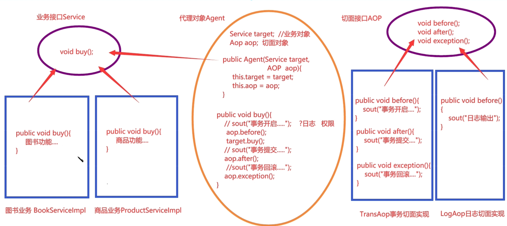
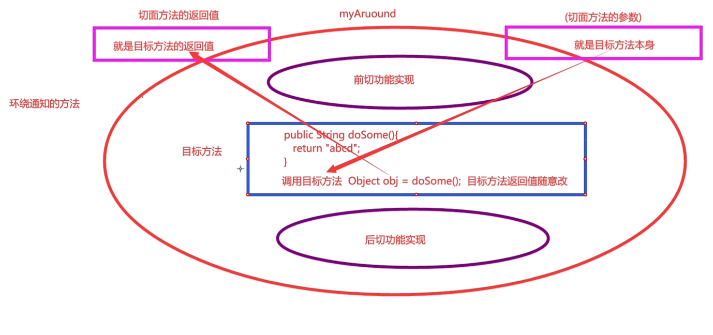
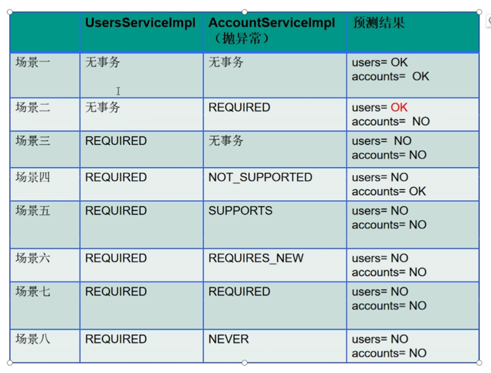
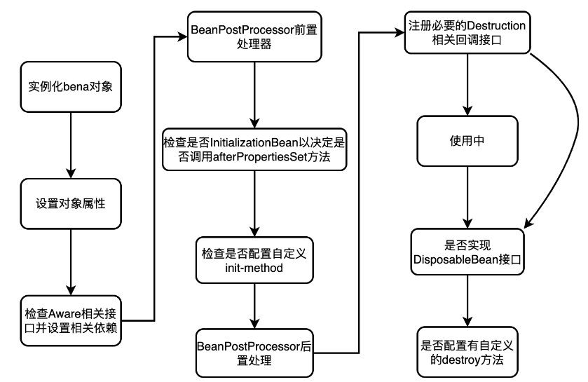

## 一些概念

- 官网:http://spring.io/

- Spring

  - 是一个容器，是整合其他框架的框架，核心是IOC和AOP。由20多个模块组成，在很多领域都提供了优秀的解决方案
  - 使用ioc降低耦合度，使用aop提高代码复用性

- spring特点

  - 轻量级

    - 由20多个模块构成，每隔jar包都很小，核心包3m左右

    - 对代码无污染。基于POJO实现，不强制要求继承任何类和任何接口。（maven就要求用它的目录结构

  - 面向接口编程

    - 灵活性、可扩展性、可维护性高，切换实现类就能切换功能

  - AOP

    - 将公共的、通用的、重复的代码单独开发，在使用的时候加回去。底层是动态代理。
      - 原业务类把日志功能单独拿出开发了，使用时通过代理类动态加入日志功能。（增强原业务类功能

  - 扩展性

    - 可整合其他框架，并使其更易用

## IOC和AOP

- ioc控制反转

  - Inversion of Control。是一个设计思想，DI是其实现技术(dependency injection)
  - 例子：把打针的控制权交给护士，由护士来帮忙打针
  - 创建对象和依赖注入（赋值）的控制权交给spring容器，程序员使用时直接拿来用

  ```java
  //正转。程序员进行对象创建和依赖注入
  Student stu=new Student();
  stu.setName("libai");
  stu.setAge(21);
  
  //spring反转
  <bean id="stu" class="demo.Student">
      <property name="name" value="libai"></property>
      <property name="age" value="21"></property>
  </bean>
  ```

- aop面向切面编程
  
  - 切面：公共的业务、逻辑、操作。如日志

## 步骤

- 加入spring依赖

```xml
<!-- https://mvnrepository.com/artifact/org.springframework/spring-context -->
<dependency>
    <groupId>org.springframework</groupId>
    <artifactId>spring-context</artifactId>
    <version>5.3.0</version>
</dependency>
```

- 添加个配置文件
  - new ->XML Configuration File ->Spring Config
  - resources/applicationContext.xml

- 属性注入

  - xml注入
  - 或注解注入

- 创建个实体类

  - JavaBean即可

- 测试

  ```java
      public void  stu(){
          //创建容器对象
          ApplicationContext ac=new ClassPathXmlApplicationContext("applicationConfig.xml");
          //取出的都是Object对象
          Student stu=(Student)ac.getBean("stu");
          System.out.println(stu);
      }
  //Student{name='libai', age=21, school=School{name='Kassel', address='New York'}}
  ```

## xml文件注入

- set方法注入

```xml
<?xml version="1.0" encoding="UTF-8"?>
<beans xmlns="http://www.springframework.org/schema/beans"
       xmlns:xsi="http://www.w3.org/2001/XMLSchema-instance"
       xsi:schemaLocation="http://www.springframework.org/schema/beans http://www.springframework.org/schema/beans/spring-beans.xsd">

<!--Set方法注入。需要提供无参构造和对应set方法-->
    <!-- 单独一个bean标签就会创建好一个对象  -->
    <bean id="stu" class="org.example.Student" >
        <!--  简单类型和string用value。引用类型用ref，指向一个bean标签的id  -->
        <property name="name" value="libai"></property>
        <property name="age" value="21"></property>
        <property name="school" ref="sch"></property>
    </bean>
    <!--  bean标签没有先后顺序，前面的可以引用后面的  -->
    <bean id="sch" class="org.example.School">
        <property name="name" value="Kassel"></property>
        <property name="address" value="New York"></property>
    </bean>
</beans>


//引用类型注入还可以设置通过类型或名字自动注入,会在整个xml能拿到的对象中匹配.和下面的注解的用名字和类型一致
 <bean id="stu" class="org.example.Student"  autowire="byType">//或者byName
        <!--  简单类型和string用value。引用类型用ref，指向一个bean标签的id  -->
        <property name="name" value="libai"></property>
        <property name="age" value="21"></property>
        <!--<property name="school" ref="sch"></property> 这个可以不要了-->
    </bean>
```

- 构造方法注入

  - 参数名注入

    - 是有构造方法的参数，不是字段名

    ```xml
    <!--  参数名注入 public School(String name, String address)   -->
        <bean id="sch1" class="org.example.School">
            <constructor-arg name="name" value="逐鹿"></constructor-arg>
            <constructor-arg name="address" value="月亮之上"></constructor-arg>
        </bean>
    ```

  - 参数下标注入

    - 从左到右，0、1、2

    ```xml
    <!--  下标对应着参数，所以顺序可交换  -->
        <bean id="sch2" class="org.example.School">
            <constructor-arg index="1" value="上界三千州"></constructor-arg>
            <constructor-arg index="0" value="天仙" ></constructor-arg>
        </bean>
    ```

  - 默认顺序注入

    - 从左到右，已经定了

    ```xml
    <!-- 默认顺序注入   -->
        <bean id="sch4" class="org.example.School">
            <constructor-arg value="天神"></constructor-arg>
            <constructor-arg value="上界"></constructor-arg>
        </bean>
    ```

  - 混合注入

    - 上面三种混搭，只要注入正确即可（不太推荐

    ```xml
    <!--  下标对应着参数，所以顺序可交换  -->
        <bean id="sch2" class="org.example.School">
            <constructor-arg index="1" value="上界三千州"></constructor-arg>
            <constructor-arg name="name" value="天仙" ></constructor-arg>
        </bean>
    ```

## 注解注入

- 常用注解

  - 创建对象
    - @Component
      - 可创建任意对象
    - @Controller
      - 专门创建控制器对象（Servlet），接收
    - @Service
      - 专门创建业务逻辑层对象
    - @Repository
      - 专门创建数据访问层对象
  - 依赖注入
    - @Value
      - 给简单类型注入（8种基本类型+String）
    - @Autowired
      - 在最终得xml文件（此处是two.xml)能拿到的对象找一个同源类型的注入
      - 同源类型。
        - 相同类型，父类引用执行子类，接口执向实现类
      - 父子类型都存在时，意味着有多个可以注入的对象。此时再按照对象名和字段名匹配。若有2个相同或者都不匹配，则报错
      - 有实现类对象的话，接口类型引用可以用@Autowired，尽管Idea报红线
    - @Autowried+@Qualifier
      - 根据名称注入，在最终得xml文件（此处是two.xml)能拿到的对象找一个同名同源类型的注入

- 步骤

  - 甚至可以不用set，提供无参构造就行

  ```java
  @Component("school")//可以自己为对象取名
  public class School {
      //用注解注入时可以不用set方法，
      @Value("至尊殿堂")
      private String name;
      @Value("下界")
      private String address;
  }
  
  @Component//创建的对象默认驼峰命名：student
  public class Student {
      @Value("hezhizhang")
      private String name;
      @Value("21")//类型要匹配
      private int age;
      //@Autowired //按类型注入，在最终得xml文件（此处是two.xml)能拿到的对象找一个同源类型的注入
      @Autowired//不加@Autowired，只用@Qualifier的话注入不成功，为null
      @Qualifier("school")//按对象名注入
      private School school;
  }
  ```
  
- 包扫描

```xml
    <!--  
    会扫描包下的所有类，找有相应注解的类
    建议给的包名精确点，减少消耗，也不易混淆  
      -->
    <!--  多个 可用空格或逗号隔开 -->
    <context:component-scan base-package="org.two org.annomvc,org.example"></context:component-scan>
    <!--  单个包  -->
    <context:component-scan base-package="org.annomvc.dao"></context:component-scan>
```

- 特点
  - 在mvc开发中，有些对象常常只用创建一个。所以注解注入也够用
  - 底层不是用set方法注入：不提供set方法也能完成注入
  - 要有无参构造方法来创建的对象，否则报错

## 三层架构

- 不使用Spring

  - 上层通过接口指向实现类创建下层对象，并调用其方法。（当然每一层都有自己的逻辑。也就是每一层都要手动new下一层的对象

  - 实体类

    - User

    ```java
    public class User {
        private String name;
        private int age;
    
        public String getName() {
            return name;
        }
    
        public void setName(String name) {
            this.name = name;
        }
    
        public int getAge() {
            return age;
        }
    
        public void setAge(int age) {
            this.age = age;
        }
    }
    ```

  - 数据访问层

    - UserMapper.java(接口)

    ```java
    public interface UserMapper {
        int insert(User user);
    }
    ```

    - UserMapperImpl.java(实现类)

    ```java
    public class UserMapperImpl implements UserMapper {
        @Override
        public int insert(User user) {
            System.out.println("数据访问层mapper插入成功");
            return 1;
        }
    }
    ```

  - 业务逻辑层

    - UserService.java(接口)

    ```java
    public interface UserService {
        int insert(User user);
    }
    ```

    - UserServiceImpl.java（实现类

    ```java
    public class UserServiceImpl implements UserService {
        private UserMapper userMapper=new UserMapperImpl();
        @Override
        public int insert(User user) {
            System.out.println("业务逻辑层。。。");
            return userMapper.insert(user);
        }
    }
    ```

  - 界面层

    - UserController.java

    ```java
    public class UserController {
        private UserService userService=new UserServiceImpl();
        public int insert(User user){
            return userService.insert(user);
        }
    }
    ```

- Spring接管

  - 接口啥的还是要的，不同的是创建对象的方式

  - xml来依赖注入

    - 通过bean标签来创建对象并指定依赖（set或构造方法都行，此处就用set

    ```xml
    //几个实现类不用手动创建对象了
    private UserService userService;//不用new了
    private UserMapper userMapper;//不用手动创建了
    //再提供set方法即可
    
    <bean id="mapper" class="org.beanmvc.dao.UserMapperImpl"></bean>
    <bean id="service" class="org.beanmvc.service.UserServiceImpl">
      <property name="userMapper" ref="mapper"></property>
    </bean>
    <bean id="controller" class="org.beanmvc.controller.UserController">
       <property name="userService" ref="service"></property>
    </bean>
    
    ```

  - 注解注入

    - 这三个对象一般都是只有一个，所以用注解也没啥问题
    - xml文件

    ```xml
    //基于注解的，依旧是包扫描
     <context:component-scan base-package="org.annomvc"></context:component-scan>
    ```

    - 添加注解

      - UserMapper

      ```java
      @Repository
      public class UserMapperImpl implements UserMapper {
          @Override
          public int insert(User user) {
              System.out.println(user.getName()+"数据访问层mapper插入成功");
              return 1;
          }
      }
      ```

      - UserService

      ```java
      @Service
      public class UserServiceImpl implements UserService {
          @Autowired
          private UserMapper userMapper;//不用手动创建了
          @Override
          public int insert(User user) {
              System.out.println("业务逻辑层。。。");
              return userMapper.insert(user);
          }
      }
      ```

      - UserController

      ```java
      @Controller
      //界面层
      public class UserController {
          @Autowired
          private UserService userService;//不用new了
          public int insert(User user){
              System.out.println("界面层");
              return userService.insert(user);
          }
      }
      ```

      - 取的时候用驼峰命名法

      ```java
      ac.getBean("userController");
      ```

## 配置文件的拆分

- 用于xml方式注入

  - 这些.xml文件功能：用来创建各层、各类的对象或者完成各层的配置，用一个文件整合是为了读取配置文件时只读取一次
  - （有时注解也可以整合下，毕竟.xml还是要有几个的）

- 策略

  - 按三层

    - 同目录下没有重复名文件的话，用起来还不错，xml文件就4个，一般不会增多

    - applicationContext_controller.xml

      - <bean id="" class="demo.controller.UserController">
      - <bean id="" class="demo.controller.BookController">

    - applicationContext_service.xml

      - <bean id="" class="demo.service.UserService">
      - <bean id="" class="demo.service.BookService">

    - applicationContext_mapper.xml（spring整合mybatis时可用来配置数据源

      - <bean id="" class="demo.mapper.UserMapper">
      - <bean id="" class="demo.mapper.BookMapper">

    - 还得用一个xml来整合

      - 一个xml的ref属性引用的id是另一个xml文件时，idea可以会划红线，不用管，直接整合
      - applicationContext.xml

      ```xml
          <import resource="applicationContext_*.xml"></import>
          <!--  当然也可以一个个导入  -->
          <!--  <import resource="applicationContext_controller.xml"></import>  -->
      ```

    - 创建整合后的ac即可

    ```java
        ApplicationContext ac;
        @Before
        public  void before(){
            ac=new ClassPathXmlApplicationContext ("combmvc/applicationContext.xml");
        }
    ```

  - 按功能分

    - 这个容易造成xml增多吧
    - applicationContext_user.xml
      - <bean id="" class="demo.controller.UserController">
      - <bean id="" class="demo.service.UserService">
      - <bean id="" class="demo.mapper.UserMapper">
    - applicationContext_book.xml
      - <bean id="" class="demo.controller.BookController">
      - <bean id="" class="demo.service.BookService">
      - <bean id="" class="demo.mapper.BookMapper">


## AOP

- 概念

  - Aspect Orient Programming：面向切面编程
  - 将交叉业务封装成切面，单独开发，再利用动态代理技术将切面织入到主业务逻辑中
    - 交叉业务：
  - 利用动态代理技术并定义2套接口：主业务接口和页面接口，使代理类的主业务和切面都可以灵活切换

- 常用术语

  - 切面：公共的、通用的，与主业务无关的代码，如：安全检查、事务控制、日志、缓存等
  - 连接点：也就是目标方法。
  - 切入点(Pointcut)：切入位置，多个连接点构成切入点。切入点可以是一个目标方法，可以是一个类中的所有方法，可以是某个包下所有类的方法
  - 目标对象：目标方法的所有者
  - 通知(Advice):切入时机，目标方法执行前、后，或者环绕目标方法

- 手写AOP五个版本

  - 业务：图书购买。切面：事务控制

  - 一：业务和切面耦合在一起

  ```java
  //只有一个实现类
  public class BookServiceImpl {
      public void buy(){
          try {
              System.out.println("开启事务");
              System.out.println("购买图书业务实现one");
              System.out.println("事务提交");
          } catch (Exception e) {
              System.out.println("事务回滚");
          }
          //当然还有资源关闭啥的
      }
  }
  ```

  - 二：子类代理拆分业务和切面

  ```java
  //父类，只有业务
  public class BookServiceImpl {
      public void buy(){
          System.out.println("购买图书业务实现two");
      }
  }
  
  //子类。增加切面
  public class SubBookServiceImpl extends BookServiceImpl{
      @Override
      public void buy() {
          try {
              System.out.println("事务开启");
              super.buy();
              System.out.println("事务提交");
          } catch (Exception e) {
              System.out.println("事务回滚");
          }
      }
  }
  ```

  - 三：静态代理拆分业务和业务接口，但是切面还耦合在业务中

  ```java
  //业务接口
  //规定业务功能
  public interface Service {
      void buy();
  }
  
  //业务实现类
  //实现业务功能
  public class BookServiceImpl implements Service{
      @Override
      public void buy() {
          System.out.println("购买图书业务实现three");
      }
  }
  
  //代理类
  //代理目标类，增加切面
  //题外话：又不是JavaBean，set方法不是必须的，构造器赋值是个更简洁的方式
  public class Agent implements Service {
      Service target;
      //根据不同的参数可以代理不同的目标对象，灵活切换
      public Agent(Service target) {
          this.target = target;
      }
      //增加切面
      @Override
      public void buy() {
          try{
              System.out.println("事务开启");
              target.buy();
              System.out.println("事务提交");
          }catch (Exception e){
              System.out.println("事务回滚");
          }
      }
  }
  ```

  - 四：静态代理拆分业务和业务接口，切面和切面接口

    - 原理图
    - 
    - 实现

    ```java
    //业务
    //规定业务功能
    public interface Service {
        void buy();
    }
    //实现业务功能
    public class BookServiceImpl implements Service {
        @Override
        public void buy() {
            System.out.println("购买图书业务实现four");
        }
    }
    public class ProductServiceImpl implements Service{
        @Override
        public void buy() {
            System.out.println("购买商品业务实现four");
        }
    }
    
    //切面
    //
    public interface AOP {
        //有默认实现，切面实现类根据需要去重写
        default void before(){}
        default void after(){}
        default void exception(){}
    }
    public class AffairAopImpl implements AOP{
        @Override
        public void before() {
            System.out.println("事务开启");
        }
    
        @Override
        public void after() {
            System.out.println("事务提交");
        }
    
        @Override
        public void exception() {
            System.out.println("事务回滚");
        }
    }
    public class LogAopImpl implements AOP{
        @Override
        public void before() {
            System.out.println("Logging...");
        }
    }
    
    //代理目标类，增加切面。只实现业务接口就好了，切面只是传入
    public class Agent implements Service {
        Service target;
        AOP aop;
        //根据不同的参数可以代理不同的目标对象，灵活切换
        public Agent(Service target,AOP aop) {
            this.target = target;
            this.aop=aop;
        }
        //增加切面
        @Override
        public void buy() {
            try{
                aop.before();
                target.buy();
                aop.after();
            }catch (Exception e){
                aop.exception();
            }
        }
    }
    
    //测试，单个
    aop.fourthVersion.Agent agent2=new Agent(bookService,affairAop);
    agent2.buy();
    //切入多个切面，agent2的affairAop被放在了里面。
    //没啥，就一个调用而已。因为参数是Service接口，而Agent也实现了它
    aop.fourthVersion.Agent agent4=new Agent(agent2,logAop);
    agent4.buy();
    //结果
    Logging...
    事务开启
    购买图书业务实现four
    事务提交
    
    ```

  - 五：用动态代理完成第四步

```java
//规定业务功能
public interface Service {
    void buy();
    default void show(){}
}
//实现业务功能
public class BookServiceImpl implements Service {
    @Override
    public void buy() {
        System.out.println("购买图书业务实现four");
    }

    @Override
    public void show() {
        System.out.println("showing");
    }
}

//aop接口和实现类
public interface AOP {
    //有默认实现，切面实现类根据需要去重写
    default void before(){}
    default void after(){}
    default void exception(){}
}
public class AffairAopImpl implements AOP {
    @Override
    public void before() {
        System.out.println("事务开启");
    }

    @Override
    public void after() {
        System.out.println("事务提交");
    }

    @Override
    public void exception() {
        System.out.println("事务回滚");
    }
}

//代理类
public class ProxyFactory {
    public static Object getAgent(Service target,AOP aop){
        return Proxy.newProxyInstance(
                target.getClass().getClassLoader(),
                target.getClass().getInterfaces(),
                new InvocationHandler() {
                    @Override
                    public Object invoke(Object proxy, Method method, Object[] args)
                            throws Throwable {
                        Object obj=null;
                        try{
                            aop.before();
                            obj=method.invoke(target,args);
                            aop.after();
                        }catch (Exception e){
                            aop.exception();
                        }
                        return obj;
                    }
                }
        );

    }
}

//测试。多个切面的话同理
Service agent2=(Service)ProxyFactory.getAgent(agent1,logAop);
agent2.show();
```

## SpringAOP

- 常用通知

  - Before:目标方法调用前执行，接口org.springframework.aop.MethodBeforeAdvice
  - After:目标方法调用后执行，接口org.springframe.aop.AfterReturningAdvice
  - Throws：目标方法抛出异常时执行，接口org.springframework.aop.ThrowsAdvice
  - Around:环绕通知，接口org.springframework.intercept.MethodInterceptor
    - 拦截目标对象方法的调用，如事务处理。在执行前和后增加？

- 使用

  - java

  ```java
  public interface BookService {
      //买书
      boolean bug(String userName,String bookName,double price);
      //评论
      void comment(String userName,String comments);
  }
  
  public class BookServiceImpl implements BookService{
      @Override
      public boolean bug(String userName, String bookName, double price) {
          System.out.println(userName+" buys "+" the " +bookName+" cost "+price);
          return true;
      }
  
      @Override
      public void comment(String userName, String comments) {
          System.out.println(userName+"  has made a  comment \""+comments+"\"");
      }
  }
  
  //实现spring提供的通知接口
  public class LogAdvice implements MethodBeforeAdvice {
      /**
       * 可以通过这三个参数获取一些信息
       * @param method   被切入的目标方法
       * @param objects   该目标方法的参数
       * @param o     该目标方法的对象
       * @throws Throwable
       */
      @Override
      public void before(Method method, Object[] objects, Object o) throws Throwable {
          SimpleDateFormat sf=new SimpleDateFormat("yyyy-MM-dd");
          //输出当前时间，被且入的方法，及其实参值
          System.out.println("\n[系统日志]"+sf.format(new Date())+"----"+method.getName()+
                  "----"+ Arrays.toString(objects));
      }
  }
  ```

  - xml

  ```xml
  <!--同过xml完成动态代理的配置-->
  <?xml version="1.0" encoding="UTF-8"?>
  <beans xmlns="http://www.springframework.org/schema/beans"
         xmlns:xsi="http://www.w3.org/2001/XMLSchema-instance"
         xsi:schemaLocation="http://www.springframework.org/schema/beans http://www.springframework.org/schema/beans/spring-beans.xsd">
  <!--  创建 对象 springaop是自己的包 -->
      <bean id="bookServiceTarget" class="springaop.BookServiceImpl"></bean>
      <bean id="logAdvice" class="springaop.LogAdvice"></bean>
  
  <!--  绑定业务和切面  -->
      <bean id="bookService" class="org.springframework.aop.framework.ProxyFactoryBean">
          <!--  配置业务接口 -->
          <property name="interfaces" value="springaop.BookService"></property>
          <!-- 配置切面-->
          <property name="interceptorNames">
              <!--列表说明切面可以有多个-->
              <list>
                  <value>logAdvice</value>
              </list>
          </property>
          <!--放入-->
          <property name="target" ref="bookServiceTarget"></property>
      </bean>
  </beans>
  ```

  

## AspectJ

- 概述

  - 很多框架都实现了AOP功能，Spring是其一，AspectJ也是。且其实现方式更为简洁，还支持注解式开发，易学易用

  - 官网：http://www.eclipse.org/aspectj/

- 常用注解

  - 前置通知@Before
  - 后置通知@AfterReturning
  - 环绕通知@Around
  - 最终通知@After
  - 定义切入点@Pointcut       可简写切入点表达式

- 切入点表达式

  - 用来指定切入点

  ```java
  execution(modifiers-pattern? ret-type-pattern declaring-type-pattern?
           name-pattern(param-pattern) throws-pattern?)
  
  modifiers-pattern 访问权限
  ret-type-pattern  返回值类型（必选
  declaring-type-pattern    类的全限定名
  name-pattern(param-pattern)    方法名(参数类型)（必选
  throws-pattern        抛出的异常类型
  ?			后面有问号的表示可选
      
  通配符
  *		任意多个字符
  ..		在方法参数中表示任意参数
  .*		该包下的所有类
  ..*		表示本路径及其所有子路径
  .*		前有一个包
  ..*		前有任意多个包
  
  类名支持通配符，类名和方法名间常用.连接
  实例
  execution(public * *())			任意公共方法
  execution(* set*(..))			任意以set开头的方法
  execution(* demo.service.*.*(..))	demo.service包下的任意方法（不包含子包
  execution(* demo.service..*.*(..))  demo.service包及其子包下的任意方法
  execution(* *.demo.service.*.*(..))	前只有一个包下的demo.service包下的任意方法
  execution(* *..demo.service.*.*(..))	前有任意个包都行
  ```

- 步骤

  - 添加依赖

  ```xml
     <!-- https://mvnrepository.com/artifact/org.springframework/spring-context -->
      <dependency>
        <groupId>org.springframework</groupId>
        <artifactId>spring-context</artifactId>
        <version>5.3.0</version>
      </dependency>
  	<!--用和spring-context版本一致的吧-->
      <!-- https://mvnrepository.com/artifact/org.springframework/spring-aspects -->
      <dependency>
        <groupId>org.springframework</groupId>
        <artifactId>spring-aspects</artifactId>
        <version>5.3.0</version>
      </dependency>
  ```

  

  - 前置通知

    - 只能拿到方法签名（方法头），不能拿到返回值

    ```java
    //业务接口和实现类
    public interface SomeService {
        String doSome(String name,int age);
    }
    //@Service  注解注入
    public class SomeServiceImpl implements SomeService{
        @Override
        public String doSome(String name, int age) {
            System.out.println(name+" 执行了doSome方法 "+age);
            return "abc";
        }
    }
    
    //切面类。用来声明切面方法
    @Aspect         //交给AspectJ框架去识别切面类
    //@Component  注解注入
    public class MyAspect {
        /*
        切面的功能都是由切面方法来完成
        前置通知规范
            访问权限是public
            返回值是void
            方法名自定义
            没有参数，有也只能是JoinPoint类型
            用@Before注解声明前置切入及其切入点
                属性:value 指定切入点表达式
         */
        @Before(value="execution(public String aspectj.SomeService.doSome(String,int))")//较完整的
        public void myBefore(){
            System.out.println("doSome 方法的前置通知");
        }
    }
    
    //spring配置文件（用注解形式来创建对象和依赖注入也行）
    <!--  创建对象  -->
    <bean id="someService" class="aspectj.SomeServiceImpl"></bean>
    <bean id="myAspect" class="aspectj.MyAspect"></bean>
    <!--
        注解方式不用bean标签创建对象，但是要添加包扫描
         <context:component-scan base-package="aspectj"></context:component-scan>
    -->
    <!--  由AspectJ根据注解自动绑定切面和业务  -->
    <aop:aspectj-autoproxy></aop:aspectj-autoproxy>
     
    //测试
    ApplicationContext ac=new ClassPathXmlApplicationContext("aspectj/applicationContext.xml");
    SomeService someService=(SomeService)ac.getBean("someService");//注解注入的话是取驼峰someServiceImpl
    someService.doSome("baijvyi",21);
    
    
    //若是想要拿到方法相关信息，则用JoinPoint对象
    @Before(value="execution(* aspectj.SomeService.*(..))")
    public void myBefore1(JoinPoint jp){
        System.out.println("方法签名："+jp.getSignature());
        System.out.println("实参 "+ Arrays.toString(jp.getArgs()));
    }
    
    ```

  - 后置通知

  ```java
      /*
      后置通知规范
          权限public
          返回值void
          名称自定义
          可有参数(常用 Object obj为目标方法执行后的返回值,void则为null)，目前好像只能有这一个参数
              当然也可以没有，无论目标方法本身有没有参数
          @AfterReturning注解
              value:切入点表达式
              returning:指定目标方法返回值名称，得与切面方法的参数一致。没有参数可以不写这个属性
  
       */
      @AfterReturning(value = "execution(* aspectj.SomeServiceImpl.doAfterReturn(..))",returning="obj")
      public void myAfterReturning(Object obj){
          System.out.println("后置通知");
          if(obj!=null){
              //分情况来决定是否可以改变目标方法的返回值
              if(obj instanceof String){
                  //8种基本类型和String都不可以改变
                  obj=obj.toString().toLowerCase();//无影响
              }
              if(obj instanceof SomeService){
                  //引用类型，可以改变
              }
          }
      }
  ```

  - 环绕通知

    - 通过拦截目标方法，在其前后增强功能，功能最强大,环绕方法的返回值就作为目标方法的返回值。（事务一般就用这个）

    

    ```java
     /*
        环绕通知规范
            权限是public
            返回值作为目标方法的返回值
            方法名自定义
            有参数，此参数就是目标方法
            回避（抛出）Throwable异常。why？
            @Around
                value:切入点表达式
         */
        @Around(value = "execution(* aspectj.SomeServiceImpl.doAround(String))")
        public String aroundAspect(ProceedingJoinPoint pjp) throws Throwable {
            System.out.println("前Around");
    
            //传递参数，调用目标方法，初步拿到目标方法返回值
            Object obj=pjp.proceed(pjp.getArgs());//此处要抛出Throwable。
    
            System.out.println("后Around");
            return obj.toString().toUpperCase();//这里才作为目标方法最终的返回值
        }
    ```

  - 最终通知

    - 无论目标方法是否正常执行，最终通知的代码都会被执行。类似于try-catch-finally种的finally语句块

    ```java
        /*
        最终通知规范
            权限public
            返回值void
            方法名自定义
            方法可没有参数，有也只能是JoinPoint类型
            @After
                value:切入点表达式
         */
        @After(value = "execution(* aspectj.SomeServiceImpl.doAfter(..))")
        public void myAfter(JoinPoint jp){
            System.out.println("签名 "+jp.getSignature());
            System.out.println("After");
        }
    ```

    

-  给切面表达式取别名

  - @Pointcut

  ```java
      //切入点表达式取别名
      @Pointcut(value = "execution(* aspectj.SomeServiceImpl.doAll(..))")
      public void myCut(){}
  
      //取的时候直接调用函数
      @Before(value = "myCut()")
      public void myBefore1(){
          System.out.println("@Before");
      }
  ```
  
- 若方法出现异常

  - 后置通知和环绕通知的后置通知不会执行

- 不同通知的执行顺序

  - 多个相同的通知呢？再说吧

  ```java
  @Around-pre					//前环绕
  @Before						//前置
  doAll method execute		//目标方法
  @AfterReturning				//后
  @After						//最终
  @Around-next				//后环绕
  ```

- 代理模式切换

  - 默认是JDK动态代理，只能接口引用来接收对象，因为底层已经是代理对象

  ```java
  <aop:aspectj-autoproxy></aop:aspectj-autoproxy>
  SomeService someService=(SomeService)ac.getBean("SomeService");
  ```

  - 改为CGLib子类动态代理,用接口或实现类接都行

  ```java
  <aop:aspectj-autoproxy proxy-target-class="true"></aop:aspectj-autoproxy>
  SomeService someService=(SomeService)ac.getBean("SomeService");
  SomeServiceImpl someService=(SomeServiceImpl)ac.getBean("SomeService");
  ```

  - 一般用JDK动态代理就够了。都用接口来接没错

## Spring整合Mybatis

- 步骤

  - 添加依赖

  ```xml
    <dependencies>
      <!-- 单元测试 -->
      <dependency>
        <groupId>junit</groupId>
        <artifactId>junit</artifactId>
        <version>4.13</version>
        <scope>test</scope>
      </dependency>
      <!-- spring核心-->
      <dependency>
        <groupId>org.springframework</groupId>
        <artifactId>spring-context</artifactId>
        <version>5.3.0</version>
      </dependency>
      <!-- aspectj -->
      <dependency>
        <groupId>org.springframework</groupId>
        <artifactId>spring-aspects</artifactId>
        <version>5.3.0</version>
      </dependency>
      <!-- spring事务 -->
      <dependency>
        <groupId>org.springframework</groupId>
        <artifactId>spring-tx</artifactId>
        <version>5.3.0</version>
      </dependency>
      <!-- spring-jdbc -->
      <dependency>
        <groupId>org.springframework</groupId>
        <artifactId>spring-jdbc</artifactId>
        <version>5.3.0</version>
      </dependency>
      <!--  mysql-connector  -->
      <dependency>
        <groupId>mysql</groupId>
        <artifactId>mysql-connector-java</artifactId>
        <version>8.0.22</version>
      </dependency>
      <!-- mybatis -->
      <dependency>
        <groupId>org.mybatis</groupId>
        <artifactId>mybatis</artifactId>
        <version>3.5.6</version>
      </dependency>
      <!--  mybatis和spring集成  -->
      <dependency>
        <groupId>org.mybatis</groupId>
        <artifactId>mybatis-spring</artifactId>
        <version>2.0.6</version>
      </dependency>
      <!--  阿里数据库连接池（比mybatis的更高效、安全  -->
      <dependency>
        <groupId>com.alibaba</groupId>
        <artifactId>druid</artifactId>
        <version>1.2.4</version>
      </dependency>
    </dependencies>
  ```

  - 添加模板SqlMapConfig.xml和xxxMapper.xml

    - 只是简化开发，新建对应文件时会有以这模板为基础
    - File-Settings->Editor->File and Code Templates
      - Name:模板名       Extension:扩展名
      - 当初类开头的名字时间就是在这里设置的
      - emmm，创建了模板，但新建文件时不出现。。

  - (添加Mybatis核心配置文件SqlMapConfig.xml)

    - 其实基本可以不用，spring已经接管了相关功能，不过有些是spring接管不了的，所以留着吧
- 好像最终没有使用到这个配置文件
  
    ```xml
    <?xml version="1.0" encoding="UTF-8" ?>
    <!DOCTYPE configuration
            PUBLIC "-//mybatis.org//DTD Config 3.0//EN"
    
            "http://mybatis.org/dtd/mybatis-3-config.dtd">
    
    <configuration>
        <settings>
            <!--   输出日志到控制台   -->
            <setting name="logImpl" value="STDOUT_LOGGING"/>
        </settings>
    </configuration>
    ```

  - 添加Spring配置文件

    - applicationContext_mapper.xml             接管了SqlMapConfig.xml的功能

    ```xml
    <?xml version="1.0" encoding="UTF-8"?>
    <beans //spring配置文件头就不写在这了>
    
    <!--读取属性配置文件-->
        <context:property-placeholder location="mysql.properties" ></context:property-placeholder>
    
    <!--  创建数据源  用Druid连接池-->
        <bean id="dataSource" class="com.alibaba.druid.pool.DruidDataSource">
            <!--  怎么读取不了配置文件${driver}.明明上面已经加载成功了   -->
            <property name="driverClassName" value="com.mysql.cj.jdbc.Driver"></property>
            <property name="url" value="jdbc:mysql://127.0.0.1:3306/beimysql"></property>
            <property name="username" value="root"></property>
            <property name="password" value="beiyuan3721"></property>
        </bean>
    <!--  配置SqlSessionFactoryBean类  完成mybatis中SqlSessionFactory类的功能-->
        <bean class="org.mybatis.spring.SqlSessionFactoryBean">
            <!--  配置数据源,因伤上面配置好的  -->
            <property name="dataSource" ref="dataSource"></property>
            <!--  配置mybatis核心配置文件.毕竟有些功能要在这里完成  -->
            <property name="configLocation" value="SqlMapConfig.xml"></property>
            <!--  注册实体类别名,类就可以不用全限定名了   -->
            <property name="typeAliasesPackage" value="sm.pojo"></property>
        </bean>
        <!--
            注册mapper.xml   让该配置文件知道mapper在哪
            不取id,反正程序员自己又用不到,系统调用就行
        -->
        <bean class="org.mybatis.spring.mapper.MapperScannerConfigurer">
            <property name="basePackage" value="sm.mapper"></property>
        </bean>
    </beans>
    ```
    
    - applicationContext_service.xml
    
  ```xml
    <?xml version="1.0" encoding="UTF-8"?>
  <beans xmlns="http://www.springframework.org/schema/beans"
           xmlns:xsi="http://www.w3.org/2001/XMLSchema-instance"
           xmlns:context="http://www.springframework.org/schema/context"
           xsi:schemaLocation="http://www.springframework.org/schema/beans http://www.springframework.org/schema/beans/spring-beans.xsd http://www.springframework.org/schema/context https://www.springframework.org/schema/context/spring-context.xsd">
            <!--sm基于注解开发,添加包扫描-->
        	<!--基于注解创建对象-->
            <context:component-scan base-package="sm.service.impl"></context:component-scan>
            <!-- 事务处理都是放在service层 -->
    </beans>
  ```
  
    - total.xml
    
    - 整合下，把资源合并
  
    ```xml
      <?xml version="1.0" encoding="UTF-8"?>
    <beans xmlns="http://www.springframework.org/schema/beans"
             xmlns:xsi="http://www.w3.org/2001/XMLSchema-instance"
             xmlns:context="http://www.springframework.org/schema/context"
             xsi:schemaLocation="http://www.springframework.org/schema/beans http://www.springframework.org/schema/beans/spring-beans.xsd http://www.springframework.org/schema/context https://www.springframework.org/schema/context/spring-context.xsd">
      
              <!--  这次要整合,因为mapper中有数据库的配置,不加载这个不行.mapper是一定要的  -->
          <import resource="applicationContext_service.xml"></import>
          <import resource="applicationContext_mapper.xml"></import>
      </beans>
      //ApplicationContext ac=new ClassPathXmlApplicationContext("sm/total.xml");
    ```
  
  - 添加实体类，mapper接口及其实现类，service接口及其实现类
  
  - 和mybatis的一致

## Spring注解式事务

- @Transactional添加到类上，则对类中所有方法生效（不灵活）。添加到方法上，则只对该方法生效（太繁琐）

- spring事务默认自动提交，且出错不回滚

  - 如在service层出错，但是还是增加成功了

  ```java
  @Service
  public class UserServiceImpl implements UserService {
      @Autowired
      UserMapper mapper;
      @Override
      public int insert(User user) {
          int res=mapper.insert(user);
          int error=1/0;
          return res;
      }
  }
  ```

  

- 添加事务管理

  - applicationContext_service.xml

  ```xml
  <?xml version="1.0" encoding="UTF-8"?>
  <beans xmlns="http://www.springframework.org/schema/beans"
         xmlns:xsi="http://www.w3.org/2001/XMLSchema-instance"
         xmlns:context="http://www.springframework.org/schema/context" xmlns:tx="http://www.springframework.org/schema/tx"
         xsi:schemaLocation="http://www.springframework.org/schema/beans http://www.springframework.org/schema/beans/spring-beans.xsd http://www.springframework.org/schema/context https://www.springframework.org/schema/context/spring-context.xsd http://www.springframework.org/schema/tx http://www.springframework.org/schema/tx/spring-tx.xsd">
          <!--sm基于注解开发,添加包扫描-->
          <context:component-scan base-package="sm.service.impl"></context:component-scan>
          <!-- 通常事务处理都是放在service层 -->
          <!--要用到里面配置的数据源等。这里引进了，但时候用ac=new ...(..service.xml)就行了-->
          <import resource="applicationContext_mapper.xml"></import>
          <!--添加事务管理器-->
          <bean id="transactionManager" class="org.springframework.jdbc.datasource.DataSourceTransactionManager">
                  <!--配置数据源。ref是mapper中配置好的-->
                  <property name="dataSource" ref="dataSource"></property>
          </bean>
          <!--
          添加注解驱动（解析注解@Transactional？)
              annotation-driven http://ww.springframe.org/schema/tx   后缀得是tx
               transaction-manager是上面的事务管理器id
          -->
          <tx:annotation-driven transaction-manager="transactionManager"></tx:annotation-driven>
  </beans>
  ```

  - 在service实现类添加注解@Transactional

    ```xml
    @Service
    //propagation用来指定事务隔离级别，增删改都用REQUIRED
    @Transactional(propagation = Propagation.REQUIRED)
    public class UserServiceImpl implements UserService {
        @Autowired
        UserMapper mapper;
        @Override
        public int insert(User user) {
            int res=mapper.insert(user);
            int error=1/0;
            return res;
        }
    }
    //经测试，添加成功了，出错后事务被回滚了
    ```

  - @Transactional的其他属性

  ```java
  @Transactional(propagation = Propagation.REQUIRED,//事务隔离级别（增删改都用REQUIRED
          noRollbackForClassName = "ArithmeticException",//发生该异常不回滚.使用异常名
          noRollbackFor = ArithmeticException.class,//发生该异常不回滚，使用异常类型
          rollbackForClassName = "",//发生了该异常一定回滚
          //rollbackFor = ArithmeticException.class,//发生了该异常一定回滚
          timeout = -1,//事务有效时间，超过自动回滚。默认-1，永不超时
          readOnly = false,//修改数据权限，查询则要设置为true
          isolation = Isolation.DEFAULT//设置数据库隔离级别。此处表示使用默认
  )
  ```

## spring声明式事务

- 在配置文件中按照条件配置。一次可配置一大堆（推荐使用

- 步骤

  - 项目中方法的命名要有规范才好匹配

    - 增加      add     save	insert	
    - 更新       update  change    modify   set
    - 删除       delete    drop       remove     clear
    - 查询       select     find      search       get

  - 三个文件各司其职，最后用total整合

    - mapper

    ```xml
    <?xml version="1.0" encoding="UTF-8"?>
    <beans //spring配置文件头啥的就不写在这里>
    
        <!--读取属性配置文件-->
        <context:property-placeholder location="mysql.properties" ></context:property-placeholder>
    
        <!--  创建数据源  用Druid连接池-->
        <bean id="dataSource" class="com.alibaba.druid.pool.DruidDataSource">
            <!--  怎么读取不了配置文件${driver}.明明上面已经加载成功了   -->
            <property name="driverClassName" value="com.mysql.cj.jdbc.Driver"></property>
            <property name="url" value="jdbc:mysql://127.0.0.1:3306/beimysql"></property>
            <property name="username" value="root"></property>
            <property name="password" value="beiyuan3721"></property>
        </bean>
        <!--  配置SqlSessionFactoryBean类  完成mybatis中SqlSessionFactory类的功能-->
        <bean class="org.mybatis.spring.SqlSessionFactoryBean">
            <!--  配置数据源,用上面配置好的  -->
            <property name="dataSource" ref="dataSource"></property>
            <!--  配置mybatis核心配置文件.毕竟有些功能要在这里完成  -->
            <property name="configLocation" value="SqlMapConfig.xml"></property>
            <!--  注册实体类别名,类就可以不用全限定名了   -->
            <property name="typeAliasesPackage" value="sm.pojo"></property>
        </bean>
        <!--
            注册mapper.xml   让该配置文件知道mapper在哪
            由mybatis自己创建相应访问数据库的mapper对象
            不取id,反正程序员自己又用不到,系统调用就行
        -->
        <bean class="org.mybatis.spring.mapper.MapperScannerConfigurer">
            <property name="basePackage" value="sm.mapper"></property>
        </bean>
    </beans>
    ```

    - service

    ```xml
    <?xml version="1.0" encoding="UTF-8"?>
    <beans>
        <!--sm基于注解开发,添加包扫描。目前就为了创建相应service对象-->
        <context:component-scan base-package="sm.service.impl"></context:component-scan>
        <!-- 通常事务处理都是放在service层 不过为了管理，还是统一放在applicationContext_transaction.xml中-->
    </beans>
    ```

    - transaction

    ```xml
    <?xml version="1.0" encoding="UTF-8"?>
    <beans>
    
        <!--添加事务管理器-->
        <bean id="transactionManager" class="org.springframework.jdbc.datasource.DataSourceTransactionManager">
            <!--报红没关系，最后用total.xml整合-->
            <property name="dataSource" ref="dataSource"></property>
        </bean>
        
        <!--
        有些事务想要自己的特性
            可通过注解来单独指定
            并注解事务的优先级order设置得比声明的高
        -->
        <tx:annotation-driven order="66"></tx:annotation-driven>
       <!--配置事务切面。advice  http://www.springframework.org/schema/tx  后缀还是tx-->
        <tx:advice id="myadvice" transaction-manager="transactionManager">
            <tx:attributes>
                <!--name去匹配相应方法。其他的则是设置其属性-->
                <tx:method name="*select*" read-only="true"/>
                <tx:method name="*insert*" propagation="REQUIRED"/>
                <tx:method name="*update*" propagation="REQUIRED"/>
                <tx:method name="*delete*" propagation="REQUIRED"/>
                <tx:method name="*" propagation="SUPPORTS"/>
            </tx:attributes>
        </tx:advice>
        <!--绑定切面和切入点-->
        <aop:config>
            <!--切入点-->
            <aop:pointcut id="mypoint" expression="execution(* sm.service.impl.*.*(..))"/>
            <!--绑定-->
            <!--优先级order设置得比注解式低-->
            <aop:advisor advice-ref="myadvice" pointcut-ref="mypoint" order="7"></aop:advisor>
        </aop:config>
    </beans>
    ```

    - total

    ```xml
    <?xml version="1.0" encoding="UTF-8"?>
    <beans>
        <!--整合-->
        <import resource="applicationContext_service.xml"></import>
        <import resource="applicationContext_mapper.xml"></import>
        <import resource="applicationContext_transaction.xml"></import>
    </beans>
    ```


## spring事务的隔离级别

- 五大
  - READ_UNCOMMITTED
    - 读未提交，可读取到事务未提交的数据
    - 存在脏读，不可重复读，幻读
  - READ_COMMITTED
    - 读已提交，只能读取到事务已经提交的数据。
    - 存在不可重复读，幻读
    - Oracle等多数数据库默认该级别
  - REPEATABLE_READ
    - 可重复读，事务执行时锁定引用的行，其他事务无法修改
    - 存在幻读
  - SERIALIZABLE
    - 串行读，各事务串行执行
    - 不存在三问题，但是无法并发，效率低
  - DEFAULT
    - 使用各数据库对应的默认级别
    - oracle的默认级别是读已提交
    - mysql的默认级别是可重复读，InnoDB（mysql存储引擎之一）解决了幻读
- 读问题
  - 脏读
    - A事务在运行过程中，读取到了B事务还没有提交的数据，这就导致了脏读问题
    - 脏读是针对update修改操作，是对一条数据记录而言
  - 不可重复读
    - 事务A第一次读取数据，事务B修改数据（和脏读区分的话，就事务B已经提交了），事务A还没结束再次读取数据，发现数据不一致
    - 不可重复读也是针对的update修改操作，是对一条数据记录而言
  - 幻读
    - 事务A第一次根据某个条件修改10条数据，此时事务B新增了一条满足条件的数据，事务A再查看时，发现还有一条没有修改的数据，就像发生了幻觉一样
    - 幻读是针对的insert、delete新增和删除操作，是对多条数据记录而言，事务A发现前后行数不一致

## spring事务管理器

- 为什么要添加

  - 不同的数据库访问技术使用的是不同的事务管理对象

  ```java
  JDBC  		Connection   con.commit()    		con.rollback()
  Mybatis 	SqlSession   sqlSession.commit()    sqlSession.rollback()
  Hibernate   Session      session.commit()		session.rollback()	
  ```

  - 事务管理来管理相应的对象

  ```xml
  <!--添加事务管理器-->
          <bean id="transactionManager" class="org.springframework.jdbc.datasource.DataSourceTransactionManager">
                  <!--配置数据源。ref是mapper中配置好的-->
                  <property name="dataSource" ref="dataSource"></property>
          </bean>
  <!--mybatis对应的是DataSourceTransactionManager-->
  ```

## Spring事务的传播特性

- 定义了被调用方法的事务边界，多个事务之间的合并、互斥都可以通过设置事务的传播特性解决。
- （处理事务间的包含关系，在一个事务方法中调用另一个事务处理方法
- 七个

```
可以理解为A方法调用了B方法

常用
PROPAGATION_REQUIRED		
	B必须运行在一个事务中，若A存在一个事务，则B运行在这个事务中，否则，将创建一个新的事务
PROPAGATION_REQUIRES_NEW
	B新开事务，若A有事务，则执行到B时，挂起A。B运行在自己的事务中，B结束后再A
PROPAGATION_SUPPORTS
	B支持事务（可有可无）。若A有则和A一样的事务，A没有则B也没有
PROPAGATION_NEVER
	B不能运行在事务中，否则抛出异常
PROPAGATION_NOT_SUPPORTED
	B不支持事务，若A有事务，则执行到B时，挂起A。B运行在非事务环境中，B结束后再A
不常用
PROPAGATION_MANDATORY
	方法必须运行在一个事务中，如果当前事务不存在，就抛出异常。和PROPAGATION_NEVER互斥
PROPAGATION_NESTED
	如果A事务存在，则B方法应该运行在一个嵌套事务中。否则，它看起来和 PROPAGATION_REQUIRED 看起来没什么俩样
```

- 例子

  - 以下A方法是UserMapper的insert()，B方法是AccountService的save()。分别对User和Account表进行增加一条数据的操作
  - 再说一次，事务都是加在业务逻辑层

  - UserServiceImpl.java

  ```java
  @Servie
  @Transaction(propagation=Propagation.REQUIRED)
  public class UserServiceImpl implements UserService{
      @Autowired
      UserMapper userMapper;
      @Autowired
      AccountService accountService;
      
      //A方法
      @Override
      public int insert(User user){
          int num =userMapper.insert(user);//A自己的
          int res=accountService.save(new Account(300,"menghaoran","chunxiao"));//调用了B方法
          return num;
      }
  }
  ```

  - AccountServiceImpl.java

  ```java
  @Servie
  @Transaction(propagation=Propagation.SUPPORTS)
  public class AccountServiceImpl implements AccountService{
      @Autowired
      AccountMapper accountMapper;
      
      //B方法
      @Override
      public int save(Account account){
          int num=accountMapper.save(account);
          int a=1/0;//出现了错误
          return num;
      }
  }
  ```

  - 各种场景分析能否插入成功

  

## Spring bean的生命周期

- 主要包含四个阶段：实例化Bean --＞ Bean属性注入 --＞ 初始化Bean --＞销毁Bean



- 过程
  - 实例化Bean
    - 当客户向容器请求一个尚未初始化的bean时，或初始化bean的时候需要注入另一个尚末初始化的依赖时，容器就会调用doCreateBean()方法进行实例化，实际上就是通过反射的方式创建出一个bean对象
  - 属性注入
    - 给属性赋值
  - 初始化bean
    - Spring会检测该对象是否实现了xxxAware接口，通过Aware类型的接口，可以让我们拿到Spring容器的些资源。如实现
      BeanNameAware接口可以获取到BeanName，实现BeanFactoryAware接口可以获取到工厂对象BeanFactory等
    - 执行BeanPostProcessor的前置处理方法postProcessBeforelnitialization()，对Bean进行一些自定义的前置处理
    - 判断Bean是否实现了InitializingBean接口，如果实现了，将会执行lnitializingBean的afeterPropertiesSet()初始化方法；
    - 执行用户自定义的初始化方法，如init-method
    - 执行BeanPostProcessor的后置处理方法postProcessAfterinitialization()
  - 销毁bean
    - 判断Bean是否实现了DestructionAwareBeanPostProcessor接口，若实现了，则会执行DestructionAwareBeanPostProcessor后置处理器的销毁回调方法
    - 判断Bean是否实现了DisposableBean接口，若实现了将会调用其实现的destroy()方法
    - 判断Bean是否配置了dlestroy-method等自定义的销毁方法，若有，则会自动调用其配置的销毁方法


